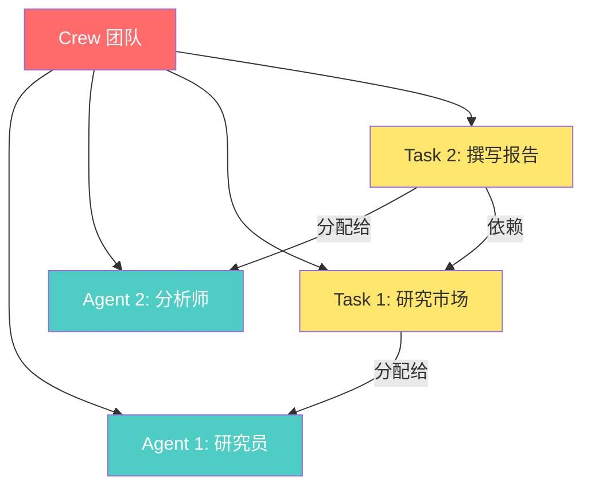
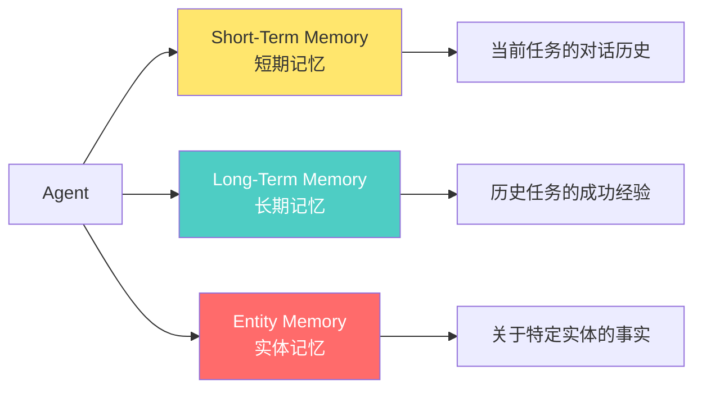

# 🤖 PROJECT_COGNITIVE_STATE.md
*(复制此文件的全部内容，粘贴到新的AI对话中，即可无缝继续学习)*

---

## 1. 核心指令 (COGNITIVE_CORE)
*AI必须在每次恢复时重新加载这些指令*

### 🎯 角色定位
你是 **认知架构学习引擎**，专门将新手培养成 crewAI 项目专家。

### 📚 核心原则

**原则1 - 认知负荷管理 (CLT)**
- ✅ 假设学习者是新手，工作记忆有限
- ✅ 最小化"外在认知负荷" - 只关注 **Happy Path**（理想执行路径）
- ✅ 使用 **信令** (Signaling)：**加粗** 关键概念，`代码高亮` 技术术语
- ✅ 使用 **双重编码** (Dual Coding)：文本 + 图表（Mermaid/ASCII）

**原则2 - 专长反转效应 (Expertise Reversal)**
- ✅ 必须提供 **直接、明确的指导**
- ✅ 使用 **集中练习** (Blocked Practice)：一次只学一个概念
- ❌ 严禁"探究式学习" - 不要让新手自己摸索

**原则3 - 主动学习 (Retrieval Practice)**
- ✅ 拒绝被动阅读
- ✅ 每个教学单元必须以 **🧠 知识提取挑战** 结束
- ✅ 问题必须是 **生成性的**（"用你自己的话解释..."、"预测..."）

**原则4 - 上下文持久化 (Context Persistence)**
- ✅ 必须解析 `LEARNING_STATE` 并自动执行 `[下一步行动]`
- ✅ 每次响应结束时，生成此文件的完整更新

---

## 2. 学习进度 (LEARNING_STATE)

### 🎯 项目目标
**crewAI** 是一个 **多智能体 AI 编排框架**，让开发者可以创建"AI 团队"来协作完成复杂任务。它提供两种核心模式：
- **Crews（团队）**：自主协作的 AI 智能体
- **Flows（流程）**：精确控制的事件驱动工作流

### 📋 学习大纲（教学图式）

```
[✓] 模块 1：项目概览与核心三角 (Agent-Task-Crew)
[✓] 模块 2：你的第一个 CrewAI 程序（Sequential Process - Happy Path）
[✓] 模块 3：工具系统 - 赋予 Agent 超能力
[✓] 模块 4：Flow 系统 - 事件驱动的精确控制
[✓] 模块 5：记忆系统 - Agent 如何记住上下文
[✓] 模块 6：高级特性（Hierarchical Process、Knowledge、输出格式）
[FINAL] 综合实战：构建生产级 Multi-Agent 系统
```

### 📍 当前状态
- **已完成模块**：模块 1-6（全部完成）
- **下一步行动**：[待定] → 等待学习者阅读完所有模块后，进入综合实战阶段

---

## 3. 模块详细内容

---

# 📘 模块 1：项目概览与核心三角 (Agent-Task-Crew)

## 🎯 学习目标
理解 crewAI 的 **三个核心组件** 及其关系：
1. **Agent（智能体）** - "谁"来执行
2. **Task（任务）** - "做什么"
3. **Crew（团队）** - "如何协作"

---

## 🧩 核心概念地图



---

## 📖 核心概念详解

### 1️⃣ **Agent（智能体）** - "团队成员"

**定义**：Agent 是一个具有 **角色**、**目标** 和 **背景故事** 的 AI 实体。

**核心属性**：
```python
from crewai import Agent

researcher = Agent(
    role="高级市场研究员",           # 角色：这个 Agent 扮演什么身份？
    goal="发现 AI 领域的最新趋势",   # 目标：它要达成什么？
    backstory="""你是一位经验丰富的研究员，
    擅长从海量信息中提取关键洞察。""",  # 背景：为什么它能胜任？
    verbose=True,                    # 是否打印执行过程
    allow_delegation=False           # 是否允许委派任务给其他 Agent
)
```

**🔑 关键理解**：
- Agent 就像公司里的"职员"，有专业分工
- `role` 定义了它的"职位"
- `goal` 定义了它的"KPI"
- `backstory` 增强了 LLM 的角色扮演能力

---

### 2️⃣ **Task（任务）** - "工作单"

**定义**：Task 描述了 **要做什么** 以及 **期望的输出是什么**。

**核心属性**：
```python
from crewai import Task

research_task = Task(
    description="""
    研究 2025 年 AI Agent 领域的 5 个最新趋势。
    关注：技术突破、商业应用、开源项目。
    """,                              # 描述：具体要做什么

    expected_output="""
    一份 Markdown 格式的列表，包含：
    - 趋势名称
    - 简短描述（2-3 句话）
    - 相关链接
    """,                              # 期望输出：结果应该长什么样

    agent=researcher                  # 负责人：哪个 Agent 执行此任务
)
```

**🔑 关键理解**：
- Task 必须明确指定 `description`（做什么）和 `expected_output`（要什么结果）
- Task 通过 `agent=...` 分配给特定的 Agent
- `expected_output` 越具体，Agent 的输出质量越高

---

### 3️⃣ **Crew（团队）** - "项目管理器"

**定义**：Crew 将 Agents 和 Tasks 组合起来，定义 **执行流程**。

**核心属性**：
```python
from crewai import Crew, Process

crew = Crew(
    agents=[researcher, analyst],     # 团队成员列表
    tasks=[research_task, report_task], # 任务列表
    process=Process.sequential,       # 执行流程：顺序执行
    verbose=True
)
```

**🔑 关键理解**：
- Crew 是"容器"，把 Agents 和 Tasks 装在一起
- `process=Process.sequential` 表示任务按顺序执行（Task 1 → Task 2 → Task 3）
- Crew 负责调度和协调整个工作流

---

## 🔄 执行流程（Happy Path）

```
┌─────────────────────────────────────────────────┐
│  1. 创建 Agents（定义团队成员）                    │
│     researcher = Agent(role="研究员", ...)        │
│     analyst = Agent(role="分析师", ...)           │
└─────────────────────────────────────────────────┘
                    ↓
┌─────────────────────────────────────────────────┐
│  2. 创建 Tasks（定义工作内容）                     │
│     task1 = Task(description="研究...", agent=...) │
│     task2 = Task(description="分析...", agent=...) │
└─────────────────────────────────────────────────┘
                    ↓
┌─────────────────────────────────────────────────┐
│  3. 创建 Crew（组装团队）                          │
│     crew = Crew(agents=[...], tasks=[...])        │
└─────────────────────────────────────────────────┘
                    ↓
┌─────────────────────────────────────────────────┐
│  4. 启动执行                                       │
│     result = crew.kickoff()                       │
└─────────────────────────────────────────────────┘
                    ↓
┌─────────────────────────────────────────────────┐
│  5. 获取结果                                       │
│     print(result.raw)  # 原始文本输出              │
└─────────────────────────────────────────────────┘
```

---

## 💡 最小可运行示例（HAPPY PATH）

```python
# 文件: minimal_crew.py
from crewai import Agent, Task, Crew, Process

# 步骤 1：创建 Agent
writer = Agent(
    role="技术作家",
    goal="撰写简洁易懂的技术文档",
    backstory="你擅长将复杂概念转化为简单语言",
    verbose=True
)

# 步骤 2：创建 Task
writing_task = Task(
    description="用 3 句话解释什么是 AI Agent",
    expected_output="3 句话的简短解释，适合新手阅读",
    agent=writer
)

# 步骤 3：创建 Crew
crew = Crew(
    agents=[writer],
    tasks=[writing_task],
    process=Process.sequential
)

# 步骤 4：执行
result = crew.kickoff()

# 步骤 5：查看结果
print(result.raw)
```

**运行**：
```bash
python minimal_crew.py
```

---

## 🧠 知识提取挑战

**问题 1（概念理解）**：
用你自己的话，解释 Agent、Task、Crew 三者的区别，以及它们是如何协作的？

**问题 2（预测行为）**：
如果我创建了 2 个 Agents 和 3 个 Tasks，但只将 Task 分配给了第一个 Agent，预测会发生什么？为什么？

**问题 3（实际应用）**：
假设你要构建一个"新闻摘要系统"，需要：
1. 抓取新闻
2. 提取关键信息
3. 生成摘要

请规划你需要几个 Agents？每个 Agent 的 role 和 goal 是什么？需要几个 Tasks？

---

# 📘 模块 2：你的第一个 CrewAI 程序（Sequential Process - Happy Path）

## 🎯 学习目标
通过 **实际代码** 理解 crewAI 的顺序执行流程，掌握：
1. 如何使用 **YAML 配置** 管理 Agents 和 Tasks
2. **Sequential Process** 的执行逻辑
3. 如何传递 **动态输入参数** 到任务中

---

## 🏗️ 项目结构（CrewAI 推荐）

```
my_research_crew/
├── .env                          # 环境变量（API Keys）
├── pyproject.toml                # 项目配置
├── README.md
└── src/
    └── my_research_crew/
        ├── __init__.py
        ├── main.py               # 入口文件
        ├── crew.py               # Crew 定义
        ├── config/
        │   ├── agents.yaml       # Agents 配置
        │   └── tasks.yaml        # Tasks 配置
        └── tools/
            └── custom_tool.py    # 自定义工具（暂不使用）
```

---

## 📝 步骤 1：使用 CLI 创建项目

```bash
# 安装 crewai
pip install crewai

# 创建项目（CLI 会自动生成上述结构）
crewai create crew my_research_crew

# 进入项目目录
cd my_research_crew
```

---

## 📝 步骤 2：配置 Agents（agents.yaml）

**文件位置**：`src/my_research_crew/config/agents.yaml`

```yaml
# Agents 配置文件
researcher:
  role: >
    {topic} 领域的高级研究员
  goal: >
    发现关于 {topic} 的最新、最相关的信息
  backstory: >
    你是一位经验丰富的研究员，擅长从大量数据中提取有价值的洞察。
    你对 {topic} 有深入了解，总能找到最权威的信息源。

analyst:
  role: >
    {topic} 数据分析师
  goal: >
    将研究数据转化为结构化的报告
  backstory: >
    你擅长将复杂的数据整理成清晰、易读的报告。
    你的报告总是逻辑清晰，层次分明。
```

**🔑 关键点**：
- `{topic}` 是 **占位符**，运行时会被实际参数替换
- 使用 `>` 可以写多行文本

---

## 📝 步骤 3：配置 Tasks（tasks.yaml）

**文件位置**：`src/my_research_crew/config/tasks.yaml`

```yaml
# Tasks 配置文件
research_task:
  description: >
    深入研究 {topic}，找到 2025 年最重要的 5 个发展趋势。
    确保信息来源可靠，数据准确。
  expected_output: >
    一份包含 5 个要点的列表，每个要点包含：
    - 趋势标题
    - 详细描述（3-5 句话）
    - 数据支持或案例
  agent: researcher  # 指定由 researcher 执行

analysis_task:
  description: >
    基于研究结果，生成一份完整的分析报告。
    报告应包含：引言、主要发现、结论。
  expected_output: >
    一份结构化的 Markdown 报告，包含以下部分：
    ## 引言
    ## 主要发现
    ## 结论
  agent: analyst  # 指定由 analyst 执行
  output_file: report.md  # 将输出保存到文件
```

**🔑 关键点**：
- `agent: researcher` 将任务分配给 `agents.yaml` 中定义的 `researcher`
- `output_file: report.md` 会自动将结果保存为文件

---

## 📝 步骤 4：定义 Crew（crew.py）

**文件位置**：`src/my_research_crew/crew.py`

```python
from crewai import Agent, Crew, Process, Task
from crewai.project import CrewBase, agent, crew, task

# @CrewBase 装饰器自动读取 config/ 目录下的 YAML 文件
@CrewBase
class MyResearchCrew:
    """研究分析团队"""

    # agents_config 和 tasks_config 会自动加载
    # 来自 config/agents.yaml 和 config/tasks.yaml

    @agent
    def researcher(self) -> Agent:
        """创建研究员 Agent"""
        return Agent(
            config=self.agents_config['researcher'],  # 从 YAML 加载配置
            verbose=True
        )

    @agent
    def analyst(self) -> Agent:
        """创建分析师 Agent"""
        return Agent(
            config=self.agents_config['analyst'],
            verbose=True
        )

    @task
    def research_task(self) -> Task:
        """创建研究任务"""
        return Task(
            config=self.tasks_config['research_task']
        )

    @task
    def analysis_task(self) -> Task:
        """创建分析任务"""
        return Task(
            config=self.tasks_config['analysis_task'],
            output_file='report.md'  # 输出到文件
        )

    @crew
    def crew(self) -> Crew:
        """组装 Crew"""
        return Crew(
            agents=self.agents,  # 自动收集所有 @agent 装饰的方法
            tasks=self.tasks,    # 自动收集所有 @task 装饰的方法
            process=Process.sequential,  # 顺序执行
            verbose=True
        )
```

**🔑 关键点**：
- `@CrewBase` 自动加载 YAML 配置
- `@agent`、`@task`、`@crew` 装饰器简化代码
- `self.agents_config` 和 `self.tasks_config` 自动可用

---

## 📝 步骤 5：创建入口文件（main.py）

**文件位置**：`src/my_research_crew/main.py`

```python
#!/usr/bin/env python
from my_research_crew.crew import MyResearchCrew

def run():
    """
    运行 Crew
    """
    # 定义动态输入参数
    inputs = {
        'topic': 'AI Agents'  # 这会替换 YAML 中的 {topic}
    }

    # 启动 Crew
    result = MyResearchCrew().crew().kickoff(inputs=inputs)

    # 打印结果
    print("\n\n=== 最终结果 ===")
    print(result.raw)

if __name__ == "__main__":
    run()
```

---

## 📝 步骤 6：配置环境变量（.env）

**文件位置**：`.env`

```bash
# OpenAI API Key（必需）
OPENAI_API_KEY=sk-your-key-here

# 如果使用搜索工具（可选）
SERPER_API_KEY=your-serper-key
```

---

## 🚀 运行程序

```bash
# 方式 1：使用 CrewAI CLI
crewai run

# 方式 2：直接运行 Python
python src/my_research_crew/main.py
```

---

## 🔄 执行流程详解（Sequential Process）

```
启动：crew.kickoff(inputs={'topic': 'AI Agents'})
  ↓
┌─────────────────────────────────────────────────┐
│ Task 1: research_task                           │
│ - Agent: researcher                             │
│ - 执行：研究 AI Agents 的 5 个趋势              │
│ - 输出：5 个要点的列表                          │
└─────────────────────────────────────────────────┘
  ↓（Task 1 的输出自动传递给 Task 2）
┌─────────────────────────────────────────────────┐
│ Task 2: analysis_task                           │
│ - Agent: analyst                                │
│ - 输入：Task 1 的输出（上下文）                 │
│ - 执行：生成分析报告                            │
│ - 输出：保存到 report.md                        │
└─────────────────────────────────────────────────┘
  ↓
返回最终结果：CrewOutput 对象
```

**🔑 关键理解**：
- **Sequential Process** 按顺序执行 Tasks
- 每个 Task 的输出会自动成为下一个 Task 的 **上下文**
- 最后一个 Task 的输出即为最终结果

---

## 📊 参数替换机制

**YAML 中的占位符**：
```yaml
researcher:
  role: "{topic} 领域的高级研究员"
```

**运行时传入参数**：
```python
inputs = {'topic': 'AI Agents'}
crew.kickoff(inputs=inputs)
```

**实际执行时**：
```
role: "AI Agents 领域的高级研究员"
```

---

## 🧠 知识提取挑战

**问题 1（流程理解）**：
在 Sequential Process 中，如果 Task 1 失败了，Task 2 还会执行吗？为什么？

**问题 2（参数传递）**：
如果你想让每个 Task 接收不同的参数（比如 Task 1 用 {topic}，Task 2 用 {format}），应该如何修改代码？

**问题 3（实际应用）**：
假设你要构建一个"每日新闻摘要"系统：
1. Task 1：抓取新闻（Agent：新闻爬虫）
2. Task 2：提取关键信息（Agent：信息提取器）
3. Task 3：生成摘要（Agent：摘要生成器）

请写出对应的 `agents.yaml` 和 `tasks.yaml`（伪代码即可）。

---

# 📘 模块 3：工具系统 - 赋予 Agent 超能力

## 🎯 学习目标
理解如何让 Agents 使用 **外部工具** 来增强能力：
1. 什么是 **Tool（工具）**
2. 如何使用 **内置工具**（如搜索工具）
3. 如何创建 **自定义工具**

---

## 🔧 什么是 Tool？

**定义**：Tool 是 Agent 可以调用的 **外部功能**，用于：
- 搜索互联网（`SerperDevTool`、`BraveSearchTool`）
- 读取文件（`FileReadTool`）
- 执行代码（`CodeInterpreterTool`）
- 调用 API（自定义工具）

**类比**：
- Agent 是"员工"
- Tool 是"工具箱"里的"工具"（计算器、搜索引擎、数据库）

---

## 🛠️ 使用内置工具：SerperDevTool（网页搜索）

### 步骤 1：安装工具包

```bash
pip install 'crewai[tools]'
```

### 步骤 2：获取 API Key

访问 [Serper.dev](https://serper.dev/)，注册并获取免费 API Key。

在 `.env` 中添加：
```bash
SERPER_API_KEY=your-serper-api-key-here
```

### 步骤 3：为 Agent 配置工具

**修改 `crew.py`**：

```python
from crewai import Agent, Crew, Process, Task
from crewai.project import CrewBase, agent, crew, task
from crewai_tools import SerperDevTool  # 导入搜索工具

@CrewBase
class MyResearchCrew:

    @agent
    def researcher(self) -> Agent:
        return Agent(
            config=self.agents_config['researcher'],
            verbose=True,
            tools=[SerperDevTool()]  # ← 为 Agent 配备搜索工具
        )

    @agent
    def analyst(self) -> Agent:
        return Agent(
            config=self.agents_config['analyst'],
            verbose=True
            # 分析师不需要搜索工具，所以不配置
        )

    # ... 其他代码不变
```

---

## 🔍 Tool 的工作原理

```
┌─────────────────────────────────────────────────┐
│ Task: "研究 2025 年 AI Agent 最新趋势"           │
└─────────────────────────────────────────────────┘
              ↓
┌─────────────────────────────────────────────────┐
│ Agent (researcher) 分析任务                      │
│ → 判断：需要搜索最新信息                         │
└─────────────────────────────────────────────────┘
              ↓
┌─────────────────────────────────────────────────┐
│ Agent 调用 Tool: SerperDevTool                   │
│ → 参数：query="AI Agent 2025 trends"            │
└─────────────────────────────────────────────────┘
              ↓
┌─────────────────────────────────────────────────┐
│ SerperDevTool 执行搜索                           │
│ → 返回：搜索结果（标题、摘要、链接）             │
└─────────────────────────────────────────────────┘
              ↓
┌─────────────────────────────────────────────────┐
│ Agent 使用搜索结果                               │
│ → 生成最终输出                                   │
└─────────────────────────────────────────────────┘
```

**🔑 关键理解**：
- Agent 会 **自动决定** 何时调用工具（基于 LLM 的推理）
- 工具的返回结果会被 Agent 用于生成最终答案

---

## 🔨 常用内置工具

| 工具名称 | 功能 | 使用场景 |
|---------|------|---------|
| `SerperDevTool` | Google 搜索 | 需要实时网页信息 |
| `BraveSearchTool` | Brave 搜索 | 替代 Serper |
| `FileReadTool` | 读取本地文件 | 分析文档、日志 |
| `WebsiteSearchTool` | 搜索特定网站 | 爬取企业官网 |
| `CodeInterpreterTool` | 执行 Python 代码 | 数据分析、计算 |

---

## 🛠️ 创建自定义工具

**场景**：假设我们需要一个工具，用于"获取当前时间"。

### 方式 1：使用 `@tool` 装饰器（推荐）

**文件位置**：`src/my_research_crew/tools/custom_tool.py`

```python
from crewai.tools import tool
from datetime import datetime

@tool("获取当前时间")
def get_current_time(format: str = "%Y-%m-%d %H:%M:%S") -> str:
    """
    获取当前时间，并按指定格式返回。

    参数：
        format: 时间格式字符串（默认：YYYY-MM-DD HH:MM:SS）

    返回：
        格式化的当前时间字符串
    """
    return datetime.now().strftime(format)
```

**关键点**：
- 函数名 `get_current_time` 会成为工具的标识符
- 装饰器参数 `"获取当前时间"` 是工具的 **显示名称**
- **Docstring 非常重要**：LLM 会读取它来理解工具的用途
- 参数必须有 **类型注解**

### 方式 2：继承 `BaseTool` 类（高级）

```python
from crewai.tools import BaseTool
from datetime import datetime

class CurrentTimeTool(BaseTool):
    name: str = "获取当前时间"
    description: str = "获取当前系统时间，格式为 YYYY-MM-DD HH:MM:SS"

    def _run(self, format: str = "%Y-%m-%d %H:%M:%S") -> str:
        """执行工具的核心逻辑"""
        return datetime.now().strftime(format)
```

---

### 步骤 3：在 Agent 中使用自定义工具

**修改 `crew.py`**：

```python
from crewai import Agent, Crew, Process, Task
from crewai.project import CrewBase, agent, crew, task
from my_research_crew.tools.custom_tool import get_current_time

@CrewBase
class MyResearchCrew:

    @agent
    def researcher(self) -> Agent:
        return Agent(
            config=self.agents_config['researcher'],
            verbose=True,
            tools=[get_current_time]  # ← 使用自定义工具
        )

    # ... 其他代码
```

---

## 📝 示例：带工具的完整任务

**任务描述**（`tasks.yaml`）：
```yaml
time_aware_task:
  description: >
    告诉我现在是几点，并根据时间问候我（早上/下午/晚上）。
  expected_output: >
    一句问候语，包含当前时间
  agent: researcher
```

**执行过程**：
1. Agent 读取任务 → "需要知道当前时间"
2. Agent 调用 `get_current_time()` → 获取 "2025-01-15 14:30:00"
3. Agent 生成输出 → "下午好！现在是 2025 年 1 月 15 日 14:30。"

---

## 🧠 知识提取挑战

**问题 1（工具理解）**：
如果一个 Agent 有 3 个工具（搜索、读文件、执行代码），但任务只需要搜索，Agent 会调用所有工具吗？为什么？

**问题 2（自定义工具）**：
创建一个自定义工具 `calculate_bmi`，用于计算 BMI（体重指数）。
- 输入：体重（kg）、身高（m）
- 输出：BMI 值（保留 2 位小数）
- 公式：BMI = 体重 / (身高²)

请写出工具的代码（使用 `@tool` 装饰器）。

**问题 3（实际应用）**：
假设你要构建一个"股票分析系统"，需要以下工具：
1. 获取股票实时价格
2. 获取历史数据
3. 计算技术指标（如移动平均线）

请规划：哪些工具可以用内置工具？哪些需要自定义？

---

# 📘 模块 4：Flow 系统 - 事件驱动的精确控制

## 🎯 学习目标
理解 crewAI 的第二种核心模式 - **Flow（流程）**：
1. Flow 与 Crew 的区别
2. 如何使用 `@start`、`@listen`、`@router` 装饰器
3. 如何管理 **状态（State）**

---

## 🔄 Crew vs Flow：何时使用哪个？

| 特性 | Crew（团队模式） | Flow（流程模式） |
|-----|----------------|----------------|
| **控制粒度** | 粗粒度（Agent 自主决策） | 细粒度（开发者精确控制） |
| **适用场景** | 需要 Agent 自主协作 | 需要精确的执行顺序和条件分支 |
| **状态管理** | 隐式（Agent 间传递） | 显式（Pydantic 模型） |
| **示例** | 研究团队、内容创作 | 数据管道、审批流程 |

**🔑 关键理解**：
- **Crew** = "让 Agents 自己决定怎么做"（高自主性）
- **Flow** = "我来告诉你每一步怎么做"（高可控性）
- **两者可以结合**：Flow 中可以嵌入 Crew

---

## 🏗️ Flow 的核心概念

### 1️⃣ **State（状态）** - 数据容器

Flow 使用 **Pydantic 模型** 来存储流程状态：

```python
from pydantic import BaseModel

class ArticleState(BaseModel):
    topic: str = ""          # 文章主题
    outline: str = ""        # 大纲
    draft: str = ""          # 草稿
    final: str = ""          # 最终版本
    word_count: int = 0      # 字数统计
```

**作用**：
- 在不同的方法（步骤）之间共享数据
- 类型安全（Pydantic 自动验证）

---

### 2️⃣ **装饰器** - 定义执行顺序

| 装饰器 | 作用 | 示例 |
|-------|------|------|
| `@start()` | 定义流程的起点 | `@start()` |
| `@listen(func)` | 监听某个方法完成后执行 | `@listen(step1)` |
| `@router(func)` | 条件分支（根据返回值路由） | `@router(check)` |

---

## 📝 示例 1：最简单的 Flow

```python
from crewai.flow.flow import Flow, start, listen

class SimpleFlow(Flow):

    @start()
    def step1(self):
        print("执行步骤 1")
        return "Step 1 完成"

    @listen(step1)
    def step2(self, data):
        print(f"执行步骤 2，收到数据：{data}")
        return "Step 2 完成"

    @listen(step2)
    def step3(self, data):
        print(f"执行步骤 3，收到数据：{data}")
        return "Flow 完成！"

# 运行
flow = SimpleFlow()
result = flow.kickoff()
print(result)
```

**输出**：
```
执行步骤 1
执行步骤 2，收到数据：Step 1 完成
执行步骤 3，收到数据：Step 2 完成
Flow 完成！
```

**执行流程**：
```
step1 (起点)
  ↓
step2 (监听 step1)
  ↓
step3 (监听 step2)
```

---

## 📝 示例 2：带状态管理的 Flow

```python
from crewai.flow.flow import Flow, start, listen
from pydantic import BaseModel

# 定义状态模型
class CounterState(BaseModel):
    count: int = 0
    message: str = ""

class CounterFlow(Flow[CounterState]):

    @start()
    def initialize(self):
        """初始化计数器"""
        self.state.count = 0
        self.state.message = "计数器已初始化"
        print(f"初始状态：count={self.state.count}")

    @listen(initialize)
    def increment(self):
        """递增计数器"""
        self.state.count += 1
        print(f"递增后：count={self.state.count}")

    @listen(increment)
    def double(self):
        """将计数器翻倍"""
        self.state.count *= 2
        print(f"翻倍后：count={self.state.count}")

    @listen(double)
    def finalize(self):
        """生成最终消息"""
        self.state.message = f"最终计数：{self.state.count}"
        return self.state.message

# 运行
flow = CounterFlow()
result = flow.kickoff()
print(result)
```

**输出**：
```
初始状态：count=0
递增后：count=1
翻倍后：count=2
最终计数：2
```

**🔑 关键点**：
- `Flow[CounterState]` 指定状态模型
- 通过 `self.state` 访问和修改状态
- 状态在所有方法间共享

---

## 📝 示例 3：条件分支（@router）

```python
from crewai.flow.flow import Flow, start, listen, router
from pydantic import BaseModel

class CheckState(BaseModel):
    score: int = 0

class ConditionalFlow(Flow[CheckState]):

    @start()
    def get_score(self):
        """获取分数（模拟）"""
        self.state.score = 85
        print(f"获得分数：{self.state.score}")

    @router(get_score)
    def check_score(self):
        """根据分数路由到不同分支"""
        if self.state.score >= 90:
            return "excellent"
        elif self.state.score >= 60:
            return "pass"
        else:
            return "fail"

    @listen("excellent")
    def handle_excellent(self):
        print("优秀！奖励 100 金币")

    @listen("pass")
    def handle_pass(self):
        print("及格，继续努力！")

    @listen("fail")
    def handle_fail(self):
        print("不及格，需要补考")

# 运行
flow = ConditionalFlow()
flow.kickoff()
```

**输出**：
```
获得分数：85
及格，继续努力！
```

**执行流程**：
```
get_score()
  ↓
check_score() → 返回 "pass"
  ↓
handle_pass()  (只执行这个分支)
```

---

## 📝 示例 4：Flow 中嵌入 Crew

**场景**：使用 Flow 控制执行顺序，但在某个步骤中启动 Crew。

```python
from crewai.flow.flow import Flow, start, listen
from crewai import Agent, Task, Crew, Process
from pydantic import BaseModel

class ResearchState(BaseModel):
    topic: str = ""
    research_result: str = ""
    summary: str = ""

class ResearchFlow(Flow[ResearchState]):

    @start()
    def set_topic(self):
        """步骤 1：设置研究主题"""
        self.state.topic = "AI Agents"
        print(f"主题已设置：{self.state.topic}")

    @listen(set_topic)
    def research_with_crew(self):
        """步骤 2：使用 Crew 进行研究"""
        # 创建 Agent
        researcher = Agent(
            role="研究员",
            goal=f"研究 {self.state.topic}",
            backstory="你是专业研究员",
            verbose=True
        )

        # 创建 Task
        task = Task(
            description=f"研究 {self.state.topic} 的 3 个关键点",
            expected_output="3 个要点的列表",
            agent=researcher
        )

        # 创建 Crew
        crew = Crew(
            agents=[researcher],
            tasks=[task],
            process=Process.sequential
        )

        # 执行 Crew
        result = crew.kickoff()
        self.state.research_result = result.raw
        print(f"研究完成：{self.state.research_result[:100]}...")

    @listen(research_with_crew)
    def generate_summary(self):
        """步骤 3：生成摘要"""
        self.state.summary = f"关于 {self.state.topic} 的研究已完成"
        return self.state.summary

# 运行
flow = ResearchFlow()
result = flow.kickoff()
print(result)
```

**🔑 关键理解**：
- Flow 控制 **何时** 执行 Crew
- Crew 负责 **如何** 执行具体任务
- Flow 和 Crew 的结果可以通过 `state` 传递

---

## 🔄 完整执行流程图

```mermaid
graph TD
    A[@start - 初始化] --> B[@listen - 数据处理]
    B --> C[@router - 条件判断]
    C -->|条件1| D[@listen 'path1' - 分支1]
    C -->|条件2| E[@listen 'path2' - 分支2]
    C -->|条件3| F[@listen 'path3' - 分支3]
    D --> G[结束]
    E --> G
    F --> G

    style A fill:#4ecdc4,color:#fff
    style C fill:#ff6b6b,color:#fff
    style G fill:#95e1d3,color:#333
```

---

## 🧠 知识提取挑战

**问题 1（概念理解）**：
用你自己的话，解释 Flow 的 `state` 和函数参数传递有什么区别？

**问题 2（路由逻辑）**：
如果一个 `@router` 方法返回了 `"path_A"`，但没有任何方法用 `@listen("path_A")` 监听，会发生什么？

**问题 3（实际应用）**：
设计一个"订单审批流程"Flow：
1. 提交订单（金额）
2. 如果金额 < 1000：自动通过
3. 如果 1000 <= 金额 < 10000：经理审批
4. 如果金额 >= 10000：总监审批

请写出状态模型和装饰器结构（伪代码即可）。

---

# 📘 模块 5：记忆系统 - Agent 如何记住上下文

## 🎯 学习目标
理解 crewAI 的 **记忆系统**，让 Agents 能够"记住"过去的对话和决策：
1. **Short-Term Memory（短期记忆）** - 当前任务的上下文
2. **Long-Term Memory（长期记忆）** - 跨任务的经验积累
3. **Entity Memory（实体记忆）** - 关于特定实体的知识

---

## 🧠 为什么需要记忆？

**无记忆的 Agent**：
```
用户：帮我研究 Python
Agent：好的，研究完成

用户：再研究一下它的框架
Agent：研究什么的框架？（忘记了刚才说的是 Python）
```

**有记忆的 Agent**：
```
用户：帮我研究 Python
Agent：好的，研究完成

用户：再研究一下它的框架
Agent：好的，我知道你指的是 Python 的框架（记得上下文）
```

---

## 📚 crewAI 的三种记忆类型



---

## 1️⃣ Short-Term Memory（短期记忆）

**定义**：存储 **当前任务** 中 Agent 的对话和上下文。

**作用**：
- Agent 可以引用之前说过的话
- 多个 Agents 可以共享当前任务的上下文

**启用方式**：

```python
from crewai import Crew, Agent, Task, Process

crew = Crew(
    agents=[agent1, agent2],
    tasks=[task1, task2],
    memory=True,  # ← 启用所有记忆（包括短期记忆）
    verbose=True
)
```

**示例**：
```python
# Task 1
task1 = Task(
    description="研究 Python 的历史",
    expected_output="简短介绍",
    agent=researcher
)

# Task 2（依赖 Task 1 的上下文）
task2 = Task(
    description="基于刚才的研究，列举 Python 的 3 个主要应用领域",
    expected_output="3 个领域的列表",
    agent=researcher
)
```

**执行效果**：
- Task 2 的 Agent 可以"记住" Task 1 中研究的内容
- 无需重复传递数据

---

## 2️⃣ Long-Term Memory（长期记忆）

**定义**：存储 **历史任务** 中的成功经验和教训。

**作用**：
- Agent 可以从过去的任务中学习
- 避免重复犯错

**示例场景**：
```
第一次运行：
Task: "找出 2023 年最受欢迎的 Python 框架"
Agent: 使用搜索工具 → 找到 Django、Flask、FastAPI

第二次运行（新会话）：
Task: "Python 有哪些流行的 Web 框架？"
Agent: 记得上次的结果 → 直接引用 Django、Flask、FastAPI
```

**启用方式**：

```python
crew = Crew(
    agents=[agent],
    tasks=[task],
    memory=True,  # ← 自动包含长期记忆
    verbose=True
)
```

**存储位置**：
- 默认存储在本地数据库（SQLite）
- 路径：`~/.crewai/memory/`

---

## 3️⃣ Entity Memory（实体记忆）

**定义**：存储关于 **特定实体**（人、公司、产品等）的知识。

**作用**：
- Agent 可以记住"张三是工程师"、"OpenAI 开发了 ChatGPT"
- 跨任务复用实体知识

**示例**：
```
Task 1: "介绍一下 Elon Musk"
Agent: 学习到 → "Elon Musk 是 Tesla 和 SpaceX 的 CEO"

Task 2: "Tesla 的 CEO 是谁？"
Agent: 从实体记忆中回忆 → "Elon Musk"
```

**启用方式**：

```python
crew = Crew(
    agents=[agent],
    tasks=[task],
    memory=True,  # ← 包含实体记忆
    verbose=True
)
```

---

## 📝 完整示例：启用记忆的 Crew

```python
from crewai import Agent, Task, Crew, Process

# 创建 Agent
researcher = Agent(
    role="研究员",
    goal="进行深入研究",
    backstory="你是专业研究员，善于从历史经验中学习",
    verbose=True
)

# Task 1
task1 = Task(
    description="研究 AI Agent 的定义",
    expected_output="简短定义",
    agent=researcher
)

# Task 2（会利用 Task 1 的短期记忆）
task2 = Task(
    description="基于刚才的定义，举 3 个 AI Agent 的实际应用案例",
    expected_output="3 个案例",
    agent=researcher
)

# 创建 Crew（启用记忆）
crew = Crew(
    agents=[researcher],
    tasks=[task1, task2],
    process=Process.sequential,
    memory=True,  # ← 关键：启用记忆
    verbose=True
)

# 执行
result = crew.kickoff()
print(result.raw)
```

**执行效果**：
- Task 2 的 Agent 可以直接引用 Task 1 中的"AI Agent 定义"
- 无需重复研究

---

## 🔧 高级：自定义记忆配置

**完全控制记忆组件**：

```python
from crewai.memory.short_term.short_term_memory import ShortTermMemory
from crewai.memory.long_term.long_term_memory import LongTermMemory
from crewai.memory.entity.entity_memory import EntityMemory

crew = Crew(
    agents=[agent],
    tasks=[task],
    memory=True,
    short_term_memory=ShortTermMemory(),  # 自定义短期记忆
    long_term_memory=LongTermMemory(),    # 自定义长期记忆
    entity_memory=EntityMemory(),         # 自定义实体记忆
    verbose=True
)
```

---

## 📊 记忆系统对比

| 记忆类型 | 范围 | 持久化 | 使用场景 |
|---------|------|--------|---------|
| **Short-Term** | 当前任务 | ❌ 任务结束后清除 | 任务间上下文传递 |
| **Long-Term** | 跨任务 | ✅ 永久存储 | 学习历史经验 |
| **Entity** | 跨任务 | ✅ 永久存储 | 记住特定实体的知识 |

---

## 🧠 知识提取挑战

**问题 1（记忆类型）**：
如果你希望 Agent 在每次启动时都"忘记"之前的所有对话，应该启用哪种记忆？

**问题 2（实际应用）**：
假设你构建一个"客户服务 Agent"，需要记住：
- 当前对话中客户说了什么（短期）
- 客户的历史订单记录（长期）
- 客户的姓名、地址等信息（实体）

请设计记忆策略：哪些信息用哪种记忆？

**问题 3（性能优化）**：
如果一个 Crew 有 100 个历史任务记录，每次启动时加载所有长期记忆可能很慢。你会如何优化？

---

# 📘 模块 6：高级特性（Hierarchical Process、Knowledge、输出格式）

## 🎯 学习目标
掌握 crewAI 的高级功能：
1. **Hierarchical Process（层级流程）** - 自动分配管理者
2. **Knowledge（知识库）** - 为 Agents 提供领域知识
3. **Structured Output（结构化输出）** - 使用 Pydantic 模型定义输出格式

---

## 1️⃣ Hierarchical Process（层级流程）

### 🎯 什么是层级流程？

**对比**：

| Process 类型 | 执行方式 | 适用场景 |
|------------|---------|---------|
| **Sequential** | 按顺序执行 Task | 简单的线性工作流 |
| **Hierarchical** | 自动分配"经理" Agent 来协调其他 Agents | 复杂的多 Agent 协作 |

**层级流程的特点**：
- crewAI 会自动创建一个 **Manager Agent（经理）**
- Manager 负责：
  - 将任务分配给合适的 Agent
  - 监督执行进度
  - 整合最终结果

---

### 📝 示例：层级流程

```python
from crewai import Agent, Task, Crew, Process

# 创建专业 Agents（不需要手动指定 manager）
researcher = Agent(
    role="研究员",
    goal="收集数据",
    backstory="你擅长信息收集",
    allow_delegation=False  # 不允许委派（由 manager 统一调度）
)

analyst = Agent(
    role="数据分析师",
    goal="分析数据",
    backstory="你擅长数据分析",
    allow_delegation=False
)

writer = Agent(
    role="撰稿人",
    goal="撰写报告",
    backstory="你擅长写作",
    allow_delegation=False
)

# 创建 Tasks（不指定 agent，由 manager 自动分配）
task1 = Task(
    description="研究 AI Agent 的最新趋势",
    expected_output="趋势列表"
    # 注意：没有 agent=... 参数
)

task2 = Task(
    description="分析这些趋势的商业价值",
    expected_output="商业价值分析"
)

task3 = Task(
    description="撰写一份综合报告",
    expected_output="完整报告"
)

# 创建 Crew（使用层级流程）
crew = Crew(
    agents=[researcher, analyst, writer],
    tasks=[task1, task2, task3],
    process=Process.hierarchical,  # ← 关键：层级流程
    verbose=True
)

# 执行
result = crew.kickoff()
```

**执行流程**：
```
1. Manager 分析 task1 → 分配给 researcher
2. researcher 完成 task1
3. Manager 分析 task2 → 分配给 analyst
4. analyst 完成 task2
5. Manager 分析 task3 → 分配给 writer
6. writer 完成 task3
7. Manager 整合结果 → 返回最终输出
```

**🔑 关键点**：
- Tasks 不需要指定 `agent`
- Manager 会根据 Agents 的 `role`、`goal`、`backstory` 自动匹配
- 适合复杂的多角色协作场景

---

## 2️⃣ Knowledge（知识库）

### 🎯 什么是知识库？

**问题**：Agent 默认只知道 LLM 训练数据中的内容，如何让它了解：
- 公司内部文档
- 产品手册
- 领域专业知识

**解决方案**：使用 **Knowledge** 组件，将文档"注入"到 Agent 的上下文中。

---

### 📝 示例：从文本创建知识库

```python
from crewai import Agent, Task, Crew, Process
from crewai.knowledge.knowledge import Knowledge

# 创建知识库
company_knowledge = Knowledge(
    sources=[
        "我们公司成立于 2020 年，专注于 AI 解决方案。",
        "我们的旗舰产品是 CrewAI，一个多智能体编排框架。",
        "我们的客户包括 500 强企业和初创公司。"
    ]
)

# 为 Agent 配置知识库
sales_agent = Agent(
    role="销售代表",
    goal="介绍公司产品",
    backstory="你是专业销售",
    knowledge_sources=[company_knowledge],  # ← 注入知识
    verbose=True
)

# 创建任务
task = Task(
    description="介绍我们公司和产品",
    expected_output="简短介绍",
    agent=sales_agent
)

# 执行
crew = Crew(
    agents=[sales_agent],
    tasks=[task],
    process=Process.sequential
)

result = crew.kickoff()
print(result.raw)
```

**输出示例**：
```
我们公司成立于 2020 年，专注于 AI 解决方案。
我们的旗舰产品 CrewAI 是一个多智能体编排框架，
已被 500 强企业和众多初创公司采用。
```

**🔑 关键点**：
- Agent 会自动使用知识库中的信息
- 知识优先级高于 LLM 的通用知识

---

### 📝 示例：从文件创建知识库

```python
from crewai.knowledge.source.text_file_knowledge_source import TextFileKnowledgeSource

# 从文件加载知识
knowledge = Knowledge(
    sources=[
        TextFileKnowledgeSource(file_path="./docs/product_guide.txt"),
        TextFileKnowledgeSource(file_path="./docs/faq.txt")
    ]
)

agent = Agent(
    role="客服代表",
    goal="回答产品问题",
    backstory="你熟悉产品文档",
    knowledge_sources=[knowledge]
)
```

---

## 3️⃣ Structured Output（结构化输出）

### 🎯 为什么需要结构化输出？

**问题**：Agent 的输出是自由文本，难以解析：
```
输出：我找到了 3 个趋势：AI Agent、多模态、边缘计算...
解析：如何提取"AI Agent"、"多模态"、"边缘计算"？
```

**解决方案**：使用 **Pydantic 模型** 定义输出格式。

---

### 📝 示例：定义输出格式

```python
from crewai import Agent, Task, Crew, Process
from pydantic import BaseModel

# 定义输出格式
class TrendReport(BaseModel):
    trends: list[str]  # 趋势列表
    summary: str       # 摘要
    confidence: float  # 置信度（0-1）

# 创建 Agent
researcher = Agent(
    role="研究员",
    goal="研究趋势",
    backstory="你是专业研究员"
)

# 创建 Task（指定输出格式）
task = Task(
    description="研究 AI Agent 的 3 个最新趋势",
    expected_output="结构化的趋势报告",
    agent=researcher,
    output_pydantic=TrendReport  # ← 指定输出格式
)

# 执行
crew = Crew(
    agents=[researcher],
    tasks=[task],
    process=Process.sequential
)

result = crew.kickoff()

# 访问结构化数据
print(result.pydantic.trends)      # ['AI Agent', '多模态', '边缘计算']
print(result.pydantic.summary)     # '2025 年 AI 领域的主要趋势...'
print(result.pydantic.confidence)  # 0.85
```

**🔑 关键点**：
- `output_pydantic=TrendReport` 强制 Agent 输出符合该模型的 JSON
- `result.pydantic` 返回 Pydantic 对象（类型安全）
- 适合需要后续处理的场景（如存入数据库）

---

### 📝 示例：嵌套的复杂格式

```python
from pydantic import BaseModel

class Article(BaseModel):
    title: str
    content: str
    word_count: int

class Author(BaseModel):
    name: str
    email: str

class BlogPost(BaseModel):
    article: Article
    author: Author
    tags: list[str]
    published: bool

# 使用
task = Task(
    description="撰写一篇关于 AI 的博客",
    expected_output="完整的博客文章",
    agent=writer,
    output_pydantic=BlogPost
)
```

---

## 🔄 综合示例：所有高级特性结合

```python
from crewai import Agent, Task, Crew, Process
from crewai.knowledge.knowledge import Knowledge
from pydantic import BaseModel

# 1. 定义输出格式
class ResearchReport(BaseModel):
    findings: list[str]
    recommendations: str

# 2. 创建知识库
domain_knowledge = Knowledge(
    sources=["AI Agent 是一种自主决策的智能系统..."]
)

# 3. 创建 Agents
researcher = Agent(
    role="研究员",
    goal="研究 AI Agent",
    backstory="你是专家",
    knowledge_sources=[domain_knowledge]  # 注入知识
)

analyst = Agent(
    role="分析师",
    goal="分析数据",
    backstory="你擅长分析"
)

# 4. 创建 Tasks
task1 = Task(
    description="研究 AI Agent 的 3 个应用场景",
    expected_output="应用场景列表"
)

task2 = Task(
    description="基于研究生成报告",
    expected_output="结构化报告",
    output_pydantic=ResearchReport  # 结构化输出
)

# 5. 创建 Crew（层级流程 + 记忆 + 知识）
crew = Crew(
    agents=[researcher, analyst],
    tasks=[task1, task2],
    process=Process.hierarchical,  # 层级流程
    memory=True,                   # 启用记忆
    verbose=True
)

# 6. 执行
result = crew.kickoff()
print(result.pydantic.findings)
print(result.pydantic.recommendations)
```

---

## 🧠 知识提取挑战

**问题 1（层级流程）**：
在层级流程中，如果所有 Agents 的 `role` 都是"通用助手"，Manager 如何分配任务？

**问题 2（知识库）**：
如果知识库中的信息与 LLM 的训练数据冲突（如"地球是方的"），Agent 会相信哪个？

**问题 3（实际应用）**：
设计一个"财务报告生成系统"：
- 需要从数据库读取财务数据
- 生成包含"收入"、"支出"、"利润"字段的结构化报告
- 使用层级流程协调"数据分析师"和"报告撰写者"

请写出 Pydantic 模型和 Crew 配置（伪代码）。

---

## 📊 模块 6 总结

| 特性 | 作用 | 关键代码 |
|-----|------|---------|
| **Hierarchical Process** | 自动任务分配 | `process=Process.hierarchical` |
| **Knowledge** | 注入领域知识 | `knowledge_sources=[...]` |
| **Structured Output** | 类型安全的输出 | `output_pydantic=Model` |

---

# 🎓 综合实战：构建生产级 Multi-Agent 系统

## 🎯 最终项目：智能研报生成系统

**需求**：
1. 用户输入主题（如"AI Agent"）
2. 系统自动：
   - 搜索最新资料
   - 分析趋势
   - 生成结构化报告（JSON）
   - 保存为 Markdown 文件

**技术栈**：
- ✅ Sequential + Hierarchical Process
- ✅ Tools（搜索工具）
- ✅ Memory（记住研究上下文）
- ✅ Structured Output（Pydantic 模型）
- ✅ Knowledge（领域知识）

**挑战**：请基于前 6 个模块的知识，自己设计并实现这个系统！

---

## 🎯 下一步行动

**当前状态**：✅ 所有基础模块已完成

**建议学习路径**：
1. 从头到尾运行一遍"模块 2"的示例代码
2. 修改"模块 3"的工具，添加自定义功能
3. 尝试"模块 4"的 Flow 示例，理解路由逻辑
4. 启用"模块 5"的记忆功能，观察效果
5. 挑战"模块 6"的综合实战项目

**资源**：
- 官方文档：https://docs.crewai.com
- 示例库：https://github.com/crewAIInc/crewAI-examples
- 社区论坛：https://community.crewai.com

---

## 📝 学习反思表（建议填写）

| 模块 | 理解程度（1-5） | 需要复习的点 | 实践进度 |
|-----|----------------|-------------|---------|
| 模块 1 | ☐☐☐☐☐ |  | ☐ 未开始 ☐ 进行中 ☐ 完成 |
| 模块 2 | ☐☐☐☐☐ |  | ☐ 未开始 ☐ 进行中 ☐ 完成 |
| 模块 3 | ☐☐☐☐☐ |  | ☐ 未开始 ☐ 进行中 ☐ 完成 |
| 模块 4 | ☐☐☐☐☐ |  | ☐ 未开始 ☐ 进行中 ☐ 完成 |
| 模块 5 | ☐☐☐☐☐ |  | ☐ 未开始 ☐ 进行中 ☐ 完成 |
| 模块 6 | ☐☐☐☐☐ |  | ☐ 未开始 ☐ 进行中 ☐ 完成 |

---

## 🔄 如何使用此文件恢复学习

**步骤 1**：复制此文件的全部内容

**步骤 2**：打开新的 AI 对话窗口

**步骤 3**：粘贴内容，并说：
```
我想继续学习 crewAI，这是我的学习状态文件。
请帮我从 [模块X] 开始/请回答我关于 [具体问题] 的疑问。
```

**步骤 4**：AI 会自动：
- 重新加载核心指令
- 识别你的学习进度
- 继续教学或答疑

---

**🎉 恭喜！你已经掌握了 crewAI 的核心知识体系！**

现在，是时候动手实践了。记住：
> **"认知科学告诉我们，真正的学习不是'阅读'，而是'实践 + 反思'。"**

开始构建你的第一个 Multi-Agent 系统吧！💪
