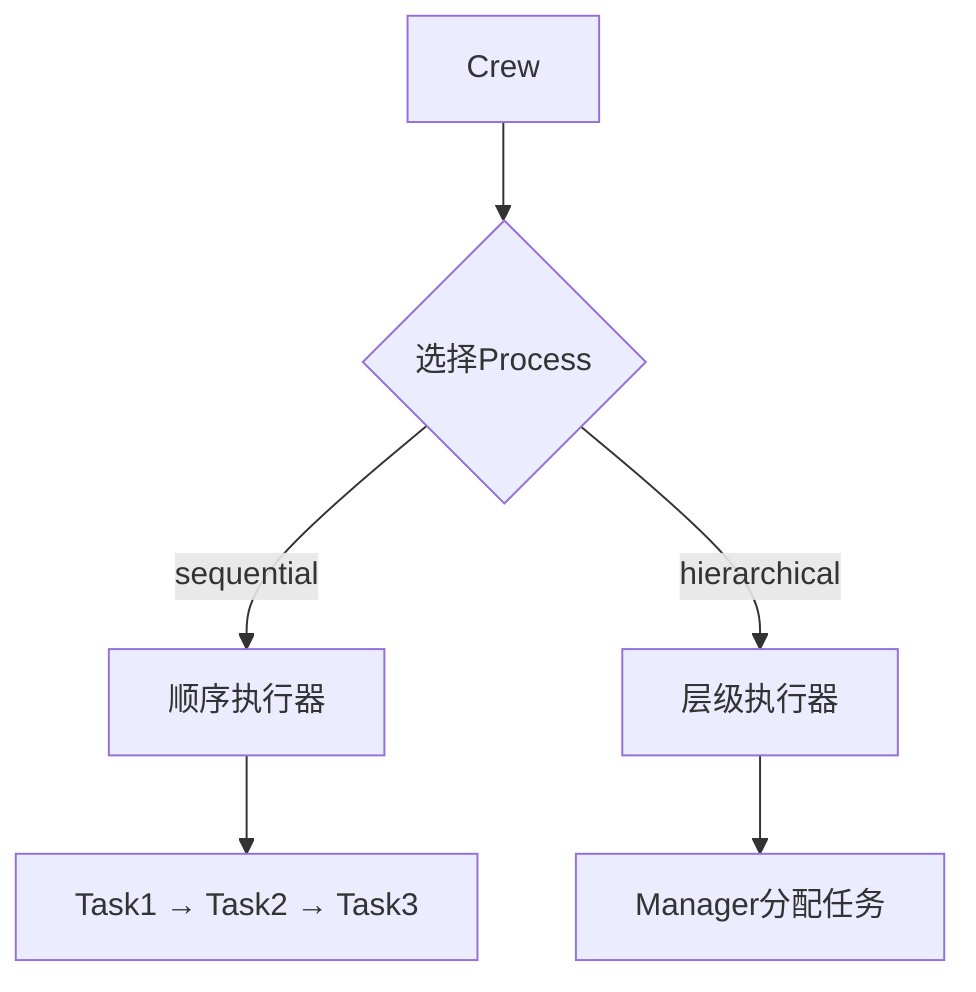
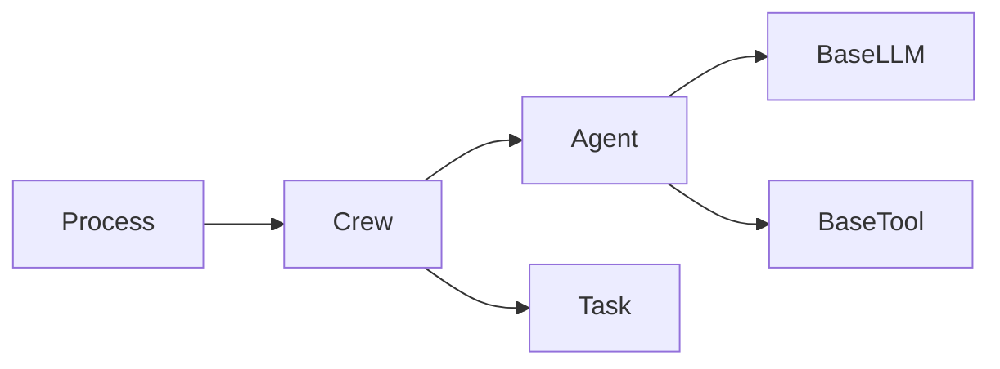
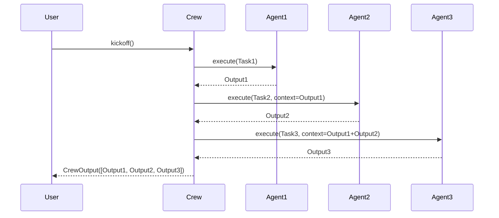
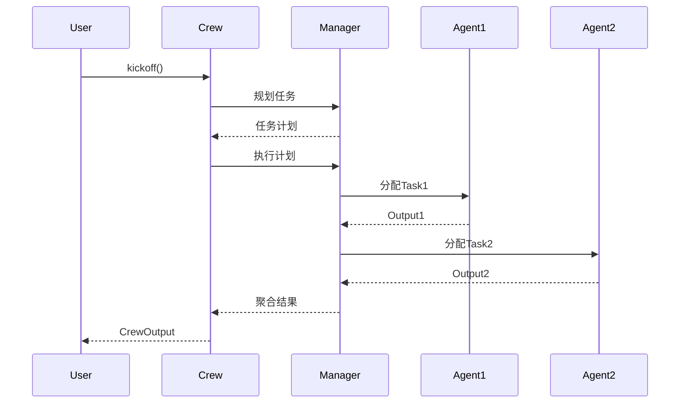
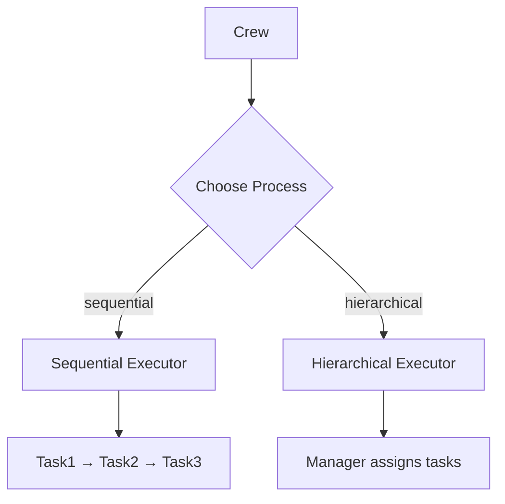
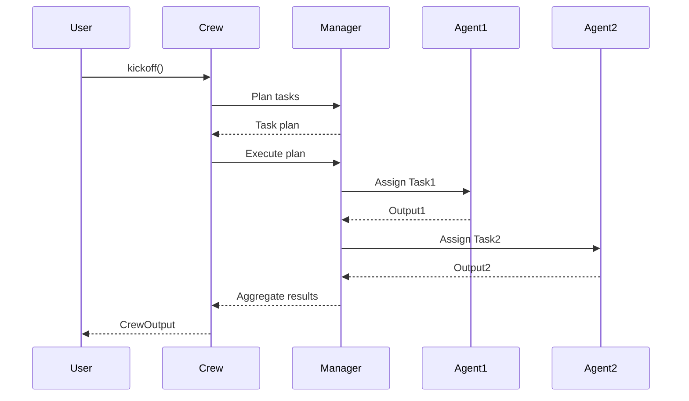

# 📚 模块 1：执行策略的枚举 - `Process`

[本文档包含模块1的完整中英双语教学内容]

## 快速导航
- [🇨🇳 中文版](#中文版)
- [🇬🇧 English Version](#english-version)

---

## 🇨🇳 中文版

### 📊 模块概览

| 属性 | 值 |
|------|-----|
| 文件路径 | `/home/user/crewAI/lib/crewai/src/crewai/process.py` |
| 代码行数 | 11 行 |
| 难度 | ★☆☆☆☆ |
| 预计学习时间 | 5 分钟 |
| 前置模块 | 无 |
| 后续模块 | 模块 2: BaseLLM |

### 🎯 学习目标

完成本模块后，你将能够：
- ✅ 理解策略模式在执行流程中的应用
- ✅ 掌握 Sequential 和 Hierarchical 两种执行模式的区别
- ✅ 理解为什么使用 Enum 而不是字符串常量
- ✅ 认识到简单设计的威力（11行代码的巨大影响）

---

### 一、源码剖析

**完整源码展示：**

```python
from enum import Enum


class Process(str, Enum):
    """
    Class representing the different processes that can be used to tackle tasks
    """

    sequential = "sequential"
    hierarchical = "hierarchical"
    # TODO: consensual = 'consensual'
```

**代码行数统计：**
- 总行数：11 行
- 有效代码：4 行
- 注释：2 行

---

### 二、What（这是什么？）

#### 核心定义

`Process` 是一个**执行策略枚举**，定义了 Crew AI 处理多任务的两种基本模式：

1. **Sequential（顺序执行）：** 任务按照定义的顺序依次执行
2. **Hierarchical（层级执行）：** 由 Manager Agent 协调任务分配和执行

#### 关键特征

**1️⃣ 多重继承：`str` + `Enum`**

```python
class Process(str, Enum):
    # 既是字符串，也是枚举
```

**为什么要这样设计？**

```python
# 好处1：可以直接序列化为字符串
process = Process.sequential
print(process)  # 输出: "sequential"

# 好处2：支持字符串比较
if process == "sequential":  # ✅ 有效

# 好处3：JSON序列化无需特殊处理
import json
config = {"process": Process.sequential}
json.dumps(config)  # ✅ 直接成功
```

**2️⃣ 仅有两种策略（+ 1个TODO）**

```python
sequential = "sequential"       # ✅ 已实现
hierarchical = "hierarchical"   # ✅ 已实现
# consensual = 'consensual'    # ⚠️ 未来扩展
```

---

### 三、Why（为什么这样设计？）

#### 🎨 设计哲学 1：策略模式（Strategy Pattern）



**核心原理：**
- **开闭原则：** 添加新策略无需修改现有代码
- **单一职责：** 每种策略负责一种执行方式
- **依赖倒置：** Crew 依赖抽象的 Process，而不是具体实现

**代码应用示例：**

```python
class Crew:
    def kickoff(self):
        # 根据 Process 选择策略
        if self.process == Process.sequential:
            return self._run_sequential()
        elif self.process == Process.hierarchical:
            return self._run_hierarchical()
```

#### 🎨 设计哲学 2：为什么用 Enum 而不是字符串？

**❌ 如果使用字符串常量：**

```python
# 容易出错
PROCESS_SEQUENTIAL = "sequential"
PROCESS_HIERARCHICAL = "hierachical"  # 拼写错误！

crew = Crew(process="sequental")  # 运行时才会发现错误
```

**✅ 使用 Enum 的优势：**

```python
crew = Crew(process=Process.sequential)  # IDE 自动补全
crew = Crew(process=Process.sequental)   # 编译时报错！

# 类型检查
def create_crew(process: Process):  # 明确的类型约束
    ...
```

**优势总结：**
1. **类型安全：** 编译时捕获错误
2. **IDE 支持：** 自动补全和重构
3. **文档清晰：** 一目了然的可选值
4. **防御性编程：** 防止无效值

#### 🎨 设计哲学 3：简单即美（KISS原则）

**11行代码的威力：**

```python
# 这11行代码影响了整个系统的执行流程
Process.sequential     → 影响 Crew._run_sequential()
                       → 影响任务依赖关系
                       → 影响上下文传递
                       → 影响成本计算

Process.hierarchical   → 需要 Manager Agent
                       → 需要 Function Calling
                       → 需要动态任务分配
                       → 更高的灵活性
```

---

### 四、Context（上下文连接）

#### 🔗 与其他模块的关系



**关键依赖关系：**

1. **Crew 依赖 Process：**
   ```python
   class Crew:
       def __init__(self, agents, tasks, process: Process = Process.sequential):
           self.process = process  # 注入策略
   ```

2. **Hierarchical 依赖 Function Calling：**
   ```python
   if self.process == Process.hierarchical:
       if not self.manager_llm.supports_function_calling():
           raise ValueError("Hierarchical模式需要支持Function Calling的LLM")
   ```

---

### 五、两种策略深度对比

#### 📊 Sequential vs Hierarchical

| 维度 | Sequential | Hierarchical |
|------|-----------|--------------|
| **执行方式** | 按顺序依次执行 | Manager 动态分配 |
| **任务依赖** | 显式定义（context） | Manager 推理决定 |
| **LLM 调用次数** | N（N个任务） | N + M（M次Manager调用） |
| **成本** | 低 | 高（额外的Manager调用） |
| **灵活性** | 低（固定顺序） | 高（动态调整） |
| **适用场景** | 简单流程 | 复杂协作 |
| **前置要求** | 无 | 需要Function Calling |

#### 🔄 Sequential 执行流程

```python
# 示例：市场研究流程
tasks = [
    Task(description="收集数据", agent=researcher),
    Task(description="分析数据", agent=analyst, context=[task1]),
    Task(description="生成报告", agent=writer, context=[task1, task2])
]

crew = Crew(agents=[...], tasks=tasks, process=Process.sequential)
result = crew.kickoff()

# 执行顺序（不可变）：
# Step 1: researcher 执行 task1
# Step 2: analyst 执行 task2（使用 task1 的输出）
# Step 3: writer 执行 task3（使用 task1 + task2 的输出）
```

**时间线：**
```
0s ───> Task1 开始
10s ───> Task1 完成 → Task2 开始
25s ───> Task2 完成 → Task3 开始
40s ───> Task3 完成 ✅
```

#### 🌳 Hierarchical 执行流程

```python
# 同样的任务，但使用层级模式
crew = Crew(
    agents=[researcher, analyst, writer],
    tasks=tasks,
    process=Process.hierarchical,
    manager_llm=OpenAI(model="gpt-4")  # 需要支持Function Calling
)

# 执行顺序（动态）：
# Step 1: Manager 分析任务依赖
# Step 2: Manager 决定先让 researcher 收集数据
# Step 3: Manager 观察结果，决定下一步
# Step 4: Manager 可能让 analyst 和 writer 并行工作
# Step 5: Manager 聚合最终结果
```

**Manager 的推理过程：**
```
Manager Thought:
"我需要先收集数据才能分析，让 researcher 先执行"

Manager Action:
assign_task(task="收集数据", agent="researcher")

Manager Observation:
"数据已收集完成"

Manager Thought:
"现在 analyst 可以分析，writer 可以准备模板，这两个可以并行"

Manager Action:
assign_tasks_parallel([
    {"task": "分析数据", "agent": "analyst"},
    {"task": "准备模板", "agent": "writer"}
])
```

---

### 六、双重编码：执行流程可视化

#### Sequential 可视化



#### Hierarchical 可视化



---

### 七、实战示例

#### 示例 1：简单的顺序执行

```python
from crewai import Crew, Agent, Task, Process

# 创建 Agents
researcher = Agent(role="研究员", goal="收集信息")
writer = Agent(role="作家", goal="撰写文章")

# 创建 Tasks
task1 = Task(description="研究AI趋势", agent=researcher)
task2 = Task(description="撰写博客", agent=writer, context=[task1])

# 使用 Sequential 模式
crew = Crew(
    agents=[researcher, writer],
    tasks=[task1, task2],
    process=Process.sequential  # 默认值
)

result = crew.kickoff()
```

#### 示例 2：复杂的层级执行

```python
# 创建多个专家 Agents
data_scientist = Agent(role="数据科学家", goal="分析数据")
market_analyst = Agent(role="市场分析师", goal="市场洞察")
strategist = Agent(role="战略师", goal="制定策略")
designer = Agent(role="设计师", goal="创建可视化")

# 创建复杂任务
tasks = [
    Task(description="分析用户数据"),
    Task(description="研究市场趋势"),
    Task(description="制定增长策略"),
    Task(description="设计dashboard")
]

# 使用 Hierarchical 模式
crew = Crew(
    agents=[data_scientist, market_analyst, strategist, designer],
    tasks=tasks,
    process=Process.hierarchical,
    manager_llm=OpenAI(model="gpt-4")
)

# Manager 会智能决定：
# - 哪些任务可以并行
# - 哪些任务有依赖关系
# - 如何最优化执行顺序
result = crew.kickoff()
```

---

### 八、深层设计洞察

#### 💡 洞察 1：为什么默认是 Sequential？

```python
class Crew:
    def __init__(self, ..., process: Process = Process.sequential):
        #                                    ^^^^^^^^^^^^^^^^^^^^
        #                                    默认是顺序执行
```

**原因分析：**

1. **成本考虑：** Sequential 的 LLM 调用次数更少
2. **确定性：** 执行顺序可预测，便于调试
3. **简单性：** 不需要额外的 Manager Agent
4. **适用性：** 80% 的场景顺序执行就足够

**成本对比：**
```
假设每个任务需要1次LLM调用

Sequential (3个任务):
- Task1: 1次调用
- Task2: 1次调用
- Task3: 1次调用
总计: 3次调用

Hierarchical (3个任务):
- Manager 规划: 1次调用
- Manager 分配 Task1: 1次调用
- Task1 执行: 1次调用
- Manager 评估: 1次调用
- Manager 分配 Task2: 1次调用
- Task2 执行: 1次调用
- Manager 分配 Task3: 1次调用
- Task3 执行: 1次调用
- Manager 聚合: 1次调用
总计: 9次调用（3倍成本！）
```

#### 💡 洞察 2：未来的 Consensual 模式

```python
# TODO: consensual = 'consensual'
```

**可能的设计方向：**

```python
# Consensual（共识）模式：多个Agent投票决定
class Process(str, Enum):
    sequential = "sequential"
    hierarchical = "hierarchical"
    consensual = "consensual"  # 未来可能添加

# 使用场景：
crew = Crew(
    agents=[expert1, expert2, expert3],
    tasks=[task],
    process=Process.consensual
)

# 执行流程：
# 1. 所有 agents 独立执行任务
# 2. 收集所有结果
# 3. 通过投票/共识算法选择最佳答案
# 4. 返回共识结果
```

**适用场景：**
- 需要多个专家意见的决策
- 提高答案可靠性
- 降低单个 Agent 的错误影响

---

### 九、知识提取挑战

#### 🔥 挑战 1：基础理解

**问题：** 为什么 `Process` 继承自 `str` 和 `Enum` 两个类？

<details>
<summary>💡 参考答案</summary>

**原因：**

1. **继承 `Enum`：** 提供枚举功能，确保只有预定义的值
2. **继承 `str`：** 使枚举值可以直接用作字符串

**好处：**
- JSON 序列化：无需特殊处理
- 字符串比较：`process == "sequential"` 有效
- 向后兼容：可以替换原有的字符串常量

**代码验证：**
```python
p = Process.sequential
print(isinstance(p, str))   # True
print(isinstance(p, Enum))  # True
print(p == "sequential")    # True
```

</details>

---

#### 🔥 挑战 2：设计模式

**问题：** `Process` 枚举体现了哪种设计模式？请用代码示例说明。

<details>
<summary>💡 参考答案</summary>

**答案：策略模式（Strategy Pattern）**

**定义：** 定义一系列算法，将每个算法封装起来，并使它们可以互换。

**代码示例：**

```python
# Process 定义了策略
class Process(str, Enum):
    sequential = "sequential"
    hierarchical = "hierarchical"

# Crew 使用策略
class Crew:
    def kickoff(self):
        # 根据策略选择执行方式
        if self.process == Process.sequential:
            return self._run_sequential()  # 策略A
        elif self.process == Process.hierarchical:
            return self._run_hierarchical()  # 策略B

# 策略可以动态切换
crew1 = Crew(process=Process.sequential)     # 使用策略A
crew2 = Crew(process=Process.hierarchical)   # 使用策略B
```

**UML 类图：**
```
┌─────────────┐
│   Process   │ (策略接口)
├─────────────┤
│ sequential  │
│ hierarchical│
└─────────────┘
       ▲
       │ 使用
       │
┌──────┴──────┐
│    Crew     │ (上下文)
├─────────────┤
│ kickoff()   │
└─────────────┘
```

</details>

---

#### 🔥 挑战 3：深度思考

**问题：** Sequential 和 Hierarchical 模式在什么场景下应该选择哪一个？请给出3个具体例子。

<details>
<summary>💡 参考答案</summary>

**选择 Sequential 的场景：**

1. **数据处理管道**
   ```python
   # 场景：ETL流程
   tasks = [
       Task("从数据库提取数据", agent=extractor),
       Task("清洗和转换数据", agent=transformer),
       Task("加载到数据仓库", agent=loader)
   ]
   # 原因：明确的依赖关系，顺序固定
   ```

2. **内容创作工作流**
   ```python
   # 场景：博客文章创作
   tasks = [
       Task("研究主题", agent=researcher),
       Task("撰写初稿", agent=writer),
       Task("编辑校对", agent=editor)
   ]
   # 原因：线性流程，成本低
   ```

3. **简单的审批流程**
   ```python
   # 场景：文档审批
   tasks = [
       Task("创建文档", agent=creator),
       Task("部门审批", agent=dept_manager),
       Task("最终审批", agent=director)
   ]
   # 原因：固定流程，确定性高
   ```

**选择 Hierarchical 的场景：**

1. **复杂项目规划**
   ```python
   # 场景：软件开发项目
   tasks = [
       Task("需求分析"),
       Task("架构设计"),
       Task("前端开发"),
       Task("后端开发"),
       Task("测试"),
       Task("部署")
   ]
   # 原因：Manager可以决定前后端并行开发
   ```

2. **多专家协作研究**
   ```python
   # 场景：市场研究
   agents = [data_scientist, market_analyst, competitor_analyst, trend_expert]
   tasks = [
       Task("分析市场数据"),
       Task("研究竞争对手"),
       Task("预测趋势"),
       Task("综合报告")
   ]
   # 原因：Manager 可以智能分配任务给合适的专家
   ```

3. **动态问题解决**
   ```python
   # 场景：客户支持
   agents = [tech_support, billing_expert, product_specialist]
   tasks = [
       Task("分析客户问题"),
       Task("查找解决方案"),
       Task("提供答复")
   ]
   # 原因：根据问题类型动态选择专家
   ```

**决策矩阵：**
```
使用 Sequential 如果：
✓ 任务依赖关系明确且固定
✓ 成本敏感
✓ 需要确定性执行顺序
✓ 任务数量较少（<5个）

使用 Hierarchical 如果：
✓ 需要动态任务分配
✓ 有并行执行的机会
✓ 任务复杂度高
✓ 需要智能决策
✓ 有合适的LLM支持Function Calling
```

</details>

---

### 十、与下一模块的桥接

**你已经掌握了：**
- ✅ Process 定义了执行策略
- ✅ Sequential vs Hierarchical 的区别
- ✅ 策略模式的应用

**下一模块（BaseLLM）你将学习：**
- ❓ Hierarchical 模式如何依赖 Function Calling？
- ❓ LLM 如何被抽象成统一接口？
- ❓ 事件驱动架构如何追踪执行状态？

**连接问题：**
> "Hierarchical 模式需要 LLM 支持 Function Calling，但不同的 LLM 提供商（OpenAI、Claude、本地模型）API 都不同。Crew AI 如何统一这些差异？"

👉 **答案在模块 2 中揭晓！**

---

## 🇬🇧 English Version

### 📊 Module Overview

| Attribute | Value |
|-----------|-------|
| File Path | `/home/user/crewAI/lib/crewai/src/crewai/process.py` |
| Lines of Code | 11 lines |
| Difficulty | ★☆☆☆☆ |
| Estimated Learning Time | 5 minutes |
| Prerequisites | None |
| Next Module | Module 2: BaseLLM |

### 🎯 Learning Objectives

After completing this module, you will be able to:
- ✅ Understand the application of Strategy Pattern in execution flow
- ✅ Master the differences between Sequential and Hierarchical execution modes
- ✅ Understand why Enum is used instead of string constants
- ✅ Recognize the power of simple design (huge impact from 11 lines of code)

---

### I. Source Code Analysis

**Complete Source Code:**

```python
from enum import Enum


class Process(str, Enum):
    """
    Class representing the different processes that can be used to tackle tasks
    """

    sequential = "sequential"
    hierarchical = "hierarchical"
    # TODO: consensual = 'consensual'
```

**Line Count Statistics:**
- Total lines: 11
- Effective code: 4 lines
- Comments: 2 lines

---

### II. What (What is this?)

#### Core Definition

`Process` is an **execution strategy enumeration** that defines two basic modes for Crew AI to handle multiple tasks:

1. **Sequential:** Tasks execute in the defined order, one after another
2. **Hierarchical:** A Manager Agent coordinates task allocation and execution

#### Key Characteristics

**1️⃣ Multiple Inheritance: `str` + `Enum`**

```python
class Process(str, Enum):
    # Both a string and an enum
```

**Why this design?**

```python
# Benefit 1: Can be directly serialized as string
process = Process.sequential
print(process)  # Output: "sequential"

# Benefit 2: Supports string comparison
if process == "sequential":  # ✅ Valid

# Benefit 3: JSON serialization without special handling
import json
config = {"process": Process.sequential}
json.dumps(config)  # ✅ Works directly
```

**2️⃣ Only Two Strategies (+ 1 TODO)**

```python
sequential = "sequential"       # ✅ Implemented
hierarchical = "hierarchical"   # ✅ Implemented
# consensual = 'consensual'    # ⚠️ Future extension
```

---

### III. Why (Why this design?)

#### 🎨 Design Philosophy 1: Strategy Pattern



**Core Principle:**
- **Open-Closed Principle:** Add new strategies without modifying existing code
- **Single Responsibility:** Each strategy handles one execution method
- **Dependency Inversion:** Crew depends on abstract Process, not concrete implementation

**Code Application Example:**

```python
class Crew:
    def kickoff(self):
        # Choose strategy based on Process
        if self.process == Process.sequential:
            return self._run_sequential()
        elif self.process == Process.hierarchical:
            return self._run_hierarchical()
```

#### 🎨 Design Philosophy 2: Why Enum instead of Strings?

**❌ If using string constants:**

```python
# Error-prone
PROCESS_SEQUENTIAL = "sequential"
PROCESS_HIERARCHICAL = "hierachical"  # Typo!

crew = Crew(process="sequental")  # Runtime error only
```

**✅ Advantages of Enum:**

```python
crew = Crew(process=Process.sequential)  # IDE autocomplete
crew = Crew(process=Process.sequental)   # Compile-time error!

# Type checking
def create_crew(process: Process):  # Explicit type constraint
    ...
```

**Summary of Advantages:**
1. **Type Safety:** Catch errors at compile time
2. **IDE Support:** Autocomplete and refactoring
3. **Clear Documentation:** Available values at a glance
4. **Defensive Programming:** Prevent invalid values

#### 🎨 Design Philosophy 3: Simplicity is Beauty (KISS Principle)

**The Power of 11 Lines:**

```python
# These 11 lines affect the entire system's execution flow
Process.sequential     → Affects Crew._run_sequential()
                       → Affects task dependencies
                       → Affects context passing
                       → Affects cost calculation

Process.hierarchical   → Requires Manager Agent
                       → Requires Function Calling
                       → Requires dynamic task allocation
                       → Higher flexibility
```

---

### IV. Context (Contextual Connections)

#### 🔗 Relationships with Other Modules


**Key Dependencies:**

1. **Crew depends on Process:**
   ```python
   class Crew:
       def __init__(self, agents, tasks, process: Process = Process.sequential):
           self.process = process  # Strategy injection
   ```

2. **Hierarchical depends on Function Calling:**
   ```python
   if self.process == Process.hierarchical:
       if not self.manager_llm.supports_function_calling():
           raise ValueError("Hierarchical mode requires LLM with Function Calling support")
   ```

---

### V. In-Depth Comparison of Two Strategies

#### 📊 Sequential vs Hierarchical

| Dimension | Sequential | Hierarchical |
|-----------|-----------|--------------|
| **Execution Method** | Execute in order | Manager dynamically assigns |
| **Task Dependencies** | Explicitly defined (context) | Manager infers decisions |
| **LLM Calls** | N (N tasks) | N + M (M Manager calls) |
| **Cost** | Low | High (extra Manager calls) |
| **Flexibility** | Low (fixed order) | High (dynamic adjustment) |
| **Use Cases** | Simple workflows | Complex collaboration |
| **Prerequisites** | None | Requires Function Calling |

#### 🔄 Sequential Execution Flow

```python
# Example: Market Research Workflow
tasks = [
    Task(description="Collect data", agent=researcher),
    Task(description="Analyze data", agent=analyst, context=[task1]),
    Task(description="Generate report", agent=writer, context=[task1, task2])
]

crew = Crew(agents=[...], tasks=tasks, process=Process.sequential)
result = crew.kickoff()

# Execution Order (immutable):
# Step 1: researcher executes task1
# Step 2: analyst executes task2 (uses task1 output)
# Step 3: writer executes task3 (uses task1 + task2 outputs)
```

**Timeline:**
```
0s ───> Task1 starts
10s ───> Task1 completes → Task2 starts
25s ───> Task2 completes → Task3 starts
40s ───> Task3 completes ✅
```

#### 🌳 Hierarchical Execution Flow

```python
# Same tasks, but using hierarchical mode
crew = Crew(
    agents=[researcher, analyst, writer],
    tasks=tasks,
    process=Process.hierarchical,
    manager_llm=OpenAI(model="gpt-4")  # Requires Function Calling support
)

# Execution Order (dynamic):
# Step 1: Manager analyzes task dependencies
# Step 2: Manager decides to let researcher collect data first
# Step 3: Manager observes results, decides next step
# Step 4: Manager may let analyst and writer work in parallel
# Step 5: Manager aggregates final results
```

**Manager's Reasoning Process:**
```
Manager Thought:
"I need to collect data before analysis, let researcher go first"

Manager Action:
assign_task(task="Collect data", agent="researcher")

Manager Observation:
"Data collection completed"

Manager Thought:
"Now analyst can analyze and writer can prepare template, these can run in parallel"

Manager Action:
assign_tasks_parallel([
    {"task": "Analyze data", "agent": "analyst"},
    {"task": "Prepare template", "agent": "writer"}
])
```

---

### VI. Dual Coding: Execution Flow Visualization

#### Sequential Visualization


#### Hierarchical Visualization



---

### VII. Practical Examples

#### Example 1: Simple Sequential Execution

```python
from crewai import Crew, Agent, Task, Process

# Create Agents
researcher = Agent(role="Researcher", goal="Collect information")
writer = Agent(role="Writer", goal="Write articles")

# Create Tasks
task1 = Task(description="Research AI trends", agent=researcher)
task2 = Task(description="Write blog post", agent=writer, context=[task1])

# Use Sequential mode
crew = Crew(
    agents=[researcher, writer],
    tasks=[task1, task2],
    process=Process.sequential  # Default value
)

result = crew.kickoff()
```

#### Example 2: Complex Hierarchical Execution

```python
# Create multiple expert Agents
data_scientist = Agent(role="Data Scientist", goal="Analyze data")
market_analyst = Agent(role="Market Analyst", goal="Market insights")
strategist = Agent(role="Strategist", goal="Formulate strategy")
designer = Agent(role="Designer", goal="Create visualizations")

# Create complex tasks
tasks = [
    Task(description="Analyze user data"),
    Task(description="Research market trends"),
    Task(description="Develop growth strategy"),
    Task(description="Design dashboard")
]

# Use Hierarchical mode
crew = Crew(
    agents=[data_scientist, market_analyst, strategist, designer],
    tasks=tasks,
    process=Process.hierarchical,
    manager_llm=OpenAI(model="gpt-4")
)

# Manager will intelligently decide:
# - Which tasks can run in parallel
# - Which tasks have dependencies
# - How to optimize execution order
result = crew.kickoff()
```

---

### VIII. Deep Design Insights

#### 💡 Insight 1: Why Sequential as Default?

```python
class Crew:
    def __init__(self, ..., process: Process = Process.sequential):
        #                                    ^^^^^^^^^^^^^^^^^^^^
        #                                    Default is sequential
```

**Reasoning:**

1. **Cost Consideration:** Sequential requires fewer LLM calls
2. **Determinism:** Execution order is predictable, easier to debug
3. **Simplicity:** No need for extra Manager Agent
4. **Applicability:** Sequential is sufficient for 80% of scenarios

**Cost Comparison:**
```
Assume each task requires 1 LLM call

Sequential (3 tasks):
- Task1: 1 call
- Task2: 1 call
- Task3: 1 call
Total: 3 calls

Hierarchical (3 tasks):
- Manager planning: 1 call
- Manager assign Task1: 1 call
- Task1 execution: 1 call
- Manager evaluation: 1 call
- Manager assign Task2: 1 call
- Task2 execution: 1 call
- Manager assign Task3: 1 call
- Task3 execution: 1 call
- Manager aggregation: 1 call
Total: 9 calls (3x cost!)
```

#### 💡 Insight 2: Future Consensual Mode

```python
# TODO: consensual = 'consensual'
```

**Possible Design Direction:**

```python
# Consensual mode: Multiple agents vote on decisions
class Process(str, Enum):
    sequential = "sequential"
    hierarchical = "hierarchical"
    consensual = "consensual"  # May be added in future

# Use case:
crew = Crew(
    agents=[expert1, expert2, expert3],
    tasks=[task],
    process=Process.consensual
)

# Execution flow:
# 1. All agents execute task independently
# 2. Collect all results
# 3. Use voting/consensus algorithm to select best answer
# 4. Return consensus result
```

**Applicable Scenarios:**
- Decisions requiring multiple expert opinions
- Improving answer reliability
- Reducing impact of single agent errors

---

### IX. Knowledge Extraction Challenge

#### 🔥 Challenge 1: Basic Understanding

**Question:** Why does `Process` inherit from both `str` and `Enum`?

<details>
<summary>💡 Reference Answer</summary>

**Reasons:**

1. **Inherit `Enum`:** Provides enumeration functionality, ensures only predefined values
2. **Inherit `str`:** Makes enum values directly usable as strings

**Benefits:**
- JSON serialization: No special handling needed
- String comparison: `process == "sequential"` works
- Backward compatibility: Can replace existing string constants

**Code Verification:**
```python
p = Process.sequential
print(isinstance(p, str))   # True
print(isinstance(p, Enum))  # True
print(p == "sequential")    # True
```

</details>

---

#### 🔥 Challenge 2: Design Pattern

**Question:** What design pattern does the `Process` enum embody? Illustrate with code example.

<details>
<summary>💡 Reference Answer</summary>

**Answer: Strategy Pattern**

**Definition:** Define a family of algorithms, encapsulate each one, and make them interchangeable.

**Code Example:**

```python
# Process defines strategies
class Process(str, Enum):
    sequential = "sequential"
    hierarchical = "hierarchical"

# Crew uses strategies
class Crew:
    def kickoff(self):
        # Choose execution method based on strategy
        if self.process == Process.sequential:
            return self._run_sequential()  # Strategy A
        elif self.process == Process.hierarchical:
            return self._run_hierarchical()  # Strategy B

# Strategies can be switched dynamically
crew1 = Crew(process=Process.sequential)     # Use Strategy A
crew2 = Crew(process=Process.hierarchical)   # Use Strategy B
```

**UML Class Diagram:**
```
┌─────────────┐
│   Process   │ (Strategy Interface)
├─────────────┤
│ sequential  │
│ hierarchical│
└─────────────┘
       ▲
       │ uses
       │
┌──────┴──────┐
│    Crew     │ (Context)
├─────────────┤
│ kickoff()   │
└─────────────┘
```

</details>

---

#### 🔥 Challenge 3: Deep Thinking

**Question:** In what scenarios should you choose Sequential vs Hierarchical mode? Provide 3 specific examples each.

<details>
<summary>💡 Reference Answer</summary>

**Scenarios for Sequential:**

1. **Data Processing Pipeline**
   ```python
   # Scenario: ETL workflow
   tasks = [
       Task("Extract data from database", agent=extractor),
       Task("Clean and transform data", agent=transformer),
       Task("Load into data warehouse", agent=loader)
   ]
   # Reason: Clear dependencies, fixed order
   ```

2. **Content Creation Workflow**
   ```python
   # Scenario: Blog post creation
   tasks = [
       Task("Research topic", agent=researcher),
       Task("Write first draft", agent=writer),
       Task("Edit and proofread", agent=editor)
   ]
   # Reason: Linear flow, low cost
   ```

3. **Simple Approval Process**
   ```python
   # Scenario: Document approval
   tasks = [
       Task("Create document", agent=creator),
       Task("Department approval", agent=dept_manager),
       Task("Final approval", agent=director)
   ]
   # Reason: Fixed process, high determinism
   ```

**Scenarios for Hierarchical:**

1. **Complex Project Planning**
   ```python
   # Scenario: Software development project
   tasks = [
       Task("Requirements analysis"),
       Task("Architecture design"),
       Task("Frontend development"),
       Task("Backend development"),
       Task("Testing"),
       Task("Deployment")
   ]
   # Reason: Manager can decide to parallelize frontend and backend
   ```

2. **Multi-Expert Collaborative Research**
   ```python
   # Scenario: Market research
   agents = [data_scientist, market_analyst, competitor_analyst, trend_expert]
   tasks = [
       Task("Analyze market data"),
       Task("Research competitors"),
       Task("Predict trends"),
       Task("Comprehensive report")
   ]
   # Reason: Manager can intelligently assign tasks to appropriate experts
   ```

3. **Dynamic Problem Solving**
   ```python
   # Scenario: Customer support
   agents = [tech_support, billing_expert, product_specialist]
   tasks = [
       Task("Analyze customer issue"),
       Task("Find solution"),
       Task("Provide response")
   ]
   # Reason: Dynamically select expert based on issue type
   ```

**Decision Matrix:**
```
Use Sequential if:
✓ Task dependencies are clear and fixed
✓ Cost-sensitive
✓ Need deterministic execution order
✓ Few tasks (<5)

Use Hierarchical if:
✓ Need dynamic task allocation
✓ Opportunities for parallel execution
✓ High task complexity
✓ Need intelligent decision-making
✓ Have suitable LLM with Function Calling support
```

</details>

---

### X. Bridge to Next Module

**You've mastered:**
- ✅ Process defines execution strategies
- ✅ Differences between Sequential and Hierarchical
- ✅ Application of Strategy Pattern

**In the next module (BaseLLM) you'll learn:**
- ❓ How does Hierarchical mode depend on Function Calling?
- ❓ How is LLM abstracted into a unified interface?
- ❓ How does event-driven architecture track execution status?

**Connecting Question:**
> "Hierarchical mode requires LLM to support Function Calling, but different LLM providers (OpenAI, Claude, local models) have different APIs. How does Crew AI unify these differences?"

👉 **Answer revealed in Module 2!**

---

## 📊 Module Completion Checklist

- [ ] Understand the role of `args_schema`
- [ ] Master the use of `@tool` decorator
- [ ] Understand the relationship between tools and Function Calling
- [ ] Recognize the Strategy Pattern in action
- [ ] Distinguish Sequential from Hierarchical execution
- [ ] Make informed decisions on which mode to use

---

**📁 Document Path:** `/home/user/crewAI/docs/Module_01_Process.md`
