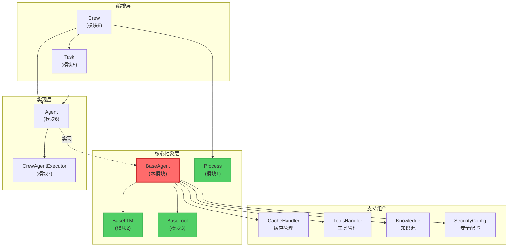

# 📘 模块 4：BaseAgent - Agent的抽象契约（深度剖析）

> **认知目标：** 理解 Crew AI 如何通过抽象基类定义Agent的"契约"，掌握复杂的验证器链、元类编程，以及为什么这个设计是多Agent系统的核心支柱。

---

## 🎯 一、文件概览与定位

**文件路径：** `/home/user/crewAI/lib/crewai/src/crewai/agents/agent_builder/base_agent.py`
**代码量：** 465 行
**难度：** ★★★★☆ (高级)
**预计学习时间：** 60-75 分钟

### 为什么这个文件如此重要？

在前面的模块中，我们学习了：
- **模块1 (Process):** Crew的执行策略（Sequential vs Hierarchical）
- **模块2 (BaseLLM):** LLM的抽象契约，定义了如何与语言模型交互
- **模块3 (BaseTool):** 工具的抽象契约，定义了Agent可以使用的能力

现在，**BaseAgent** 是将这些"能力"（LLM + Tools）与"意图"（role, goal, backstory）结合在一起的**核心抽象**。

**类比：**
- `BaseLLM` 是"大脑"
- `BaseTool` 是"手脚"
- `BaseAgent` 是"完整的人格"，它定义了：
  - 这个Agent是谁？（role）
  - 它想要什么？（goal）
  - 它的背景故事是什么？（backstory）
  - 它能做什么？（tools, llm）
  - 它如何执行任务？（execute_task - 抽象方法）

---

## 🔍 二、导入依赖分析：这个文件依赖什么？

### 核心依赖（Lines 1-36）

```python
from abc import ABC, abstractmethod  # Python的抽象基类机制
from pydantic import BaseModel, Field, PrivateAttr  # 数据验证框架
from crewai.llms.base_llm import BaseLLM  # 模块2学过的LLM抽象
from crewai.tools.base_tool import BaseTool  # 模块3学过的工具抽象
from crewai.agent.internal.meta import AgentMeta  # 元类（高级特性）
```

### 🤔 设计哲学：为什么这样依赖？

1. **ABC (Abstract Base Class):** Python的标准抽象机制
   - `@abstractmethod` 装饰器强制子类实现特定方法
   - 如果子类没有实现 `execute_task`，Python会在实例化时抛出 `TypeError`

2. **Pydantic BaseModel:** 不仅仅是"数据验证"
   - **自动类型检查**：确保 `role` 是 `str`，`max_iter` 是 `int`
   - **自定义验证器**：`@field_validator` 可以执行复杂逻辑
   - **序列化/反序列化**：轻松转换为 JSON（对于分布式系统很重要）
   - **不可变性**：`frozen=True` 的字段（如 `id`）创建后不可更改

3. **AgentMeta (元类):** 这是高级Python特性
   - 元类控制**类的创建过程**（不是实例的创建）
   - 在 `BaseAgent` 中，`AgentMeta` 可以在类定义时注入额外逻辑
   - **为什么需要它？** 可能用于注册Agent类型、自动添加方法、或实现插件系统

### 依赖图谱

```
BaseAgent (本文件)
├── 继承自
│   ├── ABC (抽象基类)
│   └── BaseModel (Pydantic数据验证)
├── 使用元类
│   └── AgentMeta (控制类创建)
├── 组合依赖
│   ├── BaseLLM (模块2) - "大脑"
│   ├── BaseTool (模块3) - "工具"
│   ├── CacheHandler - 缓存管理
│   ├── ToolsHandler - 工具管理
│   ├── Knowledge - 知识源
│   └── SecurityConfig - 安全配置
└── 被依赖于
    ├── Agent (src/crewai/agent/core.py) - BaseAgent的具体实现
    └── Crew (src/crewai/crew.py) - 编排多个Agent
```

---

## 🏗️ 三、BaseAgent类的"骨架"：核心架构

### 类定义（Line 61）

```python
class BaseAgent(BaseModel, ABC, metaclass=AgentMeta):
    """Abstract Base Class for all third party agents compatible with CrewAI."""
```

### 🔑 关键设计决策解析

#### 1️⃣ 多重继承：`BaseModel + ABC`

**为什么同时继承两个基类？**

```python
# BaseModel (Pydantic) 提供：
- 数据验证（所有字段必须符合类型）
- 序列化/反序列化（.model_dump(), .model_validate()）
- 字段描述和文档

# ABC (抽象基类) 提供：
- 强制子类实现抽象方法
- 类型检查（isinstance(agent, BaseAgent)）
```

**这是"组合模式"的体现：**
- Pydantic处理"数据层"
- ABC处理"行为层"

#### 2️⃣ 元类：`metaclass=AgentMeta`

```python
# 元类在"类被定义时"运行，不是"实例被创建时"
# 示例：
class MyAgent(BaseAgent):
    pass  # 当这行代码执行时，AgentMeta已经介入

# AgentMeta可以做什么？
# 1. 自动注册所有Agent子类到全局注册表
# 2. 验证类定义是否符合规范
# 3. 自动添加类级别的属性或方法
```

**🤔 为什么不用普通的装饰器？**
- 元类在类定义时执行，装饰器在类定义后执行
- 元类可以修改类的MRO（方法解析顺序）
- 元类可以拦截类的属性访问

---

## 📦 四、核心字段深度剖析（"这个Agent是谁？"）

### 1️⃣ 身份三要素（Lines 120-122）

```python
role: str = Field(description="Role of the agent")
goal: str = Field(description="Objective of the agent")
backstory: str = Field(description="Backstory of the agent")
```

**🤔 为什么这三个字段是必需的？**

在多Agent系统中，每个Agent需要**明确的身份**：

```python
# 示例：一个数据分析团队
researcher = Agent(
    role="数据科学家",           # 定义"我是谁"
    goal="找出销售下降的根本原因",  # 定义"我要做什么"
    backstory="拥有10年数据分析经验..."  # 定义"为什么我能做"
)

# 这三个字段会被：
# 1. 插值到LLM的系统提示中
# 2. 用于生成Agent的唯一key（见Line 333-339）
# 3. 用于调试和日志记录
```

### 2️⃣ 唯一标识符（Line 119）

```python
id: UUID4 = Field(default_factory=uuid.uuid4, frozen=True)
```

**深度解析：**

```python
# 1. default_factory=uuid.uuid4
#    每次创建Agent时，自动生成唯一ID
#    注意：这是一个函数引用，不是函数调用

# 2. frozen=True
#    ID创建后不可更改！

# 3. 为什么还需要额外的验证器？（见Line 312-318）
@field_validator("id", mode="before")
@classmethod
def _deny_user_set_id(cls, v: UUID4 | None) -> None:
    if v:
        raise PydanticCustomError(
            "may_not_set_field",
            "This field is not to be set by the user.", {}
        )
```

**🤔 为什么既有 `frozen=True` 又有验证器？**

```python
# frozen=True: 防止"创建后"修改
agent.id = "new-id"  # ❌ 抛出错误

# 验证器: 防止"创建时"设置
agent = Agent(id="custom-id", ...)  # ❌ 抛出错误

# 设计意图：ID必须由系统生成，用户无权干预
```

### 3️⃣ "大脑"和"工具箱"（Lines 140-151）

```python
tools: list[BaseTool] | None = Field(
    default_factory=list,
    description="Tools at agents' disposal"
)
llm: Any = Field(
    default=None,
    description="Language model that will run the agent."
)
```

**🔍 设计哲学：依赖注入模式**

```python
# BaseAgent不关心"具体是哪个LLM"或"具体是哪些工具"
# 它只定义接口：
agent = Agent(
    llm=OpenAIGPT4(),      # 可以是OpenAI
    # 或
    llm=ClaudeSonnet(),    # 可以是Claude
    tools=[SearchTool(), CalculatorTool()]  # 任何BaseTool子类
)

# 好处：
# 1. 可测试性：可以注入MockLLM进行单元测试
# 2. 灵活性：运行时切换LLM提供商
# 3. 解耦：Agent不依赖具体的LLM实现
```

### 4️⃣ 执行控制参数（Lines 132-145）

```python
max_rpm: int | None = Field(
    default=None,
    description="Maximum requests per minute..."
)
max_iter: int = Field(
    default=25,
    description="Maximum iterations for an agent to execute a task"
)
allow_delegation: bool = Field(
    default=False,
    description="Enable agent to delegate and ask questions..."
)
```

**🤔 为什么需要 `max_iter`？防止Agent陷入无限循环**

```python
# Agent执行任务的典型流程（ReAct循环）：
# 1. Thought: 我需要搜索数据
# 2. Action: 使用SearchTool
# 3. Observation: 找到了结果
# 4. Thought: 现在我需要分析...
# ...重复直到任务完成

# 如果没有max_iter：
# - LLM可能陷入循环（一直重复相同的Action）
# - 成本失控（每次循环都调用LLM）

# max_iter=25 是一个经验值：
# - 足够完成复杂任务
# - 不会导致无限循环
```

**🤔 为什么 `allow_delegation` 默认是 `False`？**

```python
# Delegation（委托）意味着：
agent1.ask_question(agent2, "数据在哪？")

# 风险：
# 1. 复杂性：需要额外的协调机制
# 2. 成本：每次委托都是额外的LLM调用
# 3. 循环风险：A问B，B问C，C问A...

# 因此默认禁用，只在需要时启用（如Hierarchical模式）
```

### 5️⃣ 私有属性（Lines 112-118）

```python
_logger: Logger = PrivateAttr(default_factory=lambda: Logger(verbose=False))
_rpm_controller: RPMController | None = PrivateAttr(default=None)
_original_role: str | None = PrivateAttr(default=None)
```

**🔍 `PrivateAttr` vs 普通字段？**

```python
# 普通字段（公共）：
role: str = Field(...)
# - 会被序列化到JSON
# - 会被Pydantic验证
# - 可以在 __init__ 中设置

# 私有属性：
_logger: Logger = PrivateAttr(...)
# - 不会被序列化
# - 不参与Pydantic验证
# - 通常在运行时动态设置

# 为什么保存 _original_role？
# 因为 role 可能会被 interpolate_inputs() 动态替换：
agent.role = "数据科学家-{project_name}"
agent.interpolate_inputs({"project_name": "销售分析"})
# agent.role 现在是 "数据科学家-销售分析"
# agent._original_role 仍是 "数据科学家-{project_name}"
```

---

## ⚙️ 五、验证器链：Pydantic的"守门人"机制

### 1️⃣ 模型级别的配置处理器（Lines 203-206）

```python
@model_validator(mode="before")
@classmethod
def process_model_config(cls, values: Any) -> dict[str, Any]:
    return process_config(values, cls)
```

**🤔 `mode="before"` 是什么意思？**

```python
# Pydantic的验证流程：
#
# 用户输入原始数据
#     ↓
# mode="before" 验证器 ← 这里！在类型转换之前
#     ↓
# 类型转换和解析
#     ↓
# mode="after" 验证器
#     ↓
# 最终的验证实例

# process_config 的作用：
# 允许从YAML/JSON配置文件加载Agent配置
agent = Agent(config={"role": "...", "goal": "..."})
# process_config 会展开config字典到各个字段
```

### 2️⃣ 工具验证器（Lines 208-235）

```python
@field_validator("tools")
@classmethod
def validate_tools(cls, tools: list[Any]) -> list[BaseTool]:
    if not tools:
        return []

    processed_tools = []
    required_attrs = ["name", "func", "description"]
    for tool in tools:
        if isinstance(tool, BaseTool):
            processed_tools.append(tool)
        elif all(hasattr(tool, attr) for attr in required_attrs):
            # LangChain工具兼容！
            processed_tools.append(Tool.from_langchain(tool))
        else:
            raise ValueError(f"Invalid tool type: {type(tool)}")
    return processed_tools
```

**🔍 深度解析：为什么这个验证器如此重要？**

```python
# 场景1：用户传入CrewAI原生工具
from crewai.tools import SearchTool
agent = Agent(tools=[SearchTool()])  # ✅ 直接通过

# 场景2：用户传入LangChain工具（跨框架兼容！）
from langchain.tools import DuckDuckGoSearchRun
agent = Agent(tools=[DuckDuckGoSearchRun()])  # ✅ 自动转换

# 场景3：用户传入无效对象
agent = Agent(tools=["invalid"])  # ❌ 抛出清晰的错误

# 这体现了"防御性编程"和"友好的错误消息"
```

**🤔 为什么需要 `Tool.from_langchain()` 转换器？**

```python
# LangChain和CrewAI的工具接口略有不同：
#
# LangChain工具：
class LangChainTool:
    name: str
    func: Callable
    description: str
    # 没有 args_schema（可能）

# CrewAI工具（BaseTool）：
class BaseTool(ABC):
    name: str
    description: str
    args_schema: Type[BaseModel]  # Pydantic schema
    def _run(self, **kwargs): ...

# Tool.from_langchain 负责：
# 1. 映射字段名
# 2. 自动生成args_schema（如果缺失）
# 3. 包装func为_run方法
```

### 3️⃣ 平台应用验证器（Lines 237-253）

```python
@field_validator("apps")
@classmethod
def validate_apps(
    cls, apps: list[PlatformAppOrAction] | None
) -> list[PlatformAppOrAction] | None:
    if not apps:
        return apps

    validated_apps = []
    for app in apps:
        if app.count("/") > 1:
            raise ValueError(
                f"Invalid app format '{app}'. "
                "Apps can only have one '/' for app/action format"
            )
        validated_apps.append(app)

    return list(set(validated_apps))  # 去重
```

**🔍 这个验证器保护什么？**

```python
# 合法格式：
apps = ["gmail", "slack", "gmail/send_email"]
# ✅ 应用名 或 应用/动作

# 非法格式：
apps = ["gmail/send/email"]
# ❌ 超过一个斜杠

# 为什么需要去重？（Line 253）
apps = ["gmail", "gmail", "slack"]
# 自动去重为 ["gmail", "slack"]
# 避免重复初始化相同的集成
```

### 4️⃣ 模型后验证器（Lines 288-310）

```python
@model_validator(mode="after")
def validate_and_set_attributes(self) -> Self:
    # 验证必需字段
    for field in ["role", "goal", "backstory"]:
        if getattr(self, field) is None:
            raise ValueError(
                f"{field} must be provided either directly or through config"
            )

    # 设置私有属性
    self._logger = Logger(verbose=self.verbose)
    if self.max_rpm and not self._rpm_controller:
        self._rpm_controller = RPMController(max_rpm=self.max_rpm, ...)

    return self
```

**🤔 为什么在 `mode="after"` 而不是 `mode="before"`？**

```python
# mode="after" 在所有字段验证完成后执行
# 此时可以安全地访问所有字段（self.verbose, self.max_rpm）

# 如果在 mode="before"：
# - self.verbose 可能还不存在
# - 无法创建依赖其他字段的对象（如Logger）
```

---

## 🎭 六、抽象方法：子类必须实现的"契约"

### 1️⃣ 核心执行方法（Lines 341-348）

```python
@abstractmethod
def execute_task(
    self,
    task: Any,
    context: str | None = None,
    tools: list[BaseTool] | None = None,
) -> str:
    pass
```

**🔍 深度解析：为什么这是抽象方法？**

```python
# BaseAgent不知道"如何"执行任务，只定义"接口"

# 不同的实现可能：
# 1. 使用ReAct循环（Reasoning + Acting）
# 2. 使用Chain-of-Thought
# 3. 使用Plan-and-Execute
# 4. 直接调用LLM（无工具）

# 子类示例：
class CrewAIAgent(BaseAgent):
    def execute_task(self, task, context, tools):
        # 1. 创建系统提示（包含role, goal, backstory）
        # 2. 启动ReAct循环
        # 3. 使用CrewAgentExecutor
        # 4. 返回最终结果
        ...
```

**🤔 为什么参数是 `task: Any` 而不是 `task: Task`？**

```python
# 这是"接口隔离原则"（ISP）的体现
# BaseAgent不想依赖具体的Task类

# 好处：
# 1. 避免循环依赖（Task也依赖BaseAgent）
# 2. 允许第三方框架使用自己的Task类型
# 3. 保持BaseAgent的通用性

# 缺点：
# - 失去了类型检查
# - 需要在运行时验证task对象
```

### 2️⃣ 执行器创建方法（Lines 350-352）

```python
@abstractmethod
def create_agent_executor(self, tools: list[BaseTool] | None = None) -> None:
    pass
```

**🔍 为什么需要单独的"创建执行器"方法？**

```python
# Agent的执行器（executor）可能需要在不同时机创建：

# 时机1：初始化时
agent = Agent(...)
agent.create_agent_executor()  # 使用默认工具

# 时机2：工具更新后
agent.tools.append(NewTool())
agent.create_agent_executor(agent.tools)  # 重新创建

# 时机3：缓存配置后（见Line 451）
agent.set_cache_handler(cache)
agent.create_agent_executor()  # 启用缓存的执行器

# 这是"工厂方法模式"的应用
```

### 3️⃣ 委托工具获取（Lines 354-356）

```python
@abstractmethod
def get_delegation_tools(self, agents: list[BaseAgent]) -> list[BaseTool]:
    """Set the task tools that init BaseAgenTools class."""
```

**🔍 委托机制的深度解析**

```python
# 委托工具允许Agent A询问Agent B：

# 场景：
researcher = Agent(role="研究员", ...)
analyst = Agent(role="分析师", ...)

# researcher需要分析数据时：
delegation_tools = researcher.get_delegation_tools([analyst])
# delegation_tools 包含：
# - AskQuestionTool(target_agent=analyst)
# - DelegateTaskTool(target_agent=analyst)

# 执行时：
researcher.execute_task(task)
# → LLM决定："我需要数据分析，调用DelegateTaskTool"
# → DelegateTaskTool内部调用：analyst.execute_task(sub_task)
```

**🤔 为什么这是抽象方法？**

```python
# 不同的Agent实现可能有不同的委托策略：
# 1. 同步委托：等待结果
# 2. 异步委托：发送请求后继续工作
# 3. 有限委托：只允许特定类型的问题
```

### 4️⃣ 平台工具获取（Lines 358-360）

```python
@abstractmethod
def get_platform_tools(self, apps: list[PlatformAppOrAction]) -> list[BaseTool]:
    """Get platform tools for specified applications."""
```

**🔍 企业集成的关键**

```python
# apps参数示例：
apps = [
    "gmail",              # 整个Gmail应用的所有工具
    "slack/send_message", # 只有Slack的发送消息功能
    "github"              # 整个GitHub集成
]

# 实现可能：
def get_platform_tools(self, apps):
    tools = []
    for app in apps:
        if "/" in app:
            app_name, action = app.split("/")
            tools.append(load_specific_action(app_name, action))
        else:
            tools.extend(load_all_actions(app))
    return tools

# 这允许细粒度控制Agent的权限
```

---

## 🔧 七、关键方法实现分析

### 1️⃣ Agent的"指纹"：key属性（Lines 332-339）

```python
@property
def key(self) -> str:
    source = [
        self._original_role or self.role,
        self._original_goal or self.goal,
        self._original_backstory or self.backstory,
    ]
    return md5("|".join(source).encode(), usedforsecurity=False).hexdigest()
```

**🔍 深度解析：为什么需要key？**

```python
# 用途1：缓存键
cache_key = f"agent_{agent.key}_task_{task.id}"
# 相同配置的Agent可以共享缓存

# 用途2：去重
agents = [agent1, agent2, agent1]  # agent1重复
unique_agents = {a.key: a for a in agents}.values()

# 用途3：调试
print(f"Agent key: {agent.key}")
# 输出: "a3f5e8c2b4d1..."

# 🤔 为什么使用 _original_role 而不是 role？
# 因为role可能被插值：
agent.role = "研究员-{project}"
agent.interpolate_inputs({"project": "AI"})
# agent.role 现在是 "研究员-AI"
# 但agent.key应该基于原始模板，否则每次插值都会改变key！
```

**🤔 为什么用MD5而不是更安全的哈希算法？**

```python
# usedforsecurity=False 是关键：
# - 这不是密码学用途（不需要SHA256）
# - MD5更快
# - 碰撞概率在这个场景下可以接受
# - 生成的key更短（32字符）
```

### 2️⃣ 深拷贝方法（Lines 366-419）

```python
def copy(self) -> Self:
    """Create a deep copy of the Agent."""
    exclude = {
        "id",          # 新Agent需要新ID
        "_logger",     # 运行时对象，不复制
        "agent_executor",  # 依赖具体配置，需要重新创建
        "llm",         # 单独处理（浅拷贝）
        ...
    }

    # 浅拷贝LLM
    existing_llm = shallow_copy(self.llm)

    # 深拷贝knowledge_sources（特殊处理）
    if self.knowledge_sources:
        shared_storage = self.knowledge_sources[0].storage
        existing_knowledge_sources = []
        for source in self.knowledge_sources:
            copied_source = source.model_copy()
            copied_source.storage = shared_storage  # 共享存储！
            existing_knowledge_sources.append(copied_source)

    # 使用Pydantic的model_dump
    copied_data = self.model_dump(exclude=exclude)
    return type(self)(**copied_data, llm=existing_llm, ...)
```

**🔍 深度解析：复制策略的微妙之处**

```python
# 1. 为什么新Agent需要新ID？
original = Agent(...)
copy = original.copy()
assert original.id != copy.id  # ✅ 必须不同
# 每个Agent实例必须唯一可识别

# 2. 为什么LLM是浅拷贝？
# LLM对象通常是无状态的（或状态不重要）
# 深拷贝LLM会：
# - 浪费内存（LLM可能很大）
# - 复制不必要的状态（如token计数器）

# 3. 为什么knowledge_sources特殊处理？
# 所有knowledge_source共享相同的storage：
#
# Original:
# ks1 → storage_A ←┐
# ks2 → storage_A ←┘
#
# Copy:
# ks1_copy → storage_A ←┐  (共享相同的storage！)
# ks2_copy → storage_A ←┘
#
# 好处：节省内存，知识库可以在Agent间共享
```

**🤔 为什么不直接用Python的 `copy.deepcopy()`？**

```python
import copy

# 问题：deepcopy会复制所有内容，包括：
# - 不应该复制的对象（logger, executor）
# - 不能复制的对象（线程锁、文件句柄）
# - LLM内部的复杂状态

# Pydantic的model_dump + 重新构造：
# - 精确控制复制什么
# - 自动触发验证器
# - 确保数据一致性
```

### 3️⃣ 输入插值方法（Lines 421-439）

```python
def interpolate_inputs(self, inputs: dict[str, Any]) -> None:
    """Interpolate inputs into the agent description and backstory."""
    if self._original_role is None:
        self._original_role = self.role
    if self._original_goal is None:
        self._original_goal = self.goal
    if self._original_backstory is None:
        self._original_backstory = self.backstory

    if inputs:
        self.role = interpolate_only(
            input_string=self._original_role, inputs=inputs
        )
        self.goal = interpolate_only(
            input_string=self._original_goal, inputs=inputs
        )
        self.backstory = interpolate_only(
            input_string=self._original_backstory, inputs=inputs
        )
```

**🔍 深度解析：动态Agent配置**

```python
# 场景：通用Agent模板
template_agent = Agent(
    role="数据分析师-{department}",
    goal="分析{department}的{metric}趋势",
    backstory="专注于{department}业务的专家..."
)

# 使用1：销售部门
sales_agent = template_agent.copy()
sales_agent.interpolate_inputs({
    "department": "销售",
    "metric": "收入"
})
# sales_agent.role = "数据分析师-销售"
# sales_agent.goal = "分析销售的收入趋势"

# 使用2：市场部门
marketing_agent = template_agent.copy()
marketing_agent.interpolate_inputs({
    "department": "市场",
    "metric": "转化率"
})
# marketing_agent.role = "数据分析师-市场"
```

**🤔 为什么需要保存 `_original_*` 字段？**

```python
# 如果没有_original_role：
agent.interpolate_inputs({"dept": "销售"})
# agent.role = "分析师-销售"

agent.interpolate_inputs({"dept": "市场"})  # 第二次调用
# ❌ agent.role = "分析师-销售-市场"
# 因为插值是基于当前的role（已经被替换过）

# 有了_original_role：
agent.interpolate_inputs({"dept": "市场"})
# ✅ agent.role = "分析师-市场"
# 每次都基于原始模板
```

---

## 🎨 八、设计模式识别

### 1️⃣ **抽象工厂模式** (Abstract Factory)

```python
# BaseAgent定义了"产品族"的接口
class BaseAgent(ABC):
    @abstractmethod
    def execute_task(...): ...

    @abstractmethod
    def create_agent_executor(...): ...

# 具体工厂：
class CrewAIAgent(BaseAgent):
    def execute_task(self, task):
        return self.agent_executor.invoke(task)

    def create_agent_executor(self, tools):
        self.agent_executor = CrewAgentExecutor(...)

# 使用：
def run_crew(agents: list[BaseAgent]):  # 接受任何BaseAgent
    for agent in agents:
        agent.execute_task(task)  # 多态调用
```

### 2️⃣ **模板方法模式** (Template Method)

```python
# BaseAgent定义了算法的骨架：
class BaseAgent:
    def copy(self):  # 模板方法
        # Step 1: 确定排除字段（固定）
        exclude = {...}

        # Step 2: 处理特殊字段（可扩展）
        llm = shallow_copy(self.llm)

        # Step 3: 序列化和重构（固定）
        return type(self)(**data, llm=llm)

# 子类可以通过覆盖特定步骤来定制：
class CustomAgent(BaseAgent):
    def copy(self):
        # 添加额外的处理逻辑
        copy = super().copy()
        copy.custom_field = self.custom_field.clone()
        return copy
```

### 3️⃣ **策略模式** (Strategy)

```python
# Agent的"执行策略"可以在运行时替换：
agent = Agent(...)

# 策略1：使用缓存
agent.set_cache_handler(CacheHandler())
agent.create_agent_executor()  # 使用缓存策略

# 策略2：无缓存
agent.cache = False
agent.create_agent_executor()  # 无缓存策略

# 策略3：限速
agent.set_rpm_controller(RPMController(max_rpm=10))
agent.create_agent_executor()  # 限速策略
```

### 4️⃣ **依赖注入** (Dependency Injection)

```python
# BaseAgent不创建依赖，而是接受注入：
agent = Agent(
    llm=injected_llm,           # 注入的依赖
    tools=injected_tools,       # 注入的依赖
    cache_handler=injected_cache  # 注入的依赖
)

# 好处：
# 1. 易于测试（注入Mock对象）
# 2. 配置灵活（运行时选择实现）
# 3. 解耦（不依赖具体类）
```

---

## 🌐 九、与其他组件的关系（架构全景）



### 数据流示例

```python
# 1. Crew初始化
crew = Crew(
    agents=[researcher, analyst],  # 注入BaseAgent实例
    tasks=[task1, task2],
    process=Process.sequential
)

# 2. Crew执行
crew.kickoff()
    ↓
# 3. Crew遍历Tasks
for task in tasks:
    task.agent.execute_task(task)  # 调用BaseAgent的抽象方法
        ↓
# 4. Agent执行
    agent.create_agent_executor(tools)  # 创建执行器
        ↓
    agent_executor.invoke()  # 启动ReAct循环
        ↓
# 5. LLM调用
    agent.llm.call(prompt)  # 使用BaseLLM
        ↓
# 6. 工具执行
    tool.run(args)  # 使用BaseTool
```

---

## 🧠 知识提取挑战

### 🔥 挑战 1：概念理解（生成性）

**用你自己的话，解释 `BaseAgent` 的核心"契约"是什么？它强制子类实现哪些功能？**

<details>
<summary>💡 参考答案</summary>

BaseAgent的核心契约包括：
1. **执行任务**（`execute_task`）：子类必须定义如何处理一个任务
2. **创建执行器**（`create_agent_executor`）：子类必须定义如何构建其执行引擎
3. **委托机制**（`get_delegation_tools`）：如果支持多Agent协作，必须定义如何获取委托工具
4. **平台集成**（`get_platform_tools`）：如果支持企业应用，必须定义如何加载集成工具

此外，BaseAgent还定义了Agent的"身份"（role, goal, backstory）、"能力"（tools, llm）和"行为约束"（max_iter, allow_delegation）。
</details>

---

### 🔥 挑战 2：设计分析（分析性）

**为什么 `BaseAgent` 同时继承 `BaseModel` 和 `ABC`？如果只继承其中一个，会失去什么能力？**

<details>
<summary>💡 参考答案</summary>

**只继承ABC：**
- ✅ 保留：强制子类实现抽象方法
- ❌ 失去：自动数据验证、序列化/反序列化、字段文档

**只继承BaseModel：**
- ✅ 保留：数据验证、Pydantic特性
- ❌ 失去：无法强制子类实现 `execute_task`（可能导致运行时错误）

**同时继承：**
- 结合了"数据完整性"和"行为契约"
- Pydantic处理"状态"（Agent的配置）
- ABC处理"行为"（Agent的能力）
</details>

---

### 🔥 挑战 3：代码预测（推理性）

**预测以下代码的输出，并解释为什么：**

```python
agent1 = Agent(
    role="研究员-{project}",
    goal="研究{topic}",
    backstory="专家"
)

agent1.interpolate_inputs({"project": "AI", "topic": "LLM"})
print("第一次插值:", agent1.role)

agent1.interpolate_inputs({"project": "量子", "topic": "纠缠"})
print("第二次插值:", agent1.role)

print("Key:", agent1.key)
```

<details>
<summary>💡 参考答案</summary>

```
第一次插值: 研究员-AI
第二次插值: 研究员-量子
Key: <基于"研究员-{project}"的MD5哈希>
```

**解释：**
1. `interpolate_inputs` 保存了原始模板到 `_original_role`
2. 每次调用都基于 `_original_role` 插值，而不是当前的 `role`
3. `key` 始终基于 `_original_role`，因此不会因插值而改变
</details>

---

### 🔥 挑战 4：架构设计（综合性）

**假设你需要创建一个 `CustomAgent`，它需要在每次执行任务前先"热身"（调用一个特殊的预处理方法）。你会如何设计？需要覆盖哪些方法？**

<details>
<summary>💡 参考答案</summary>

```python
class CustomAgent(BaseAgent):
    warmup_prompt: str = "预热提示"

    def _warmup(self):
        """热身方法：预先调用LLM"""
        self.llm.call(self.warmup_prompt)

    def execute_task(self, task, context=None, tools=None):
        # 1. 执行热身
        self._warmup()

        # 2. 创建或更新执行器
        if not self.agent_executor:
            self.create_agent_executor(tools)

        # 3. 执行任务
        return self.agent_executor.invoke(task, context)

    def create_agent_executor(self, tools=None):
        # 创建自定义执行器
        self.agent_executor = CustomExecutor(
            agent=self,
            tools=tools or self.tools,
            warmup=True  # 标记已热身
        )

    # 必须实现的其他抽象方法
    def get_delegation_tools(self, agents):
        return []  # 如果不支持委托

    def get_platform_tools(self, apps):
        return []  # 如果不支持平台集成
```

**关键点：**
1. 必须实现所有抽象方法
2. 可以添加自定义逻辑（_warmup）
3. 在 `execute_task` 中调用自定义逻辑
4. 确保与BaseAgent的契约兼容
</details>

---

### 🔥 挑战 5：调试推理（故障排查）

**以下代码会抛出什么错误？为什么？**

```python
agent = Agent(
    id="custom-uuid-12345",
    role="研究员",
    goal="研究",
    backstory="专家"
)
```

<details>
<summary>💡 参考答案</summary>

**错误：**
```
PydanticCustomError: This field is not to be set by the user.
```

**原因：**
1. `id` 字段有 `frozen=True`（不可修改）
2. `_deny_user_set_id` 验证器（Line 312-318）明确禁止用户设置ID
3. ID必须由 `uuid.uuid4()` 自动生成

**为什么这样设计？**
- 确保每个Agent实例有系统生成的唯一ID
- 防止ID冲突（用户可能设置相同的ID）
- 保持ID的一致性和可追踪性
</details>

---

## 📊 十、核心概念总结

### BaseAgent的"五大支柱"

```
1. 身份契约（Identity Contract）
   ├── role: 定义"我是谁"
   ├── goal: 定义"我要什么"
   └── backstory: 定义"我为什么能"

2. 能力契约（Capability Contract）
   ├── llm: "大脑"（思考能力）
   ├── tools: "手脚"（行动能力）
   └── knowledge: "记忆"（知识能力）

3. 行为契约（Behavior Contract）
   ├── execute_task: 如何执行任务
   ├── create_agent_executor: 如何创建执行引擎
   └── get_delegation_tools: 如何与其他Agent协作

4. 约束契约（Constraint Contract）
   ├── max_iter: 最大迭代次数
   ├── max_rpm: 速率限制
   └── allow_delegation: 是否允许委托

5. 数据契约（Data Contract）
   ├── Pydantic验证: 确保数据完整性
   ├── 序列化: 支持持久化和分布式
   └── 复制机制: 支持Agent模板
```

---

## 🎓 下一步学习建议

完成本模块后，你应该能够：

- ✅ 解释BaseAgent的核心抽象方法及其设计意图
- ✅ 理解Pydantic验证器链的执行流程
- ✅ 识别BaseAgent中使用的设计模式
- ✅ 解释Agent的复制和插值机制
- ✅ 理解BaseAgent与其他组件的依赖关系

**推荐下一步：**
- **模块5：Task（任务定义）** - 理解Agent要执行的"工作单元"
- **模块6：Agent（具体实现）** - 看BaseAgent如何被具体化
- **模块7：CrewAgentExecutor（执行引擎）** - 理解ReAct循环的实现

---

**📁 本文档路径：** `/home/user/crewAI/docs/Module_04_BaseAgent_CN.md`
