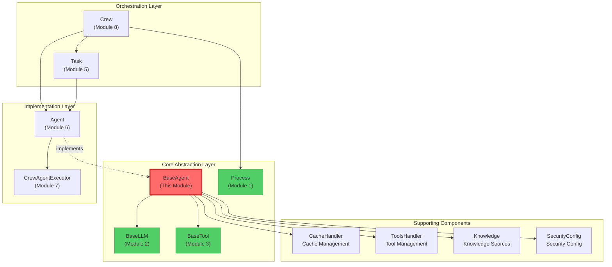

# 📘 Module 4: BaseAgent - The Abstract Contract for Agents (Deep Dive)

> **Learning Objective:** Understand how Crew AI defines the "contract" for Agents through abstract base classes, master complex validator chains and metaclass programming, and why this design is the core pillar of multi-agent systems.

---

## 🎯 I. File Overview & Context

**File Path:** `/home/user/crewAI/lib/crewai/src/crewai/agents/agent_builder/base_agent.py`
**Lines of Code:** 465 lines
**Difficulty:** ★★★★☆ (Advanced)
**Estimated Learning Time:** 60-75 minutes

### Why is this file so important?

In previous modules, we learned:
- **Module 1 (Process):** Crew's execution strategy (Sequential vs Hierarchical)
- **Module 2 (BaseLLM):** LLM abstract contract, defining how to interact with language models
- **Module 3 (BaseTool):** Tool abstract contract, defining capabilities Agents can use

Now, **BaseAgent** is the **core abstraction** that combines these "capabilities" (LLM + Tools) with "intent" (role, goal, backstory).

**Analogy:**
- `BaseLLM` is the "brain"
- `BaseTool` is the "hands and feet"
- `BaseAgent` is the "complete personality", defining:
  - Who is this Agent? (role)
  - What does it want? (goal)
  - What's its background? (backstory)
  - What can it do? (tools, llm)
  - How does it execute tasks? (execute_task - abstract method)

---

## 🔍 II. Import Dependency Analysis: What Does This File Depend On?

### Core Dependencies (Lines 1-36)

```python
from abc import ABC, abstractmethod  # Python's abstract base class mechanism
from pydantic import BaseModel, Field, PrivateAttr  # Data validation framework
from crewai.llms.base_llm import BaseLLM  # LLM abstraction from Module 2
from crewai.tools.base_tool import BaseTool  # Tool abstraction from Module 3
from crewai.agent.internal.meta import AgentMeta  # Metaclass (advanced feature)
```

### 🤔 Design Philosophy: Why These Dependencies?

1. **ABC (Abstract Base Class):** Python's standard abstraction mechanism
   - `@abstractmethod` decorator forces subclasses to implement specific methods
   - If a subclass doesn't implement `execute_task`, Python raises `TypeError` at instantiation

2. **Pydantic BaseModel:** More than just "data validation"
   - **Automatic type checking:** Ensures `role` is `str`, `max_iter` is `int`
   - **Custom validators:** `@field_validator` can execute complex logic
   - **Serialization/Deserialization:** Easy conversion to JSON (important for distributed systems)
   - **Immutability:** `frozen=True` fields (like `id`) cannot be changed after creation

3. **AgentMeta (Metaclass):** Advanced Python feature
   - Metaclasses control **the creation process of classes** (not instances)
   - In `BaseAgent`, `AgentMeta` can inject additional logic at class definition time
   - **Why needed?** Possibly for registering Agent types, auto-adding methods, or implementing plugin systems

### Dependency Map

```
BaseAgent (this file)
├── Inherits from
│   ├── ABC (Abstract Base Class)
│   └── BaseModel (Pydantic validation)
├── Uses metaclass
│   └── AgentMeta (controls class creation)
├── Composition dependencies
│   ├── BaseLLM (Module 2) - "brain"
│   ├── BaseTool (Module 3) - "tools"
│   ├── CacheHandler - cache management
│   ├── ToolsHandler - tool management
│   ├── Knowledge - knowledge sources
│   └── SecurityConfig - security configuration
└── Depended upon by
    ├── Agent (src/crewai/agent/core.py) - Concrete BaseAgent implementation
    └── Crew (src/crewai/crew.py) - Orchestrates multiple Agents
```

---

## 🏗️ III. BaseAgent Class "Skeleton": Core Architecture

### Class Definition (Line 61)

```python
class BaseAgent(BaseModel, ABC, metaclass=AgentMeta):
    """Abstract Base Class for all third party agents compatible with CrewAI."""
```

### 🔑 Key Design Decisions

#### 1️⃣ Multiple Inheritance: `BaseModel + ABC`

**Why inherit from both base classes?**

```python
# BaseModel (Pydantic) provides:
- Data validation (all fields must match types)
- Serialization/Deserialization (.model_dump(), .model_validate())
- Field descriptions and documentation

# ABC (Abstract Base Class) provides:
- Forces subclasses to implement abstract methods
- Type checking (isinstance(agent, BaseAgent))
```

**This is the "Composite Pattern" in action:**
- Pydantic handles the "data layer"
- ABC handles the "behavior layer"

#### 2️⃣ Metaclass: `metaclass=AgentMeta`

```python
# Metaclasses run when "the class is defined", not when "instances are created"
# Example:
class MyAgent(BaseAgent):
    pass  # When this line executes, AgentMeta has already intervened

# What can AgentMeta do?
# 1. Auto-register all Agent subclasses to a global registry
# 2. Validate class definition compliance
# 3. Auto-add class-level attributes or methods
```

**🤔 Why not use regular decorators?**
- Metaclasses execute at class definition time, decorators execute after
- Metaclasses can modify the class MRO (Method Resolution Order)
- Metaclasses can intercept attribute access

---

## 📦 IV. Core Fields Deep Dive ("Who is this Agent?")

### 1️⃣ Identity Triad (Lines 120-122)

```python
role: str = Field(description="Role of the agent")
goal: str = Field(description="Objective of the agent")
backstory: str = Field(description="Backstory of the agent")
```

**🤔 Why are these three fields required?**

In multi-agent systems, each Agent needs **clear identity**:

```python
# Example: A data analysis team
researcher = Agent(
    role="Data Scientist",           # Defines "who I am"
    goal="Find root cause of sales decline",  # Defines "what I want"
    backstory="10 years of data analysis experience..."  # Defines "why I can"
)

# These three fields will be:
# 1. Interpolated into LLM's system prompt
# 2. Used to generate Agent's unique key (see Line 333-339)
# 3. Used for debugging and logging
```

### 2️⃣ Unique Identifier (Line 119)

```python
id: UUID4 = Field(default_factory=uuid.uuid4, frozen=True)
```

**Deep Dive:**

```python
# 1. default_factory=uuid.uuid4
#    Auto-generates unique ID on Agent creation
#    Note: This is a function reference, not a function call

# 2. frozen=True
#    ID cannot be changed after creation!

# 3. Why is there an additional validator? (see Line 312-318)
@field_validator("id", mode="before")
@classmethod
def _deny_user_set_id(cls, v: UUID4 | None) -> None:
    if v:
        raise PydanticCustomError(
            "may_not_set_field",
            "This field is not to be set by the user.", {}
        )
```

**🤔 Why both `frozen=True` and a validator?**

```python
# frozen=True: Prevents modification "after creation"
agent.id = "new-id"  # ❌ Raises error

# Validator: Prevents setting "during creation"
agent = Agent(id="custom-id", ...)  # ❌ Raises error

# Design intent: ID must be system-generated, users have no control
```

### 3️⃣ "Brain" and "Toolbox" (Lines 140-151)

```python
tools: list[BaseTool] | None = Field(
    default_factory=list,
    description="Tools at agents' disposal"
)
llm: Any = Field(
    default=None,
    description="Language model that will run the agent."
)
```

**🔍 Design Philosophy: Dependency Injection Pattern**

```python
# BaseAgent doesn't care "which specific LLM" or "which specific tools"
# It only defines the interface:
agent = Agent(
    llm=OpenAIGPT4(),      # Can be OpenAI
    # or
    llm=ClaudeSonnet(),    # Can be Claude
    tools=[SearchTool(), CalculatorTool()]  # Any BaseTool subclass
)

# Benefits:
# 1. Testability: Can inject MockLLM for unit tests
# 2. Flexibility: Switch LLM providers at runtime
# 3. Decoupling: Agent doesn't depend on concrete LLM implementations
```

### 4️⃣ Execution Control Parameters (Lines 132-145)

```python
max_rpm: int | None = Field(
    default=None,
    description="Maximum requests per minute..."
)
max_iter: int = Field(
    default=25,
    description="Maximum iterations for an agent to execute a task"
)
allow_delegation: bool = Field(
    default=False,
    description="Enable agent to delegate and ask questions..."
)
```

**🤔 Why is `max_iter` needed? Preventing infinite loops**

```python
# Typical Agent task execution flow (ReAct loop):
# 1. Thought: I need to search for data
# 2. Action: Use SearchTool
# 3. Observation: Found results
# 4. Thought: Now I need to analyze...
# ...repeat until task complete

# Without max_iter:
# - LLM might loop infinitely (repeating same Action)
# - Costs spiral out of control (each loop calls LLM)

# max_iter=25 is an empirical value:
# - Sufficient for complex tasks
# - Won't lead to infinite loops
```

**🤔 Why is `allow_delegation` default `False`?**

```python
# Delegation means:
agent1.ask_question(agent2, "Where's the data?")

# Risks:
# 1. Complexity: Requires additional coordination mechanism
# 2. Cost: Each delegation is an extra LLM call
# 3. Loop risk: A asks B, B asks C, C asks A...

# Therefore disabled by default, only enabled when needed (e.g., Hierarchical mode)
```

### 5️⃣ Private Attributes (Lines 112-118)

```python
_logger: Logger = PrivateAttr(default_factory=lambda: Logger(verbose=False))
_rpm_controller: RPMController | None = PrivateAttr(default=None)
_original_role: str | None = PrivateAttr(default=None)
```

**🔍 `PrivateAttr` vs Regular Fields?**

```python
# Regular fields (public):
role: str = Field(...)
# - Will be serialized to JSON
# - Will be validated by Pydantic
# - Can be set in __init__

# Private attributes:
_logger: Logger = PrivateAttr(...)
# - Won't be serialized
# - Don't participate in Pydantic validation
# - Usually set dynamically at runtime

# Why save _original_role?
# Because role might be dynamically replaced by interpolate_inputs():
agent.role = "Data Scientist-{project_name}"
agent.interpolate_inputs({"project_name": "Sales Analysis"})
# agent.role is now "Data Scientist-Sales Analysis"
# agent._original_role is still "Data Scientist-{project_name}"
```

---

## ⚙️ V. Validator Chain: Pydantic's "Gatekeeper" Mechanism

### 1️⃣ Model-Level Config Processor (Lines 203-206)

```python
@model_validator(mode="before")
@classmethod
def process_model_config(cls, values: Any) -> dict[str, Any]:
    return process_config(values, cls)
```

**🤔 What does `mode="before"` mean?**

```python
# Pydantic's validation flow:
#
# User inputs raw data
#     ↓
# mode="before" validators ← Here! Before type conversion
#     ↓
# Type conversion and parsing
#     ↓
# mode="after" validators
#     ↓
# Final validated instance

# process_config's role:
# Allows loading Agent config from YAML/JSON config files
agent = Agent(config={"role": "...", "goal": "..."})
# process_config expands config dict to individual fields
```

### 2️⃣ Tools Validator (Lines 208-235)

```python
@field_validator("tools")
@classmethod
def validate_tools(cls, tools: list[Any]) -> list[BaseTool]:
    if not tools:
        return []

    processed_tools = []
    required_attrs = ["name", "func", "description"]
    for tool in tools:
        if isinstance(tool, BaseTool):
            processed_tools.append(tool)
        elif all(hasattr(tool, attr) for attr in required_attrs):
            # LangChain tool compatibility!
            processed_tools.append(Tool.from_langchain(tool))
        else:
            raise ValueError(f"Invalid tool type: {type(tool)}")
    return processed_tools
```

**🔍 Deep Dive: Why is this validator so important?**

```python
# Scenario 1: User passes CrewAI native tool
from crewai.tools import SearchTool
agent = Agent(tools=[SearchTool()])  # ✅ Passes directly

# Scenario 2: User passes LangChain tool (cross-framework compatibility!)
from langchain.tools import DuckDuckGoSearchRun
agent = Agent(tools=[DuckDuckGoSearchRun()])  # ✅ Auto-converts

# Scenario 3: User passes invalid object
agent = Agent(tools=["invalid"])  # ❌ Raises clear error

# This demonstrates "defensive programming" and "friendly error messages"
```

**🤔 Why need `Tool.from_langchain()` converter?**

```python
# LangChain and CrewAI have slightly different tool interfaces:
#
# LangChain tool:
class LangChainTool:
    name: str
    func: Callable
    description: str
    # May not have args_schema

# CrewAI tool (BaseTool):
class BaseTool(ABC):
    name: str
    description: str
    args_schema: Type[BaseModel]  # Pydantic schema
    def _run(self, **kwargs): ...

# Tool.from_langchain handles:
# 1. Mapping field names
# 2. Auto-generating args_schema (if missing)
# 3. Wrapping func as _run method
```

### 3️⃣ Platform Apps Validator (Lines 237-253)

```python
@field_validator("apps")
@classmethod
def validate_apps(
    cls, apps: list[PlatformAppOrAction] | None
) -> list[PlatformAppOrAction] | None:
    if not apps:
        return apps

    validated_apps = []
    for app in apps:
        if app.count("/") > 1:
            raise ValueError(
                f"Invalid app format '{app}'. "
                "Apps can only have one '/' for app/action format"
            )
        validated_apps.append(app)

    return list(set(validated_apps))  # Deduplication
```

**🔍 What does this validator protect?**

```python
# Valid formats:
apps = ["gmail", "slack", "gmail/send_email"]
# ✅ App name or app/action

# Invalid format:
apps = ["gmail/send/email"]
# ❌ More than one slash

# Why deduplication? (Line 253)
apps = ["gmail", "gmail", "slack"]
# Auto-deduplicated to ["gmail", "slack"]
# Avoid redundant initialization of same integration
```

### 4️⃣ Model Post-Validator (Lines 288-310)

```python
@model_validator(mode="after")
def validate_and_set_attributes(self) -> Self:
    # Validate required fields
    for field in ["role", "goal", "backstory"]:
        if getattr(self, field) is None:
            raise ValueError(
                f"{field} must be provided either directly or through config"
            )

    # Set private attributes
    self._logger = Logger(verbose=self.verbose)
    if self.max_rpm and not self._rpm_controller:
        self._rpm_controller = RPMController(max_rpm=self.max_rpm, ...)

    return self
```

**🤔 Why `mode="after"` instead of `mode="before"`?**

```python
# mode="after" executes after all field validation is complete
# At this point, all fields can be safely accessed (self.verbose, self.max_rpm)

# If in mode="before":
# - self.verbose might not exist yet
# - Can't create objects depending on other fields (like Logger)
```

---

## 🎭 VI. Abstract Methods: The "Contract" Subclasses Must Implement

### 1️⃣ Core Execution Method (Lines 341-348)

```python
@abstractmethod
def execute_task(
    self,
    task: Any,
    context: str | None = None,
    tools: list[BaseTool] | None = None,
) -> str:
    pass
```

**🔍 Deep Dive: Why is this an abstract method?**

```python
# BaseAgent doesn't know "how" to execute tasks, only defines the "interface"

# Different implementations might:
# 1. Use ReAct loop (Reasoning + Acting)
# 2. Use Chain-of-Thought
# 3. Use Plan-and-Execute
# 4. Direct LLM call (no tools)

# Subclass example:
class CrewAIAgent(BaseAgent):
    def execute_task(self, task, context, tools):
        # 1. Create system prompt (including role, goal, backstory)
        # 2. Start ReAct loop
        # 3. Use CrewAgentExecutor
        # 4. Return final result
        ...
```

**🤔 Why parameter `task: Any` instead of `task: Task`?**

```python
# This is the "Interface Segregation Principle" (ISP) in action
# BaseAgent doesn't want to depend on the concrete Task class

# Benefits:
# 1. Avoid circular dependency (Task also depends on BaseAgent)
# 2. Allow third-party frameworks to use their own Task types
# 3. Maintain BaseAgent's generality

# Drawback:
# - Lose type checking
# - Need runtime validation of task object
```

### 2️⃣ Executor Creation Method (Lines 350-352)

```python
@abstractmethod
def create_agent_executor(self, tools: list[BaseTool] | None = None) -> None:
    pass
```

**🔍 Why need a separate "create executor" method?**

```python
# Agent's executor might need to be created at different times:

# Timing 1: At initialization
agent = Agent(...)
agent.create_agent_executor()  # Use default tools

# Timing 2: After tools update
agent.tools.append(NewTool())
agent.create_agent_executor(agent.tools)  # Recreate

# Timing 3: After cache configuration (see Line 451)
agent.set_cache_handler(cache)
agent.create_agent_executor()  # Cached executor

# This is the "Factory Method Pattern" in action
```

### 3️⃣ Delegation Tools Getter (Lines 354-356)

```python
@abstractmethod
def get_delegation_tools(self, agents: list[BaseAgent]) -> list[BaseTool]:
    """Set the task tools that init BaseAgenTools class."""
```

**🔍 Deep Dive on Delegation Mechanism**

```python
# Delegation tools allow Agent A to query Agent B:

# Scenario:
researcher = Agent(role="Researcher", ...)
analyst = Agent(role="Analyst", ...)

# When researcher needs data analysis:
delegation_tools = researcher.get_delegation_tools([analyst])
# delegation_tools contains:
# - AskQuestionTool(target_agent=analyst)
# - DelegateTaskTool(target_agent=analyst)

# At execution:
researcher.execute_task(task)
# → LLM decides: "I need data analysis, call DelegateTaskTool"
# → DelegateTaskTool internally calls: analyst.execute_task(sub_task)
```

**🤔 Why is this an abstract method?**

```python
# Different Agent implementations might have different delegation strategies:
# 1. Synchronous delegation: Wait for result
# 2. Asynchronous delegation: Send request and continue working
# 3. Limited delegation: Only allow specific types of questions
```

### 4️⃣ Platform Tools Getter (Lines 358-360)

```python
@abstractmethod
def get_platform_tools(self, apps: list[PlatformAppOrAction]) -> list[BaseTool]:
    """Get platform tools for specified applications."""
```

**🔍 Key for Enterprise Integration**

```python
# apps parameter example:
apps = [
    "gmail",              # All Gmail tools
    "slack/send_message", # Only Slack's send message action
    "github"              # Entire GitHub integration
]

# Implementation might:
def get_platform_tools(self, apps):
    tools = []
    for app in apps:
        if "/" in app:
            app_name, action = app.split("/")
            tools.append(load_specific_action(app_name, action))
        else:
            tools.extend(load_all_actions(app))
    return tools

# This allows fine-grained control of Agent permissions
```

---

## 🔧 VII. Key Method Implementation Analysis

### 1️⃣ Agent's "Fingerprint": key property (Lines 332-339)

```python
@property
def key(self) -> str:
    source = [
        self._original_role or self.role,
        self._original_goal or self.goal,
        self._original_backstory or self.backstory,
    ]
    return md5("|".join(source).encode(), usedforsecurity=False).hexdigest()
```

**🔍 Deep Dive: Why need a key?**

```python
# Use 1: Cache key
cache_key = f"agent_{agent.key}_task_{task.id}"
# Agents with same config can share cache

# Use 2: Deduplication
agents = [agent1, agent2, agent1]  # agent1 duplicated
unique_agents = {a.key: a for a in agents}.values()

# Use 3: Debugging
print(f"Agent key: {agent.key}")
# Output: "a3f5e8c2b4d1..."

# 🤔 Why use _original_role instead of role?
# Because role might be interpolated:
agent.role = "Researcher-{project}"
agent.interpolate_inputs({"project": "AI"})
# agent.role is now "Researcher-AI"
# But agent.key should be based on original template, or key would change with each interpolation!
```

**🤔 Why MD5 instead of more secure hash algorithms?**

```python
# usedforsecurity=False is key:
# - This isn't for cryptographic purposes (don't need SHA256)
# - MD5 is faster
# - Collision probability is acceptable in this scenario
# - Generated key is shorter (32 characters)
```

### 2️⃣ Deep Copy Method (Lines 366-419)

```python
def copy(self) -> Self:
    """Create a deep copy of the Agent."""
    exclude = {
        "id",          # New Agent needs new ID
        "_logger",     # Runtime object, don't copy
        "agent_executor",  # Depends on specific config, needs recreation
        "llm",         # Handle separately (shallow copy)
        ...
    }

    # Shallow copy LLM
    existing_llm = shallow_copy(self.llm)

    # Deep copy knowledge_sources (special handling)
    if self.knowledge_sources:
        shared_storage = self.knowledge_sources[0].storage
        existing_knowledge_sources = []
        for source in self.knowledge_sources:
            copied_source = source.model_copy()
            copied_source.storage = shared_storage  # Shared storage!
            existing_knowledge_sources.append(copied_source)

    # Use Pydantic's model_dump
    copied_data = self.model_dump(exclude=exclude)
    return type(self)(**copied_data, llm=existing_llm, ...)
```

**🔍 Deep Dive: Subtleties of Copy Strategy**

```python
# 1. Why does new Agent need new ID?
original = Agent(...)
copy = original.copy()
assert original.id != copy.id  # ✅ Must be different
# Each Agent instance must be uniquely identifiable

# 2. Why is LLM shallow copied?
# LLM objects are usually stateless (or state doesn't matter)
# Deep copying LLM would:
# - Waste memory (LLM might be large)
# - Copy unnecessary state (like token counters)

# 3. Why special handling for knowledge_sources?
# All knowledge_sources share the same storage:
#
# Original:
# ks1 → storage_A ←┐
# ks2 → storage_A ←┘
#
# Copy:
# ks1_copy → storage_A ←┐  (Share same storage!)
# ks2_copy → storage_A ←┘
#
# Benefit: Save memory, knowledge base can be shared across Agents
```

**🤔 Why not directly use Python's `copy.deepcopy()`?**

```python
import copy

# Problem: deepcopy copies everything, including:
# - Objects that shouldn't be copied (logger, executor)
# - Objects that can't be copied (thread locks, file handles)
# - LLM's complex internal state

# Pydantic's model_dump + reconstruction:
# - Precise control over what to copy
# - Automatically triggers validators
# - Ensures data consistency
```

### 3️⃣ Input Interpolation Method (Lines 421-439)

```python
def interpolate_inputs(self, inputs: dict[str, Any]) -> None:
    """Interpolate inputs into the agent description and backstory."""
    if self._original_role is None:
        self._original_role = self.role
    if self._original_goal is None:
        self._original_goal = self.goal
    if self._original_backstory is None:
        self._original_backstory = self.backstory

    if inputs:
        self.role = interpolate_only(
            input_string=self._original_role, inputs=inputs
        )
        self.goal = interpolate_only(
            input_string=self._original_goal, inputs=inputs
        )
        self.backstory = interpolate_only(
            input_string=self._original_backstory, inputs=inputs
        )
```

**🔍 Deep Dive: Dynamic Agent Configuration**

```python
# Scenario: Generic Agent template
template_agent = Agent(
    role="Data Analyst-{department}",
    goal="Analyze {department}'s {metric} trends",
    backstory="Expert focused on {department} business..."
)

# Use 1: Sales department
sales_agent = template_agent.copy()
sales_agent.interpolate_inputs({
    "department": "Sales",
    "metric": "Revenue"
})
# sales_agent.role = "Data Analyst-Sales"
# sales_agent.goal = "Analyze Sales's Revenue trends"

# Use 2: Marketing department
marketing_agent = template_agent.copy()
marketing_agent.interpolate_inputs({
    "department": "Marketing",
    "metric": "Conversion Rate"
})
# marketing_agent.role = "Data Analyst-Marketing"
```

**🤔 Why need to save `_original_*` fields?**

```python
# Without _original_role:
agent.interpolate_inputs({"dept": "Sales"})
# agent.role = "Analyst-Sales"

agent.interpolate_inputs({"dept": "Marketing"})  # Second call
# ❌ agent.role = "Analyst-Sales-Marketing"
# Because interpolation is based on current role (already replaced)

# With _original_role:
agent.interpolate_inputs({"dept": "Marketing"})
# ✅ agent.role = "Analyst-Marketing"
# Each time based on original template
```

---

## 🎨 VIII. Design Pattern Recognition

### 1️⃣ **Abstract Factory Pattern**

```python
# BaseAgent defines the "product family" interface
class BaseAgent(ABC):
    @abstractmethod
    def execute_task(...): ...

    @abstractmethod
    def create_agent_executor(...): ...

# Concrete factory:
class CrewAIAgent(BaseAgent):
    def execute_task(self, task):
        return self.agent_executor.invoke(task)

    def create_agent_executor(self, tools):
        self.agent_executor = CrewAgentExecutor(...)

# Usage:
def run_crew(agents: list[BaseAgent]):  # Accept any BaseAgent
    for agent in agents:
        agent.execute_task(task)  # Polymorphic call
```

### 2️⃣ **Template Method Pattern**

```python
# BaseAgent defines the algorithm skeleton:
class BaseAgent:
    def copy(self):  # Template method
        # Step 1: Determine excluded fields (fixed)
        exclude = {...}

        # Step 2: Handle special fields (extensible)
        llm = shallow_copy(self.llm)

        # Step 3: Serialize and reconstruct (fixed)
        return type(self)(**data, llm=llm)

# Subclasses can customize by overriding specific steps:
class CustomAgent(BaseAgent):
    def copy(self):
        # Add extra processing logic
        copy = super().copy()
        copy.custom_field = self.custom_field.clone()
        return copy
```

### 3️⃣ **Strategy Pattern**

```python
# Agent's "execution strategy" can be replaced at runtime:
agent = Agent(...)

# Strategy 1: With cache
agent.set_cache_handler(CacheHandler())
agent.create_agent_executor()  # Use caching strategy

# Strategy 2: No cache
agent.cache = False
agent.create_agent_executor()  # No caching strategy

# Strategy 3: Rate limiting
agent.set_rpm_controller(RPMController(max_rpm=10))
agent.create_agent_executor()  # Rate limiting strategy
```

### 4️⃣ **Dependency Injection**

```python
# BaseAgent doesn't create dependencies, but accepts injections:
agent = Agent(
    llm=injected_llm,           # Injected dependency
    tools=injected_tools,       # Injected dependency
    cache_handler=injected_cache  # Injected dependency
)

# Benefits:
# 1. Easy to test (inject Mock objects)
# 2. Flexible configuration (choose implementation at runtime)
# 3. Decoupling (don't depend on concrete classes)
```

---

## 🌐 IX. Relationships with Other Components (Architecture Overview)



### Data Flow Example

```python
# 1. Crew initialization
crew = Crew(
    agents=[researcher, analyst],  # Inject BaseAgent instances
    tasks=[task1, task2],
    process=Process.sequential
)

# 2. Crew execution
crew.kickoff()
    ↓
# 3. Crew iterates Tasks
for task in tasks:
    task.agent.execute_task(task)  # Call BaseAgent's abstract method
        ↓
# 4. Agent execution
    agent.create_agent_executor(tools)  # Create executor
        ↓
    agent_executor.invoke()  # Start ReAct loop
        ↓
# 5. LLM call
    agent.llm.call(prompt)  # Use BaseLLM
        ↓
# 6. Tool execution
    tool.run(args)  # Use BaseTool
```

---

## 🧠 Knowledge Retrieval Challenges

### 🔥 Challenge 1: Conceptual Understanding (Generative)

**In your own words, explain what the core "contract" of `BaseAgent` is? What functionality does it force subclasses to implement?**

<details>
<summary>💡 Reference Answer</summary>

BaseAgent's core contract includes:
1. **Execute tasks** (`execute_task`): Subclasses must define how to handle a task
2. **Create executor** (`create_agent_executor`): Subclasses must define how to build their execution engine
3. **Delegation mechanism** (`get_delegation_tools`): If supporting multi-agent collaboration, must define how to get delegation tools
4. **Platform integration** (`get_platform_tools`): If supporting enterprise apps, must define how to load integration tools

Additionally, BaseAgent defines the Agent's "identity" (role, goal, backstory), "capabilities" (tools, llm), and "behavioral constraints" (max_iter, allow_delegation).
</details>

---

### 🔥 Challenge 2: Design Analysis (Analytical)

**Why does `BaseAgent` inherit from both `BaseModel` and `ABC`? If we only inherited from one, what capabilities would we lose?**

<details>
<summary>💡 Reference Answer</summary>

**Only inherit ABC:**
- ✅ Keep: Force subclasses to implement abstract methods
- ❌ Lose: Auto data validation, serialization/deserialization, field documentation

**Only inherit BaseModel:**
- ✅ Keep: Data validation, Pydantic features
- ❌ Lose: Can't force subclasses to implement `execute_task` (might lead to runtime errors)

**Inherit both:**
- Combines "data integrity" and "behavioral contract"
- Pydantic handles "state" (Agent configuration)
- ABC handles "behavior" (Agent capabilities)
</details>

---

### 🔥 Challenge 3: Code Prediction (Inference)

**Predict the output of the following code and explain why:**

```python
agent1 = Agent(
    role="Researcher-{project}",
    goal="Research {topic}",
    backstory="Expert"
)

agent1.interpolate_inputs({"project": "AI", "topic": "LLM"})
print("First interpolation:", agent1.role)

agent1.interpolate_inputs({"project": "Quantum", "topic": "Entanglement"})
print("Second interpolation:", agent1.role)

print("Key:", agent1.key)
```

<details>
<summary>💡 Reference Answer</summary>

```
First interpolation: Researcher-AI
Second interpolation: Researcher-Quantum
Key: <MD5 hash based on "Researcher-{project}">
```

**Explanation:**
1. `interpolate_inputs` saves original template to `_original_role`
2. Each call interpolates based on `_original_role`, not current `role`
3. `key` is always based on `_original_role`, so it doesn't change with interpolation
</details>

---

### 🔥 Challenge 4: Architecture Design (Synthesis)

**Suppose you need to create a `CustomAgent` that needs to "warm up" (call a special preprocessing method) before executing each task. How would you design it? Which methods would you need to override?**

<details>
<summary>💡 Reference Answer</summary>

```python
class CustomAgent(BaseAgent):
    warmup_prompt: str = "Warmup prompt"

    def _warmup(self):
        """Warmup method: Pre-call LLM"""
        self.llm.call(self.warmup_prompt)

    def execute_task(self, task, context=None, tools=None):
        # 1. Execute warmup
        self._warmup()

        # 2. Create or update executor
        if not self.agent_executor:
            self.create_agent_executor(tools)

        # 3. Execute task
        return self.agent_executor.invoke(task, context)

    def create_agent_executor(self, tools=None):
        # Create custom executor
        self.agent_executor = CustomExecutor(
            agent=self,
            tools=tools or self.tools,
            warmup=True  # Mark as warmed up
        )

    # Must implement other abstract methods
    def get_delegation_tools(self, agents):
        return []  # If delegation not supported

    def get_platform_tools(self, apps):
        return []  # If platform integration not supported
```

**Key points:**
1. Must implement all abstract methods
2. Can add custom logic (_warmup)
3. Call custom logic in `execute_task`
4. Ensure compatibility with BaseAgent's contract
</details>

---

### 🔥 Challenge 5: Debugging Reasoning (Troubleshooting)

**What error will the following code throw? Why?**

```python
agent = Agent(
    id="custom-uuid-12345",
    role="Researcher",
    goal="Research",
    backstory="Expert"
)
```

<details>
<summary>💡 Reference Answer</summary>

**Error:**
```
PydanticCustomError: This field is not to be set by the user.
```

**Reason:**
1. `id` field has `frozen=True` (immutable)
2. `_deny_user_set_id` validator (Line 312-318) explicitly forbids users from setting ID
3. ID must be auto-generated by `uuid.uuid4()`

**Why this design?**
- Ensure each Agent instance has a system-generated unique ID
- Prevent ID conflicts (users might set same ID)
- Maintain ID consistency and traceability
</details>

---

## 📊 X. Core Concept Summary

### BaseAgent's "Five Pillars"

```
1. Identity Contract
   ├── role: Defines "who I am"
   ├── goal: Defines "what I want"
   └── backstory: Defines "why I can"

2. Capability Contract
   ├── llm: "Brain" (thinking ability)
   ├── tools: "Hands and feet" (action ability)
   └── knowledge: "Memory" (knowledge ability)

3. Behavior Contract
   ├── execute_task: How to execute tasks
   ├── create_agent_executor: How to create execution engine
   └── get_delegation_tools: How to collaborate with other Agents

4. Constraint Contract
   ├── max_iter: Maximum iterations
   ├── max_rpm: Rate limiting
   └── allow_delegation: Whether delegation allowed

5. Data Contract
   ├── Pydantic validation: Ensure data integrity
   ├── Serialization: Support persistence and distribution
   └── Copy mechanism: Support Agent templates
```

---

## 🎓 Next Learning Recommendations

After completing this module, you should be able to:

- ✅ Explain BaseAgent's core abstract methods and design intent
- ✅ Understand Pydantic validator chain execution flow
- ✅ Identify design patterns used in BaseAgent
- ✅ Explain Agent's copy and interpolation mechanisms
- ✅ Understand BaseAgent's dependency relationships with other components

**Recommended next steps:**
- **Module 5: Task (Task Definition)** - Understand the "work unit" Agents execute
- **Module 6: Agent (Concrete Implementation)** - See how BaseAgent is concretized
- **Module 7: CrewAgentExecutor (Execution Engine)** - Understand ReAct loop implementation

---

**📁 Document Path:** `/home/user/crewAI/docs/Module_04_BaseAgent_EN.md`
