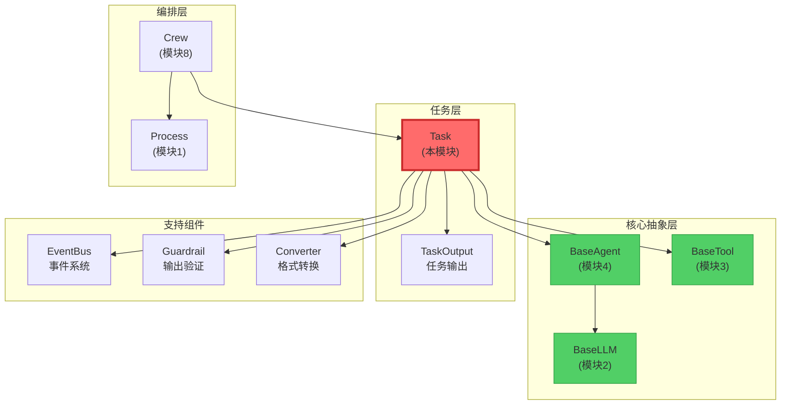

# 📘 模块 5：Task - 工作单元的定义（深度剖析）

> **认知目标：** 理解 Crew AI 如何定义"任务"（Task）这一核心概念，掌握任务执行流程、输出格式、Guardrail验证机制、异步执行，以及任务如何与Agent协作完成目标。

---

## 🎯 一、文件概览与定位

**文件路径：** `/home/user/crewAI/lib/crewai/src/crewai/task.py`
**代码量：** 956 行
**难度：** ★★★★☆ (高级)
**预计学习时间：** 90-100 分钟

### 为什么Task如此重要？

在前面的模块中，我们已经学习了：
- **模块1 (Process):** 执行策略（Sequential vs Hierarchical）
- **模块2 (BaseLLM):** LLM的抽象契约
- **模块3 (BaseTool):** 工具的抽象契约
- **模块4 (BaseAgent):** Agent的抽象接口

现在，**Task** 是将这一切"组织起来"的核心：

**类比：**
- `BaseAgent` 是"员工"（有能力、有角色）
- `Task` 是"工作订单"（有明确的需求和期望输出）
- `Crew` 是"项目经理"（分配任务给员工）

**Task定义了：**
- **任务是什么？** (description)
- **期望什么输出？** (expected_output)
- **谁来执行？** (agent)
- **需要什么上下文？** (context - 其他任务的输出)
- **如何验证输出？** (guardrail/guardrails)
- **如何保存结果？** (output_file, output_json, output_pydantic)

---

## 🔍 二、导入依赖分析：Task需要什么支撑？

### 核心依赖（Lines 1-57）

```python
from concurrent.futures import Future  # 异步执行
from threading import Thread           # 线程支持
from pydantic import BaseModel, Field  # 数据验证
from crewai.agents.agent_builder.base_agent import BaseAgent  # Agent依赖
from crewai.events.event_bus import crewai_event_bus  # 事件系统
from crewai.tasks.task_output import TaskOutput  # 任务输出
from crewai.tools.base_tool import BaseTool  # 工具依赖
```

### 🤔 设计哲学：为什么这些依赖？

#### 1. 异步支持：`concurrent.futures` + `threading`

```python
# 为什么Task需要异步执行？
# 场景：
task1 = Task(description="分析数据", async_execution=True)
task2 = Task(description="生成报告", async_execution=True)

# 同时启动两个任务：
future1 = task1.execute_async(agent1)
future2 = task2.execute_async(agent2)

# 等待完成：
result1 = future1.result()
result2 = future2.result()

# 好处：
# 1. 并行处理：节省时间
# 2. 资源利用：充分利用多核CPU
# 3. 非阻塞：不会阻塞主线程
```

#### 2. 事件驱动：`crewai_event_bus`

```python
# Task在执行时会发出3种事件：
# 1. TaskStartedEvent   - 任务开始时
# 2. TaskCompletedEvent - 任务完成时
# 3. TaskFailedEvent    - 任务失败时

# 这些事件可以被：
# - 日志系统监听（记录执行历史）
# - 监控系统监听（实时追踪进度）
# - UI系统监听（更新用户界面）
```

#### 3. 输出结构化：`TaskOutput`

```python
# TaskOutput封装了任务的所有输出信息：
class TaskOutput:
    raw: str                    # 原始输出（LLM的文本）
    pydantic: BaseModel | None  # Pydantic模型输出
    json_dict: dict | None      # JSON字典输出
    agent: str                  # 执行的Agent角色
    output_format: OutputFormat # 输出格式
    messages: list              # 执行过程中的消息
```

### 依赖图谱

```
Task (本文件)
├── 依赖于
│   ├── BaseAgent (模块4) - 执行任务的实体
│   ├── BaseTool (模块3) - 任务可用的工具
│   ├── TaskOutput - 任务输出的封装
│   ├── EventBus - 事件系统
│   ├── Guardrail - 输出验证机制
│   └── Converter - 输出格式转换
└── 被依赖于
    └── Crew (模块8) - 编排多个Task
```

---

## 🏗️ 三、Task类的"骨架"：核心架构

### 类定义（Line 63）

```python
class Task(BaseModel):
    """Class that represents a task to be executed.

    Each task must have a description, an expected output
    and an agent responsible for execution.
    """
```

### 🔑 Task的"三要素"

```python
# 最小化的Task定义：
task = Task(
    description="分析2024年Q1销售数据，找出下降的根本原因",  # 必需
    expected_output="一份详细报告，包含3-5个关键发现和建议",    # 必需
    agent=data_analyst                                      # 可选（可在Crew中分配）
)

# 为什么这三个字段是核心？
# 1. description: 告诉Agent"做什么"
# 2. expected_output: 告诉Agent"期望什么样的结果"
# 3. agent: 告诉系统"谁来做"
```

---

## 📦 四、核心字段深度剖析（"这个任务是什么？"）

### 1️⃣ 任务定义字段（Lines 94-99）

```python
description: str = Field(description="Description of the actual task.")
expected_output: str = Field(
    description="Clear definition of expected output for the task."
)
name: str | None = Field(default=None)  # 可选的任务名称
```

**🔍 深度解析：description vs expected_output**

```python
# 示例：数据分析任务
task = Task(
    description="""
        分析2024年Q1的销售数据。
        重点关注：
        1. 地区销售对比
        2. 产品类别表现
        3. 与去年同期对比
    """,
    expected_output="""
        一份包含以下内容的分析报告：
        - 执行摘要（3-5句话）
        - 3个关键数据洞察
        - 2-3个具体建议
        - 支持数据的图表说明
    """
)

# 为什么需要两个字段？
# description: 定义"过程"（如何分析）
# expected_output: 定义"结果"（输出什么格式）

# 这帮助LLM：
# 1. 理解任务范围
# 2. 知道输出标准
# 3. 避免输出过于简略或冗长
```

**🤔 如果只有description，没有expected_output会怎样？**

```python
# 没有expected_output的任务：
task = Task(
    description="分析销售数据",
    expected_output=""  # ❌ 缺失！
)

# LLM可能的输出：
# "数据已分析。"  ← 太简略
# 或
# 200页的详细报告  ← 太冗长

# 有expected_output的任务：
task = Task(
    description="分析销售数据",
    expected_output="3-5个关键发现，每个用2-3句话说明"
)

# LLM的输出会更精准：
# "发现1: ...
#  发现2: ...
#  发现3: ..."
```

### 2️⃣ 执行控制字段（Lines 107-117）

```python
agent: BaseAgent | None = Field(
    description="Agent responsible for execution the task.",
    default=None
)
async_execution: bool | None = Field(
    description="Whether the task should be executed asynchronously or not.",
    default=False,
)
callback: Any | None = Field(
    description="Callback to be executed after the task is completed.",
    default=None
)
```

**🔍 异步执行的深度解析**

```python
# 场景1：同步执行（默认）
task1 = Task(description="任务1", expected_output="...", async_execution=False)
task2 = Task(description="任务2", expected_output="...", async_execution=False)

# 执行流程：
crew.kickoff()
# → 执行task1（阻塞，等待完成）
# → 执行task2（阻塞，等待完成）
# → 返回结果

# 总时间 = task1时间 + task2时间

# 场景2：异步执行
task1 = Task(description="数据收集", expected_output="...", async_execution=True)
task2 = Task(description="文献调研", expected_output="...", async_execution=True)
task3 = Task(
    description="综合分析",
    expected_output="...",
    context=[task1, task2],  # 依赖task1和task2
    async_execution=False
)

# 执行流程：
crew.kickoff()
# → task1和task2并行执行（非阻塞）
# → 等待task1和task2完成
# → 执行task3（使用task1和task2的输出）

# 总时间 ≈ max(task1时间, task2时间) + task3时间
```

**🤔 什么时候使用异步？**

```python
# ✅ 适合异步的场景：
# 1. 任务之间无依赖关系
task_a = Task(description="分析销售数据", async_execution=True)
task_b = Task(description="分析市场趋势", async_execution=True)

# 2. I/O密集型任务（等待API响应）
task = Task(
    description="从3个API获取数据",
    async_execution=True  # 避免阻塞
)

# ❌ 不适合异步的场景：
# 1. 任务有依赖关系
task1 = Task(description="收集数据")
task2 = Task(
    description="分析数据",
    context=[task1],  # 依赖task1
    async_execution=True  # ⚠️ 要小心！Crew会自动处理依赖
)

# 2. CPU密集型任务（Python的GIL限制）
task = Task(
    description="训练机器学习模型",
    async_execution=True  # ⚠️ 可能不会更快（受GIL影响）
)
```

**🔍 Callback机制**

```python
def task_callback(output: TaskOutput):
    """任务完成后的回调函数"""
    print(f"任务完成！输出：{output.raw}")
    # 可以：
    # 1. 记录到数据库
    # 2. 发送通知
    # 3. 触发下一步流程

task = Task(
    description="分析数据",
    expected_output="分析报告",
    callback=task_callback  # 任务完成后调用
)

# 执行流程：
result = task.execute_sync(agent)
# → Agent执行任务
# → 生成TaskOutput
# → 调用callback(output)  ← 这里！
# → 返回result
```

### 3️⃣ 上下文传递字段（Lines 110-113）

```python
context: list[Task] | None | _NotSpecified = Field(
    description="Other tasks that will have their output used as context for this task.",
    default=NOT_SPECIFIED,
)
```

**🔍 深度解析：任务间的依赖链**

```python
# 场景：研究报告生成流程
task1_research = Task(
    description="研究AI的最新进展",
    expected_output="10个关键技术突破的列表"
)

task2_analysis = Task(
    description="分析这些技术突破的商业价值",
    expected_output="每个技术的商业价值评估",
    context=[task1_research]  # ← 依赖task1的输出！
)

task3_report = Task(
    description="生成综合报告",
    expected_output="一份完整的商业分析报告",
    context=[task1_research, task2_analysis]  # ← 依赖两个任务！
)

# 执行时的context传递：
# 1. task1执行 → 输出 output1
# 2. task2执行时，Agent收到的prompt包含：
#    - task2的description
#    - task2的expected_output
#    - "上下文：{output1的内容}"  ← 自动注入！
# 3. task3执行时，Agent收到：
#    - task3的description
#    - "上下文：{output1的内容}\n{output2的内容}"
```

**🤔 为什么不直接手动传递输出？**

```python
# 方案A：手动传递（❌ 不推荐）
output1 = task1.execute_sync(agent1)
task2.description += f"\n上下文：{output1.raw}"
output2 = task2.execute_sync(agent2)

# 问题：
# 1. 代码冗长
# 2. 容易出错
# 3. 不支持Crew的自动编排

# 方案B：使用context（✅ 推荐）
task2 = Task(
    description="...",
    context=[task1]  # 简洁、清晰、自动处理
)
```

### 4️⃣ 输出格式字段（Lines 118-137）

```python
output_json: type[BaseModel] | None = Field(
    description="A Pydantic model to be used to create a JSON output.",
    default=None,
)
output_pydantic: type[BaseModel] | None = Field(
    description="A Pydantic model to be used to create a Pydantic output.",
    default=None,
)
output_file: str | None = Field(
    description="A file path to be used to create a file output.",
    default=None,
)
```

**🔍 深度解析：三种输出格式**

#### 格式1：原始文本（默认）

```python
task = Task(
    description="写一篇关于AI的文章",
    expected_output="500字的文章"
    # 没有指定output_json或output_pydantic
)

result = task.execute_sync(agent)
print(result.raw)  # "人工智能（AI）是..."
# result.pydantic = None
# result.json_dict = None
```

#### 格式2：结构化JSON

```python
from pydantic import BaseModel

class AnalysisReport(BaseModel):
    summary: str
    key_findings: list[str]
    recommendations: list[str]
    confidence_score: float

task = Task(
    description="分析销售数据",
    expected_output="分析报告",
    output_json=AnalysisReport  # ← 指定JSON schema
)

result = task.execute_sync(agent)
print(result.json_dict)
# {
#     "summary": "Q1销售下降10%",
#     "key_findings": ["发现1", "发现2"],
#     "recommendations": ["建议1", "建议2"],
#     "confidence_score": 0.85
# }
```

**🤔 为什么需要结构化输出？**

```python
# 场景：下游系统需要结构化数据
task_analysis = Task(
    description="分析用户反馈",
    expected_output="分析结果",
    output_json=FeedbackAnalysis  # 结构化
)

result = task_analysis.execute_sync(agent)

# 可以直接使用：
if result.json_dict["sentiment"] == "negative":
    send_alert(result.json_dict["issues"])

# 如果是原始文本：
# result.raw = "用户反馈主要是负面的，问题包括..."
# ❌ 需要手动解析，容易出错
```

#### 格式3：Pydantic模型

```python
task = Task(
    description="提取用户信息",
    expected_output="用户信息",
    output_pydantic=UserProfile  # ← Pydantic模型
)

result = task.execute_sync(agent)
print(result.pydantic)  # UserProfile对象
print(result.pydantic.name)  # 可以直接访问字段
print(result.pydantic.age)

# 好处：
# 1. 类型检查
# 2. 自动验证
# 3. IDE自动补全
```

**🔍 output_json vs output_pydantic的区别**

```python
# output_json：
# - 返回 dict
# - 适合序列化和传输
# - 没有类型检查

# output_pydantic：
# - 返回 Pydantic对象
# - 适合在Python代码中使用
# - 有类型检查和验证
# - 可以使用模型方法

# 示例：
class User(BaseModel):
    name: str
    age: int

    def is_adult(self) -> bool:
        return self.age >= 18

# 使用output_pydantic：
result_pydantic.pydantic.is_adult()  # ✅ 可以调用方法

# 使用output_json：
result_json.json_dict["age"] >= 18  # ❌ 只能手动检查
```

#### 格式4：保存到文件

```python
task = Task(
    description="生成报告",
    expected_output="Markdown报告",
    output_file="reports/analysis_{date}.md",  # 支持模板
    create_directory=True  # 自动创建目录
)

# 执行时会：
# 1. 执行任务
# 2. 将输出保存到文件
# 3. 自动创建reports/目录（如果不存在）

# 支持插值：
crew.kickoff(inputs={"date": "2024-Q1"})
# → 保存到 reports/analysis_2024-Q1.md
```

### 5️⃣ Guardrail验证字段（Lines 167-200）

```python
guardrail: GuardrailType | None = Field(
    default=None,
    description="Function or string description of a guardrail to validate task output"
)
guardrails: GuardrailsType | None = Field(
    default=None,
    description="List of guardrails to validate task output"
)
guardrail_max_retries: int = Field(
    default=3,
    description="Maximum number of retries when guardrail fails"
)
```

**🔍 深度解析：Guardrail机制**

#### 什么是Guardrail？

```python
# Guardrail是"输出验证器"
# 它检查Agent的输出是否符合要求

# 示例：确保输出不包含敏感信息
def no_sensitive_info(output: TaskOutput) -> tuple[bool, str | TaskOutput]:
    """
    Guardrail签名：
    - 输入：TaskOutput
    - 输出：(是否通过, 错误信息或新输出)
    """
    sensitive_keywords = ["密码", "身份证", "信用卡"]

    for keyword in sensitive_keywords:
        if keyword in output.raw:
            return False, f"输出包含敏感信息：{keyword}"

    return True, output

task = Task(
    description="总结用户反馈",
    expected_output="总结报告",
    guardrail=no_sensitive_info  # ← 添加验证
)
```

**🔍 Guardrail的执行流程**

```python
# 执行流程：
result = task.execute_sync(agent)

# 内部流程：
# 1. Agent执行任务 → 生成output1
# 2. 调用guardrail(output1)
#    ↓
#    如果返回 (True, output1):  # 通过
#        → 返回output1
#    如果返回 (False, error_msg):  # 未通过
#        → 重试（最多3次）
#        → Agent重新执行，收到错误反馈
#        → 生成output2
#        → 再次验证...
```

**🤔 为什么需要Guardrail？**

```python
# 场景1：确保输出格式正确
def check_json_format(output: TaskOutput) -> tuple[bool, str | TaskOutput]:
    try:
        json.loads(output.raw)
        return True, output
    except:
        return False, "输出不是有效的JSON"

# 场景2：确保输出长度
def check_length(output: TaskOutput) -> tuple[bool, str | TaskOutput]:
    if len(output.raw) < 100:
        return False, "输出太短，请提供更详细的内容"
    if len(output.raw) > 1000:
        return False, "输出太长，请精简内容"
    return True, output

# 场景3：确保包含关键信息
def check_key_points(output: TaskOutput) -> tuple[bool, str | TaskOutput]:
    required_keywords = ["数据分析", "结论", "建议"]
    missing = [kw for kw in required_keywords if kw not in output.raw]

    if missing:
        return False, f"缺少关键部分：{', '.join(missing)}"
    return True, output
```

**🔍 多个Guardrails**

```python
task = Task(
    description="生成分析报告",
    expected_output="详细报告",
    guardrails=[
        check_length,        # 1. 检查长度
        check_format,        # 2. 检查格式
        check_key_points,    # 3. 检查关键点
    ]
)

# 执行流程：
# 1. Agent生成输出
# 2. 依次执行每个guardrail
# 3. 如果任何一个失败，重试
# 4. 最多重试3次（guardrail_max_retries）
```

**🤔 Guardrail vs Pydantic验证的区别**

```python
# Pydantic验证：
# - 验证数据"结构"（类型、必需字段等）
# - 无法验证"语义"

class Report(BaseModel):
    content: str  # ✅ 确保content是字符串
    # ❌ 无法确保content包含"结论"

# Guardrail验证：
# - 可以验证"语义"
# - 可以调用外部API
# - 可以执行复杂逻辑

def check_quality(output: TaskOutput) -> tuple[bool, str]:
    # ✅ 可以检查内容质量
    if "conclusion" not in output.raw.lower():
        return False, "缺少结论部分"
    return True, output
```

### 6️⃣ 私有属性（Lines 194-204）

```python
_guardrail: GuardrailCallable | None = PrivateAttr(default=None)
_guardrails: list[GuardrailCallable] = PrivateAttr(default_factory=list)
_original_description: str | None = PrivateAttr(default=None)
_original_expected_output: str | None = PrivateAttr(default=None)
_thread: threading.Thread | None = PrivateAttr(default=None)
```

**🤔 为什么需要保存原始值？**

```python
# 与BaseAgent类似的插值机制：
task = Task(
    description="分析{department}部门的{metric}数据",
    expected_output="{metric}分析报告"
)

# 第一次执行：
crew.kickoff(inputs={"department": "销售", "metric": "收入"})
# task.description = "分析销售部门的收入数据"
# task._original_description = "分析{department}部门的{metric}数据"

# 第二次执行：
crew.kickoff(inputs={"department": "市场", "metric": "转化率"})
# task.description = "分析市场部门的转化率数据"
# ✅ 基于_original_description重新插值

# 如果没有_original_description：
# task.description = "分析销售部门的收入数据{department}"  # ❌ 错误！
```

---

## ⚙️ 五、验证器链：Pydantic的"守门人"机制

### 1️⃣ Guardrail函数验证器（Lines 207-264）

```python
@field_validator("guardrail")
@classmethod
def validate_guardrail_function(
    cls, v: str | GuardrailCallable | None
) -> str | GuardrailCallable | None:
    if v is not None and callable(v):
        sig = inspect.signature(v)
        positional_args = [
            param for param in sig.parameters.values()
            if param.default is inspect.Parameter.empty
        ]
        if len(positional_args) != 1:
            raise ValueError("Guardrail function must accept exactly one parameter")

        # 检查返回类型注解
        return_annotation = sig.return_annotation
        if return_annotation != inspect.Signature.empty:
            # 必须是 Tuple[bool, Any]
            ...
    return v
```

**🔍 深度解析：为什么要验证函数签名？**

```python
# ✅ 正确的Guardrail函数：
def valid_guardrail(output: TaskOutput) -> tuple[bool, str]:
    # 1个参数 ✅
    # 返回 tuple[bool, str] ✅
    return True, output

# ❌ 错误的Guardrail函数：
def invalid_guardrail_1(output: TaskOutput, extra_param: str):
    # 2个参数 ❌
    return True, output

def invalid_guardrail_2(output: TaskOutput) -> bool:
    # 返回类型错误 ❌
    return True

# 为什么要在创建Task时就验证？
task = Task(
    description="...",
    guardrail=invalid_guardrail_1  # ← 立即抛出错误！
)
# 而不是等到执行时才发现错误
```

### 2️⃣ 必需字段验证器（Lines 271-279）

```python
@model_validator(mode="after")
def validate_required_fields(self) -> Self:
    required_fields = ["description", "expected_output"]
    for field in required_fields:
        if getattr(self, field) is None:
            raise ValueError(
                f"{field} must be provided either directly or through config"
            )
    return self
```

**🤔 为什么不用Field(required=True)？**

```python
# 因为支持config配置：
task = Task(
    config={
        "description": "分析数据",
        "expected_output": "报告"
    }
)

# 执行流程：
# 1. process_model_config (mode="before")
#    → 展开config到各个字段
# 2. validate_required_fields (mode="after")
#    → 检查字段是否存在
```

### 3️⃣ 输出类型验证器（Lines 427-437）

```python
@model_validator(mode="after")
def check_output(self) -> Self:
    output_types = [self.output_json, self.output_pydantic]
    if len([type for type in output_types if type]) > 1:
        raise PydanticCustomError(
            "output_type",
            "Only one output type can be set",
            {},
        )
    return self
```

**🔍 为什么只能有一种输出类型？**

```python
# ❌ 不允许：
task = Task(
    description="...",
    output_json=ReportJSON,
    output_pydantic=ReportPydantic  # 冲突！
)

# 原因：
# 1. 避免歧义：LLM应该生成哪种格式？
# 2. 简化逻辑：只需要一个转换器
# 3. 清晰的意图：用户必须明确选择
```

### 4️⃣ 文件路径验证器（Lines 360-410）

```python
@field_validator("output_file")
@classmethod
def output_file_validation(cls, value: str | None) -> str | None:
    if value is None:
        return None

    # 安全检查：
    if ".." in value:
        raise ValueError("Path traversal attempts are not allowed")

    if value.startswith(("~", "$")):
        raise ValueError("Shell expansion characters are not allowed")

    if any(char in value for char in ["|", ">", "<", "&", ";"]):
        raise ValueError("Shell special characters are not allowed")

    # 支持模板变量：
    if "{" in value or "}" in value:
        return value  # 保留模板

    # 移除前导斜杠（安全性）
    if value.startswith("/"):
        return value[1:]
    return value
```

**🔍 深度解析：为什么需要这些安全检查？**

```python
# ❌ 危险的路径：
task = Task(
    output_file="../../../etc/passwd"  # 路径遍历攻击
)

task = Task(
    output_file="report.txt; rm -rf /"  # 命令注入
)

task = Task(
    output_file="~/important.txt"  # Shell扩展（不可预测）
)

# ✅ 安全的路径：
task = Task(
    output_file="reports/analysis.txt"  # 相对路径
)

task = Task(
    output_file="reports/{date}/report.md"  # 模板变量
)
```

---

## 🎬 六、执行流程：从Task到TaskOutput

### 同步执行流程（Lines 451-458）

```python
def execute_sync(
    self,
    agent: BaseAgent | None = None,
    context: str | None = None,
    tools: list[BaseTool] | None = None,
) -> TaskOutput:
    """Execute the task synchronously."""
    return self._execute_core(agent, context, tools)
```

### 异步执行流程（Lines 474-498）

```python
def execute_async(
    self,
    agent: BaseAgent | None = None,
    context: str | None = None,
    tools: list[BaseTool] | None = None,
) -> Future[TaskOutput]:
    """Execute the task asynchronously."""
    future: Future[TaskOutput] = Future()
    threading.Thread(
        daemon=True,
        target=self._execute_task_async,
        args=(agent, context, tools, future),
    ).start()
    return future
```

**🔍 深度解析：Future模式**

```python
# Future是"未来的结果"的占位符
future = task.execute_async(agent)

# 此时任务在后台执行
print("任务已启动，继续其他工作...")
do_other_work()

# 需要结果时：
result = future.result()  # 阻塞，直到任务完成
print(f"任务完成：{result.raw}")

# 好处：
# 1. 非阻塞启动
# 2. 可以同时启动多个任务
# 3. 在需要时才获取结果
```

### 核心执行逻辑（Lines 500-591）

```python
def _execute_core(
    self,
    agent: BaseAgent | None,
    context: str | None,
    tools: list[Any] | None,
) -> TaskOutput:
    try:
        # 1. 验证agent
        agent = agent or self.agent
        if not agent:
            raise Exception("Task has no agent assigned")

        # 2. 记录开始时间
        self.start_time = datetime.datetime.now()

        # 3. 发出任务开始事件
        crewai_event_bus.emit(self, TaskStartedEvent(...))

        # 4. Agent执行任务
        result = agent.execute_task(
            task=self,
            context=context,
            tools=tools,
        )

        # 5. 导出结构化输出
        pydantic_output, json_output = self._export_output(result)

        # 6. 创建TaskOutput
        task_output = TaskOutput(
            name=self.name or self.description,
            description=self.description,
            expected_output=self.expected_output,
            raw=result,
            pydantic=pydantic_output,
            json_dict=json_output,
            agent=agent.role,
            output_format=self._get_output_format(),
        )

        # 7. 执行Guardrails验证
        if self._guardrails:
            for guardrail in self._guardrails:
                task_output = self._invoke_guardrail_function(...)

        # 8. 记录结束时间
        self.end_time = datetime.datetime.now()

        # 9. 调用回调函数
        if self.callback:
            self.callback(self.output)

        # 10. 保存到文件
        if self.output_file:
            self._save_file(content)

        # 11. 发出任务完成事件
        crewai_event_bus.emit(self, TaskCompletedEvent(...))

        return task_output

    except Exception as e:
        # 发出任务失败事件
        crewai_event_bus.emit(self, TaskFailedEvent(...))
        raise e
```

**🔍 执行流程图**

```
┌─────────────────────────────────────────┐
│ task.execute_sync(agent, context, tools)│
└───────────────┬─────────────────────────┘
                │
                ▼
┌───────────────────────────────┐
│ 1. 验证Agent是否存在          │
└───────────────┬───────────────┘
                │
                ▼
┌───────────────────────────────┐
│ 2. 记录开始时间               │
│    start_time = datetime.now()│
└───────────────┬───────────────┘
                │
                ▼
┌───────────────────────────────┐
│ 3. 发出TaskStartedEvent       │
└───────────────┬───────────────┘
                │
                ▼
┌───────────────────────────────┐
│ 4. Agent执行任务              │
│    result = agent.execute_task│
└───────────────┬───────────────┘
                │
                ▼
┌───────────────────────────────┐
│ 5. 导出结构化输出             │
│    (Pydantic/JSON)            │
└───────────────┬───────────────┘
                │
                ▼
┌───────────────────────────────┐
│ 6. 创建TaskOutput对象         │
└───────────────┬───────────────┘
                │
                ▼
┌───────────────────────────────┐
│ 7. 执行Guardrails验证         │
│    (可能重试3次)              │
└───────────────┬───────────────┘
                │
                ▼
┌───────────────────────────────┐
│ 8. 调用callback函数           │
└───────────────┬───────────────┘
                │
                ▼
┌───────────────────────────────┐
│ 9. 保存到文件(如果需要)       │
└───────────────┬───────────────┘
                │
                ▼
┌───────────────────────────────┐
│ 10. 发出TaskCompletedEvent    │
└───────────────┬───────────────┘
                │
                ▼
┌───────────────────────────────┐
│ 返回 TaskOutput               │
└───────────────────────────────┘
```

---

## 🛡️ 七、Guardrail深度剖析：输出验证机制

### Guardrail执行函数（Lines 859-956）

```python
def _invoke_guardrail_function(
    self,
    task_output: TaskOutput,
    agent: BaseAgent,
    tools: list[BaseTool],
    guardrail: GuardrailCallable,
    guardrail_index: int | None = None,
) -> TaskOutput:
    max_attempts = self.guardrail_max_retries + 1

    for attempt in range(max_attempts):
        # 调用guardrail验证
        guardrail_result = process_guardrail(
            output=task_output,
            guardrail=guardrail,
            ...
        )

        if guardrail_result.success:
            # 验证通过
            return task_output

        # 验证失败
        if attempt >= self.guardrail_max_retries:
            # 超过最大重试次数
            raise Exception(f"Task failed guardrail validation after {self.guardrail_max_retries} retries")

        # 重试：让Agent重新生成输出
        context = f"上次输出未通过验证：{guardrail_result.error}\n请修正后重新生成。"
        result = agent.execute_task(
            task=self,
            context=context,
            tools=tools,
        )

        # 创建新的TaskOutput
        task_output = TaskOutput(...)

    return task_output
```

**🔍 Guardrail重试机制**

```python
# 场景：输出必须包含"结论"
def check_conclusion(output: TaskOutput) -> tuple[bool, str]:
    if "结论" not in output.raw:
        return False, "输出缺少'结论'部分，请添加。"
    return True, output

task = Task(
    description="分析数据",
    expected_output="分析报告",
    guardrail=check_conclusion,
    guardrail_max_retries=3
)

# 执行流程：
# 尝试1：Agent生成输出1
#   → 验证失败："输出缺少'结论'部分"
#   → 重试

# 尝试2：Agent收到反馈："上次输出未通过验证：输出缺少'结论'部分，请添加。"
#   → 生成输出2（包含"结论"）
#   → 验证通过 ✅
#   → 返回输出2
```

**🤔 LLM Guardrail vs 程序化Guardrail**

```python
# 程序化Guardrail（Python函数）：
def check_length(output: TaskOutput) -> tuple[bool, str]:
    if len(output.raw) < 100:
        return False, "输出太短"
    return True, output

# LLM Guardrail（使用LLM验证）：
task = Task(
    description="写文章",
    expected_output="文章",
    guardrail="确保文章的语气是专业的、客观的，不包含主观偏见"  # ← 字符串描述
)

# LLM Guardrail的实现：
# 内部会创建一个特殊的"验证Agent"：
class LLMGuardrail:
    def __init__(self, description: str, llm: BaseLLM):
        self.description = description
        self.llm = llm

    def __call__(self, output: TaskOutput) -> tuple[bool, str]:
        prompt = f"""
        验证以下输出是否符合要求：
        要求：{self.description}

        输出：
        {output.raw}

        是否符合要求？请回答"是"或"否"，并说明原因。
        """

        result = self.llm.call(prompt)

        if "是" in result:
            return True, output
        else:
            return False, f"LLM验证失败：{result}"
```

**🔍 何时使用哪种Guardrail？**

```python
# ✅ 使用程序化Guardrail：
# 1. 可以明确定义的规则
check_length, check_format, check_keywords

# 2. 需要快速验证（不调用LLM）
# 3. 验证逻辑是确定性的

# ✅ 使用LLM Guardrail：
# 1. 难以用代码表达的要求
"确保语气友好"
"确保没有冒犯性内容"
"确保逻辑连贯"

# 2. 需要语义理解
# 3. 验证标准是主观的
```

---

## 🔧 八、关键方法实现分析

### 1️⃣ Task的"指纹"：key属性（Lines 460-466）

```python
@property
def key(self) -> str:
    description = self._original_description or self.description
    expected_output = self._original_expected_output or self.expected_output
    source = [description, expected_output]

    return md5("|".join(source).encode(), usedforsecurity=False).hexdigest()
```

**🔍 与BaseAgent.key的相似设计**

```python
# 用途：
# 1. 任务去重
# 2. 任务映射（在copy时使用）
# 3. 缓存键

# 为什么基于原始值？
task = Task(
    description="分析{department}数据",
    expected_output="报告"
)

crew.kickoff(inputs={"department": "销售"})
# task.key 基于 "分析{department}数据"  ← 原始模板
# 而不是 "分析销售数据"  ← 插值后的值

# 这样确保同一个任务模板的key始终相同
```

### 2️⃣ 插值方法（Lines 633-706）

```python
def interpolate_inputs_and_add_conversation_history(
    self, inputs: dict[str, str | int | float | dict | list]
) -> None:
    # 保存原始值
    if self._original_description is None:
        self._original_description = self.description
    if self._original_expected_output is None:
        self._original_expected_output = self.expected_output

    if not inputs:
        return

    # 插值description
    self.description = interpolate_only(
        input_string=self._original_description,
        inputs=inputs
    )

    # 插值expected_output
    self.expected_output = interpolate_only(
        input_string=self._original_expected_output,
        inputs=inputs
    )

    # 插值output_file
    if self.output_file is not None:
        self.output_file = interpolate_only(
            input_string=self._original_output_file,
            inputs=inputs
        )

    # 添加对话历史（如果有）
    if inputs.get("crew_chat_messages"):
        conversation_history = format_messages(inputs["crew_chat_messages"])
        self.description += f"\n\n对话历史：\n{conversation_history}"
```

**🔍 深度解析：对话历史注入**

```python
# 场景：用户与Crew的多轮对话
crew_chat_messages = [
    {"role": "user", "content": "分析销售数据"},
    {"role": "assistant", "content": "我需要知道具体是哪个季度的数据"},
    {"role": "user", "content": "2024年Q1"}
]

# Task的description会变成：
"""
分析销售数据

对话历史：
User: 分析销售数据
Assistant: 我需要知道具体是哪个季度的数据
User: 2024年Q1
"""

# 这让Agent能够理解上下文！
```

### 3️⃣ 复制方法（Lines 718-759）

```python
def copy(
    self,
    agents: list[BaseAgent],
    task_mapping: dict[str, Task]
) -> Task:
    exclude = {
        "id",          # 新Task需要新ID
        "agent",       # 需要从agents中查找
        "context",     # 需要从task_mapping中查找
        "tools",       # 浅拷贝
    }

    copied_data = self.model_dump(exclude=exclude)

    # 克隆context（任务依赖）
    cloned_context = (
        [task_mapping[context_task.key] for context_task in self.context]
        if isinstance(self.context, list)
        else None
    )

    # 查找对应的Agent
    cloned_agent = get_agent_by_role(self.agent.role) if self.agent else None

    # 浅拷贝tools
    cloned_tools = shallow_copy(self.tools) if self.tools else []

    return self.__class__(
        **copied_data,
        context=cloned_context,
        agent=cloned_agent,
        tools=cloned_tools,
    )
```

**🔍 深度解析：为什么需要task_mapping？**

```python
# 场景：复制整个Crew（包含多个Task）
original_task1 = Task(description="任务1", ...)
original_task2 = Task(
    description="任务2",
    context=[original_task1]  # 依赖task1
)

# 复制时：
task_mapping = {}

# 复制task1：
copied_task1 = original_task1.copy(agents, task_mapping)
task_mapping[original_task1.key] = copied_task1

# 复制task2：
copied_task2 = original_task2.copy(agents, task_mapping)
# context需要指向copied_task1，而不是original_task1！
# task_mapping[original_task1.key] → copied_task1

# 这样确保依赖关系正确！
```

### 4️⃣ 文件保存方法（Lines 795-845）

```python
def _save_file(self, result: dict | str | Any) -> None:
    if self.output_file is None:
        raise ValueError("output_file is not set.")

    try:
        # 解析路径
        resolved_path = Path(self.output_file).expanduser().resolve()
        directory = resolved_path.parent

        # 创建目录
        if self.create_directory and not directory.exists():
            directory.mkdir(parents=True, exist_ok=True)

        # 写入文件
        with resolved_path.open("w", encoding="utf-8") as file:
            if isinstance(result, dict):
                json.dump(result, file, ensure_ascii=False, indent=2)
            else:
                file.write(str(result))
    except (OSError, IOError) as e:
        raise RuntimeError(f"Failed to save output file: {e}") from e
```

**🔍 路径解析细节**

```python
# expanduser(): 展开 ~ 为用户目录
Path("~/reports/file.txt").expanduser()
# → /home/username/reports/file.txt

# resolve(): 解析为绝对路径
Path("../reports/file.txt").resolve()
# → /home/username/project/reports/file.txt

# 为什么需要这些？
# 1. 跨平台兼容性
# 2. 处理相对路径
# 3. 安全性（验证路径合法性）
```

---

## 🎨 九、设计模式识别

### 1️⃣ **观察者模式** (Observer Pattern)

```python
# Task发出事件，其他组件监听
class Task:
    def _execute_core(...):
        # 发出事件
        crewai_event_bus.emit(self, TaskStartedEvent(...))

        # 执行任务
        result = agent.execute_task(...)

        # 发出事件
        crewai_event_bus.emit(self, TaskCompletedEvent(...))

# 监听者：
class LoggingListener:
    def on_task_started(self, event: TaskStartedEvent):
        print(f"任务开始：{event.task.description}")

    def on_task_completed(self, event: TaskCompletedEvent):
        print(f"任务完成：{event.output.raw}")

crewai_event_bus.subscribe(TaskStartedEvent, logging_listener.on_task_started)
```

### 2️⃣ **Future模式** (Future Pattern)

```python
# Task的异步执行使用Future模式
future = task.execute_async(agent)

# Future代表"未来的结果"
# 可以：
# 1. 检查是否完成：future.done()
# 2. 获取结果（阻塞）：future.result()
# 3. 取消任务：future.cancel()
```

### 3️⃣ **模板方法模式** (Template Method)

```python
# _execute_core定义了执行的"骨架"
class Task:
    def _execute_core(...):
        # 1. 验证
        # 2. 记录开始时间
        # 3. 发出事件
        # 4. 执行任务  ← 可扩展点
        # 5. 验证输出  ← 可扩展点
        # 6. 保存文件  ← 可扩展点
        # 7. 发出事件
```

### 4️⃣ **策略模式** (Strategy)

```python
# 不同的输出格式策略
class Task:
    def _get_output_format(self) -> OutputFormat:
        if self.output_json:
            return OutputFormat.JSON
        if self.output_pydantic:
            return OutputFormat.PYDANTIC
        return OutputFormat.RAW

# 不同的Guardrail策略
# - 程序化验证
# - LLM验证
```

---

## 🌐 十、与其他组件的关系（架构全景）



### 数据流示例

```python
# 完整的执行流程
crew = Crew(
    agents=[researcher, analyst],
    tasks=[task1, task2],
    process=Process.sequential
)

crew.kickoff()
    ↓
# Crew遍历Tasks
for task in tasks:
    ↓
    # Task执行
    task._execute_core(agent, context, tools)
        ↓
        # 1. 发出TaskStartedEvent
        crewai_event_bus.emit(TaskStartedEvent)
        ↓
        # 2. Agent执行
        agent.execute_task(task, context, tools)
            ↓
            # Agent调用LLM
            llm.call(prompt)
            ↓
            # Agent使用Tools
            tool.run(args)
        ↓
        # 3. 创建TaskOutput
        task_output = TaskOutput(...)
        ↓
        # 4. Guardrail验证
        if guardrail:
            validate(task_output)
        ↓
        # 5. 保存文件
        if output_file:
            save_to_file()
        ↓
        # 6. 发出TaskCompletedEvent
        crewai_event_bus.emit(TaskCompletedEvent)
    ↓
# 返回结果
return task_output
```

---

## 🧠 知识提取挑战

### 🔥 挑战 1：概念理解（生成性）

**用你自己的话，解释Task的"三要素"是什么？为什么它们是必需的？**

<details>
<summary>💡 参考答案</summary>

Task的三要素：
1. **description**：描述任务的内容和要求（"做什么"）
2. **expected_output**：定义期望的输出格式和标准（"期望什么样的结果"）
3. **agent**：指定谁来执行这个任务（"谁来做"）

为什么必需：
- **description**：没有它，Agent不知道要做什么
- **expected_output**：没有它，Agent可能生成过于简略或冗长的输出
- **agent**：没有它（且不在Crew中分配），任务无法执行

这三者形成了一个完整的"工作订单"。
</details>

---

### 🔥 挑战 2：设计分析（分析性）

**为什么Task需要保存`_original_description`和`_original_expected_output`？如果不保存会有什么问题？**

<details>
<summary>💡 参考答案</summary>

**为什么需要保存原始值：**
- Task支持模板插值（类似BaseAgent）
- 原始值是模板，例如："分析{department}的{metric}数据"
- 每次执行时可能用不同的inputs插值

**如果不保存原始值：**
```python
# 第一次执行
task.description = "分析{department}的{metric}数据"
inputs = {"department": "销售", "metric": "收入"}
# → description变成 "分析销售的收入数据"

# 第二次执行
inputs = {"department": "市场", "metric": "转化率"}
# ❌ 基于已插值的description再插值
# → "分析销售的收入数据{department}" ← 错误！
```

**保存原始值后：**
- 每次都基于`_original_description`重新插值
- 确保每次执行都能正确替换变量
</details>

---

### 🔥 挑战 3：代码预测（推理性）

**预测以下代码的输出，并解释Guardrail的重试机制：**

```python
retry_count = 0

def length_check(output: TaskOutput) -> tuple[bool, str]:
    global retry_count
    retry_count += 1
    print(f"尝试 {retry_count}")

    if len(output.raw) < 50:
        return False, "输出太短"
    return True, output

task = Task(
    description="写一篇文章",
    expected_output="文章",
    guardrail=length_check,
    guardrail_max_retries=2
)

# 假设Agent每次生成的输出长度为：30, 40, 60
result = task.execute_sync(agent)
```

<details>
<summary>💡 参考答案</summary>

**输出：**
```
尝试 1
尝试 2
尝试 3
```

**解释：**
1. **第一次尝试**：Agent生成30字符 → 验证失败（< 50）→ 重试
2. **第二次尝试**：Agent收到反馈"输出太短"，生成40字符 → 验证失败 → 重试
3. **第三次尝试**：Agent再次收到反馈，生成60字符 → 验证通过 ✅

**关键点：**
- `guardrail_max_retries=2` 意味着最多重试2次
- 总共会尝试 1（初始）+ 2（重试）= 3次
- 每次重试时，Agent会收到上一次失败的错误信息
</details>

---

### 🔥 挑战 4：架构设计（综合性）

**设计一个任务链：Task1收集数据 → Task2分析数据 → Task3生成报告。Task1和Task2可以并行执行，Task3依赖它们。如何设计？**

<details>
<summary>💡 参考答案</summary>

```python
# Task1：收集销售数据（可异步）
task1_sales = Task(
    description="收集2024年Q1的销售数据",
    expected_output="销售数据CSV文件的路径",
    agent=data_collector,
    async_execution=True  # 异步执行
)

# Task2：收集市场数据（可异步）
task2_market = Task(
    description="收集2024年Q1的市场趋势数据",
    expected_output="市场数据的总结",
    agent=market_researcher,
    async_execution=True  # 异步执行
)

# Task3：综合分析（依赖Task1和Task2）
task3_analysis = Task(
    description="分析销售和市场数据，找出关联性",
    expected_output="综合分析报告",
    agent=analyst,
    context=[task1_sales, task2_market],  # 依赖前两个任务
    async_execution=False  # 同步执行（需要等待context）
)

# Task4：生成最终报告（依赖Task3）
task4_report = Task(
    description="生成高管汇报PPT",
    expected_output="PPT文件",
    agent=report_generator,
    context=[task3_analysis],
    output_file="reports/executive_summary.pptx"
)

crew = Crew(
    agents=[data_collector, market_researcher, analyst, report_generator],
    tasks=[task1_sales, task2_market, task3_analysis, task4_report],
    process=Process.sequential
)

# 执行流程：
# 1. task1_sales 和 task2_market 并行执行
# 2. 等待两者完成
# 3. task3_analysis 执行（使用task1和task2的输出作为context）
# 4. task4_report 执行（使用task3的输出）
```

**关键设计点：**
1. Task1和Task2设置 `async_execution=True`（并行）
2. Task3设置 `context=[task1, task2]`（依赖）
3. Crew会自动处理任务依赖和执行顺序
</details>

---

### 🔥 挑战 5：故障排查（调试推理）

**以下代码会抛出什么错误？为什么？**

```python
class UserProfile(BaseModel):
    name: str
    age: int

task = Task(
    description="提取用户信息",
    expected_output="用户档案",
    output_json=UserProfile,
    output_pydantic=UserProfile  # 同时设置两个
)
```

<details>
<summary>💡 参考答案</summary>

**错误：**
```
PydanticCustomError: Only one output type can be set, either output_pydantic or output_json.
```

**原因：**
1. Task有一个验证器 `check_output`（Line 427-437）
2. 它检查`output_json`和`output_pydantic`是否同时被设置
3. 如果同时设置，抛出错误

**为什么这样设计？**
- 避免歧义：LLM应该生成哪种格式？
- 简化逻辑：只需要一个转换器
- 清晰的意图：强制用户明确选择

**正确做法：**
```python
# 选择一个：
task = Task(
    description="提取用户信息",
    expected_output="用户档案",
    output_pydantic=UserProfile  # 只设置一个
)
```
</details>

---

## 📊 十一、核心概念总结

### Task的"六大支柱"

```
1. 任务定义 (Task Definition)
   ├── description: 任务内容
   ├── expected_output: 期望输出
   └── name: 任务名称（可选）

2. 执行控制 (Execution Control)
   ├── agent: 执行者
   ├── async_execution: 是否异步
   ├── callback: 完成后回调
   └── context: 任务依赖

3. 输出格式 (Output Format)
   ├── output_json: JSON输出
   ├── output_pydantic: Pydantic输出
   └── output_file: 文件输出

4. 质量保证 (Quality Assurance)
   ├── guardrail/guardrails: 输出验证
   └── guardrail_max_retries: 最大重试次数

5. 执行追踪 (Execution Tracking)
   ├── start_time: 开始时间
   ├── end_time: 结束时间
   └── events: TaskStarted/Completed/Failed

6. 工具与资源 (Tools & Resources)
   ├── tools: 可用工具
   └── security_config: 安全配置
```

---

## 🎓 下一步学习建议

完成本模块后，你应该能够：

- ✅ 解释Task的核心三要素及其设计意图
- ✅ 理解同步和异步执行的区别与使用场景
- ✅ 掌握context依赖机制和任务链设计
- ✅ 理解三种输出格式（raw, json, pydantic）的区别
- ✅ 掌握Guardrail验证机制和重试逻辑
- ✅ 理解Task的事件驱动架构

**推荐下一步：**
- **模块6：Agent（具体实现）** - 看BaseAgent如何被具体化，理解ReAct循环
- **模块7：CrewAgentExecutor（执行引擎）** - 深入理解Agent的推理循环
- **模块8：Crew（多Agent编排）** - 理解如何编排多个Agent和Task

---

**📁 本文档路径：** `/home/user/crewAI/docs/Module_05_Task_CN.md`
