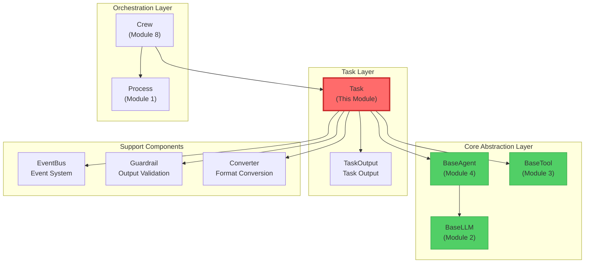

# 📘 Module 5: Task - Definition of Work Units (Deep Dive)

> **Learning Objective:** Understand how Crew AI defines the core concept of "Task", master the task execution flow, output formats, Guardrail validation mechanism, asynchronous execution, and how tasks collaborate with Agents to achieve goals.

---

## 🎯 1. File Overview and Positioning

**File Path:** `/home/user/crewAI/lib/crewai/src/crewai/task.py`
**Lines of Code:** 956 lines
**Difficulty:** ★★★★☆ (Advanced)
**Estimated Learning Time:** 90-100 minutes

### Why is Task So Important?

In previous modules, we've already learned:
- **Module 1 (Process):** Execution strategies (Sequential vs Hierarchical)
- **Module 2 (BaseLLM):** LLM abstract contract
- **Module 3 (BaseTool):** Tool abstract contract
- **Module 4 (BaseAgent):** Agent abstract interface

Now, **Task** is the core component that "organizes everything":

**Analogy:**
- `BaseAgent` is the "employee" (with capabilities and roles)
- `Task` is the "work order" (with clear requirements and expected output)
- `Crew` is the "project manager" (assigns tasks to employees)

**Task defines:**
- **What is the task?** (description)
- **What output is expected?** (expected_output)
- **Who executes it?** (agent)
- **What context is needed?** (context - output from other tasks)
- **How to validate output?** (guardrail/guardrails)
- **How to save results?** (output_file, output_json, output_pydantic)

---

## 🔍 2. Import Dependency Analysis: What Does Task Need?

### Core Dependencies (Lines 1-57)

```python
from concurrent.futures import Future  # Async execution
from threading import Thread           # Thread support
from pydantic import BaseModel, Field  # Data validation
from crewai.agents.agent_builder.base_agent import BaseAgent  # Agent dependency
from crewai.events.event_bus import crewai_event_bus  # Event system
from crewai.tasks.task_output import TaskOutput  # Task output
from crewai.tools.base_tool import BaseTool  # Tool dependency
```

### 🤔 Design Philosophy: Why These Dependencies?

#### 1. Async Support: `concurrent.futures` + `threading`

```python
# Why does Task need async execution?
# Scenario:
task1 = Task(description="Analyze data", async_execution=True)
task2 = Task(description="Generate report", async_execution=True)

# Start both tasks simultaneously:
future1 = task1.execute_async(agent1)
future2 = task2.execute_async(agent2)

# Wait for completion:
result1 = future1.result()
result2 = future2.result()

# Benefits:
# 1. Parallel processing: Saves time
# 2. Resource utilization: Fully utilizes multi-core CPU
# 3. Non-blocking: Doesn't block the main thread
```

#### 2. Event-Driven: `crewai_event_bus`

```python
# Task emits 3 types of events during execution:
# 1. TaskStartedEvent   - When task starts
# 2. TaskCompletedEvent - When task completes
# 3. TaskFailedEvent    - When task fails

# These events can be listened to by:
# - Logging system (records execution history)
# - Monitoring system (tracks progress in real-time)
# - UI system (updates user interface)
```

#### 3. Structured Output: `TaskOutput`

```python
# TaskOutput encapsulates all output information from the task:
class TaskOutput:
    raw: str                    # Raw output (LLM text)
    pydantic: BaseModel | None  # Pydantic model output
    json_dict: dict | None      # JSON dictionary output
    agent: str                  # Executing Agent role
    output_format: OutputFormat # Output format
    messages: list              # Messages during execution
```

### Dependency Map

```
Task (this file)
├── Depends on
│   ├── BaseAgent (Module 4) - Entity that executes the task
│   ├── BaseTool (Module 3) - Tools available to the task
│   ├── TaskOutput - Encapsulation of task output
│   ├── EventBus - Event system
│   ├── Guardrail - Output validation mechanism
│   └── Converter - Output format conversion
└── Depended on by
    └── Crew (Module 8) - Orchestrates multiple Tasks
```

---

## 🏗️ 3. Task Class "Skeleton": Core Architecture

### Class Definition (Line 63)

```python
class Task(BaseModel):
    """Class that represents a task to be executed.

    Each task must have a description, an expected output
    and an agent responsible for execution.
    """
```

### 🔑 Task's "Three Essentials"

```python
# Minimal Task definition:
task = Task(
    description="Analyze Q1 2024 sales data, identify root causes of decline",  # Required
    expected_output="A detailed report with 3-5 key findings and recommendations",    # Required
    agent=data_analyst                                      # Optional (can be assigned in Crew)
)

# Why are these three fields core?
# 1. description: Tells Agent "what to do"
# 2. expected_output: Tells Agent "what kind of result is expected"
# 3. agent: Tells system "who does it"
```

---

## 📦 4. Core Fields Deep Dive ("What is this task?")

### 1️⃣ Task Definition Fields (Lines 94-99)

```python
description: str = Field(description="Description of the actual task.")
expected_output: str = Field(
    description="Clear definition of expected output for the task."
)
name: str | None = Field(default=None)  # Optional task name
```

**🔍 Deep Analysis: description vs expected_output**

```python
# Example: Data analysis task
task = Task(
    description="""
        Analyze Q1 2024 sales data.
        Focus on:
        1. Regional sales comparison
        2. Product category performance
        3. Year-over-year comparison
    """,
    expected_output="""
        An analysis report containing:
        - Executive summary (3-5 sentences)
        - 3 key data insights
        - 2-3 specific recommendations
        - Chart descriptions supporting the data
    """
)

# Why two fields?
# description: Defines the "process" (how to analyze)
# expected_output: Defines the "result" (what format to output)

# This helps the LLM:
# 1. Understand task scope
# 2. Know output standards
# 3. Avoid outputs that are too brief or verbose
```

**🤔 What happens if you only have description but no expected_output?**

```python
# Task without expected_output:
task = Task(
    description="Analyze sales data",
    expected_output=""  # ❌ Missing!
)

# Possible LLM output:
# "Data analyzed."  ← Too brief
# or
# 200-page detailed report  ← Too verbose

# Task with expected_output:
task = Task(
    description="Analyze sales data",
    expected_output="3-5 key findings, each explained in 2-3 sentences"
)

# LLM output will be more precise:
# "Finding 1: ...
#  Finding 2: ...
#  Finding 3: ..."
```

### 2️⃣ Execution Control Fields (Lines 107-117)

```python
agent: BaseAgent | None = Field(
    description="Agent responsible for execution the task.",
    default=None
)
async_execution: bool | None = Field(
    description="Whether the task should be executed asynchronously or not.",
    default=False,
)
callback: Any | None = Field(
    description="Callback to be executed after the task is completed.",
    default=None
)
```

**🔍 Deep Analysis of Async Execution**

```python
# Scenario 1: Synchronous execution (default)
task1 = Task(description="Task 1", expected_output="...", async_execution=False)
task2 = Task(description="Task 2", expected_output="...", async_execution=False)

# Execution flow:
crew.kickoff()
# → Execute task1 (blocking, wait for completion)
# → Execute task2 (blocking, wait for completion)
# → Return results

# Total time = task1 time + task2 time

# Scenario 2: Async execution
task1 = Task(description="Data collection", expected_output="...", async_execution=True)
task2 = Task(description="Literature research", expected_output="...", async_execution=True)
task3 = Task(
    description="Comprehensive analysis",
    expected_output="...",
    context=[task1, task2],  # Depends on task1 and task2
    async_execution=False
)

# Execution flow:
crew.kickoff()
# → task1 and task2 execute in parallel (non-blocking)
# → Wait for task1 and task2 to complete
# → Execute task3 (using outputs from task1 and task2)

# Total time ≈ max(task1 time, task2 time) + task3 time
```

**🤔 When to use async?**

```python
# ✅ Good for async scenarios:
# 1. Tasks with no dependencies
task_a = Task(description="Analyze sales data", async_execution=True)
task_b = Task(description="Analyze market trends", async_execution=True)

# 2. I/O intensive tasks (waiting for API responses)
task = Task(
    description="Fetch data from 3 APIs",
    async_execution=True  # Avoid blocking
)

# ❌ Not suitable for async scenarios:
# 1. Tasks with dependencies
task1 = Task(description="Collect data")
task2 = Task(
    description="Analyze data",
    context=[task1],  # Depends on task1
    async_execution=True  # ⚠️ Be careful! Crew automatically handles dependencies
)

# 2. CPU-intensive tasks (Python GIL limitation)
task = Task(
    description="Train ML model",
    async_execution=True  # ⚠️ Might not be faster (due to GIL)
)
```

**🔍 Callback Mechanism**

```python
def task_callback(output: TaskOutput):
    """Callback function after task completion"""
    print(f"Task completed! Output: {output.raw}")
    # Can:
    # 1. Log to database
    # 2. Send notifications
    # 3. Trigger next step in workflow

task = Task(
    description="Analyze data",
    expected_output="Analysis report",
    callback=task_callback  # Called after task completion
)

# Execution flow:
result = task.execute_sync(agent)
# → Agent executes task
# → Generates TaskOutput
# → Calls callback(output)  ← Here!
# → Returns result
```

### 3️⃣ Context Passing Field (Lines 110-113)

```python
context: list[Task] | None | _NotSpecified = Field(
    description="Other tasks that will have their output used as context for this task.",
    default=NOT_SPECIFIED,
)
```

**🔍 Deep Analysis: Task Dependency Chain**

```python
# Scenario: Research report generation workflow
task1_research = Task(
    description="Research latest AI advances",
    expected_output="List of 10 key technological breakthroughs"
)

task2_analysis = Task(
    description="Analyze the business value of these breakthroughs",
    expected_output="Business value assessment for each technology",
    context=[task1_research]  # ← Depends on task1 output!
)

task3_report = Task(
    description="Generate comprehensive report",
    expected_output="A complete business analysis report",
    context=[task1_research, task2_analysis]  # ← Depends on two tasks!
)

# Context passing during execution:
# 1. task1 executes → outputs output1
# 2. When task2 executes, Agent receives a prompt containing:
#    - task2's description
#    - task2's expected_output
#    - "Context: {output1 content}"  ← Automatically injected!
# 3. When task3 executes, Agent receives:
#    - task3's description
#    - "Context: {output1 content}\n{output2 content}"
```

**🤔 Why not manually pass outputs?**

```python
# Approach A: Manual passing (❌ Not recommended)
output1 = task1.execute_sync(agent1)
task2.description += f"\nContext: {output1.raw}"
output2 = task2.execute_sync(agent2)

# Problems:
# 1. Verbose code
# 2. Error-prone
# 3. Doesn't support Crew's automatic orchestration

# Approach B: Use context (✅ Recommended)
task2 = Task(
    description="...",
    context=[task1]  # Simple, clear, automatically handled
)
```

### 4️⃣ Output Format Fields (Lines 118-137)

```python
output_json: type[BaseModel] | None = Field(
    description="A Pydantic model to be used to create a JSON output.",
    default=None,
)
output_pydantic: type[BaseModel] | None = Field(
    description="A Pydantic model to be used to create a Pydantic output.",
    default=None,
)
output_file: str | None = Field(
    description="A file path to be used to create a file output.",
    default=None,
)
```

**🔍 Deep Analysis: Three Output Formats**

#### Format 1: Raw Text (default)

```python
task = Task(
    description="Write an article about AI",
    expected_output="A 500-word article"
    # No output_json or output_pydantic specified
)

result = task.execute_sync(agent)
print(result.raw)  # "Artificial Intelligence (AI) is..."
# result.pydantic = None
# result.json_dict = None
```

#### Format 2: Structured JSON

```python
from pydantic import BaseModel

class AnalysisReport(BaseModel):
    summary: str
    key_findings: list[str]
    recommendations: list[str]
    confidence_score: float

task = Task(
    description="Analyze sales data",
    expected_output="Analysis report",
    output_json=AnalysisReport  # ← Specify JSON schema
)

result = task.execute_sync(agent)
print(result.json_dict)
# {
#     "summary": "Q1 sales down 10%",
#     "key_findings": ["Finding 1", "Finding 2"],
#     "recommendations": ["Recommendation 1", "Recommendation 2"],
#     "confidence_score": 0.85
# }
```

**🤔 Why do we need structured output?**

```python
# Scenario: Downstream system needs structured data
task_analysis = Task(
    description="Analyze user feedback",
    expected_output="Analysis results",
    output_json=FeedbackAnalysis  # Structured
)

result = task_analysis.execute_sync(agent)

# Can directly use:
if result.json_dict["sentiment"] == "negative":
    send_alert(result.json_dict["issues"])

# If it were raw text:
# result.raw = "User feedback is mainly negative, issues include..."
# ❌ Need manual parsing, error-prone
```

#### Format 3: Pydantic Model

```python
task = Task(
    description="Extract user information",
    expected_output="User information",
    output_pydantic=UserProfile  # ← Pydantic model
)

result = task.execute_sync(agent)
print(result.pydantic)  # UserProfile object
print(result.pydantic.name)  # Can directly access fields
print(result.pydantic.age)

# Benefits:
# 1. Type checking
# 2. Automatic validation
# 3. IDE auto-completion
```

**🔍 Difference between output_json vs output_pydantic**

```python
# output_json:
# - Returns dict
# - Suitable for serialization and transmission
# - No type checking

# output_pydantic:
# - Returns Pydantic object
# - Suitable for use in Python code
# - Has type checking and validation
# - Can use model methods

# Example:
class User(BaseModel):
    name: str
    age: int

    def is_adult(self) -> bool:
        return self.age >= 18

# Using output_pydantic:
result_pydantic.pydantic.is_adult()  # ✅ Can call methods

# Using output_json:
result_json.json_dict["age"] >= 18  # ❌ Only manual checking
```

#### Format 4: Save to File

```python
task = Task(
    description="Generate report",
    expected_output="Markdown report",
    output_file="reports/analysis_{date}.md",  # Supports templates
    create_directory=True  # Automatically create directory
)

# During execution:
# 1. Execute task
# 2. Save output to file
# 3. Automatically create reports/ directory (if it doesn't exist)

# Supports interpolation:
crew.kickoff(inputs={"date": "2024-Q1"})
# → Saves to reports/analysis_2024-Q1.md
```

### 5️⃣ Guardrail Validation Fields (Lines 167-200)

```python
guardrail: GuardrailType | None = Field(
    default=None,
    description="Function or string description of a guardrail to validate task output"
)
guardrails: GuardrailsType | None = Field(
    default=None,
    description="List of guardrails to validate task output"
)
guardrail_max_retries: int = Field(
    default=3,
    description="Maximum number of retries when guardrail fails"
)
```

**🔍 Deep Analysis: Guardrail Mechanism**

#### What is a Guardrail?

```python
# Guardrail is an "output validator"
# It checks whether Agent's output meets requirements

# Example: Ensure output doesn't contain sensitive information
def no_sensitive_info(output: TaskOutput) -> tuple[bool, str | TaskOutput]:
    """
    Guardrail signature:
    - Input: TaskOutput
    - Output: (whether it passes, error message or new output)
    """
    sensitive_keywords = ["password", "ID card", "credit card"]

    for keyword in sensitive_keywords:
        if keyword in output.raw:
            return False, f"Output contains sensitive information: {keyword}"

    return True, output

task = Task(
    description="Summarize user feedback",
    expected_output="Summary report",
    guardrail=no_sensitive_info  # ← Add validation
)
```

**🔍 Guardrail Execution Flow**

```python
# Execution flow:
result = task.execute_sync(agent)

# Internal flow:
# 1. Agent executes task → generates output1
# 2. Call guardrail(output1)
#    ↓
#    If returns (True, output1):  # Passes
#        → Return output1
#    If returns (False, error_msg):  # Doesn't pass
#        → Retry (up to 3 times)
#        → Agent re-executes, receives error feedback
#        → Generates output2
#        → Validate again...
```

**🤔 Why do we need Guardrails?**

```python
# Scenario 1: Ensure output format is correct
def check_json_format(output: TaskOutput) -> tuple[bool, str | TaskOutput]:
    try:
        json.loads(output.raw)
        return True, output
    except:
        return False, "Output is not valid JSON"

# Scenario 2: Ensure output length
def check_length(output: TaskOutput) -> tuple[bool, str | TaskOutput]:
    if len(output.raw) < 100:
        return False, "Output too short, please provide more detail"
    if len(output.raw) > 1000:
        return False, "Output too long, please condense"
    return True, output

# Scenario 3: Ensure key information is included
def check_key_points(output: TaskOutput) -> tuple[bool, str | TaskOutput]:
    required_keywords = ["data analysis", "conclusion", "recommendations"]
    missing = [kw for kw in required_keywords if kw not in output.raw]

    if missing:
        return False, f"Missing key sections: {', '.join(missing)}"
    return True, output
```

**🔍 Multiple Guardrails**

```python
task = Task(
    description="Generate analysis report",
    expected_output="Detailed report",
    guardrails=[
        check_length,        # 1. Check length
        check_format,        # 2. Check format
        check_key_points,    # 3. Check key points
    ]
)

# Execution flow:
# 1. Agent generates output
# 2. Execute each guardrail in sequence
# 3. If any fails, retry
# 4. Retry up to 3 times (guardrail_max_retries)
```

**🤔 Difference between Guardrail vs Pydantic validation**

```python
# Pydantic validation:
# - Validates data "structure" (types, required fields, etc.)
# - Cannot validate "semantics"

class Report(BaseModel):
    content: str  # ✅ Ensures content is a string
    # ❌ Cannot ensure content includes "conclusion"

# Guardrail validation:
# - Can validate "semantics"
# - Can call external APIs
# - Can execute complex logic

def check_quality(output: TaskOutput) -> tuple[bool, str]:
    # ✅ Can check content quality
    if "conclusion" not in output.raw.lower():
        return False, "Missing conclusion section"
    return True, output
```

### 6️⃣ Private Attributes (Lines 194-204)

```python
_guardrail: GuardrailCallable | None = PrivateAttr(default=None)
_guardrails: list[GuardrailCallable] = PrivateAttr(default_factory=list)
_original_description: str | None = PrivateAttr(default=None)
_original_expected_output: str | None = PrivateAttr(default=None)
_thread: threading.Thread | None = PrivateAttr(default=None)
```

**🤔 Why do we need to save original values?**

```python
# Similar interpolation mechanism as BaseAgent:
task = Task(
    description="Analyze {department} department's {metric} data",
    expected_output="{metric} analysis report"
)

# First execution:
crew.kickoff(inputs={"department": "sales", "metric": "revenue"})
# task.description = "Analyze sales department's revenue data"
# task._original_description = "Analyze {department} department's {metric} data"

# Second execution:
crew.kickoff(inputs={"department": "marketing", "metric": "conversion"})
# task.description = "Analyze marketing department's conversion data"
# ✅ Re-interpolate based on _original_description

# Without _original_description:
# task.description = "Analyze sales department's revenue data{department}"  # ❌ Wrong!
```

---

## ⚙️ 5. Validator Chain: Pydantic's "Gatekeeper" Mechanism

### 1️⃣ Guardrail Function Validator (Lines 207-264)

```python
@field_validator("guardrail")
@classmethod
def validate_guardrail_function(
    cls, v: str | GuardrailCallable | None
) -> str | GuardrailCallable | None:
    if v is not None and callable(v):
        sig = inspect.signature(v)
        positional_args = [
            param for param in sig.parameters.values()
            if param.default is inspect.Parameter.empty
        ]
        if len(positional_args) != 1:
            raise ValueError("Guardrail function must accept exactly one parameter")

        # Check return type annotation
        return_annotation = sig.return_annotation
        if return_annotation != inspect.Signature.empty:
            # Must be Tuple[bool, Any]
            ...
    return v
```

**🔍 Deep Analysis: Why validate function signatures?**

```python
# ✅ Correct Guardrail function:
def valid_guardrail(output: TaskOutput) -> tuple[bool, str]:
    # 1 parameter ✅
    # Returns tuple[bool, str] ✅
    return True, output

# ❌ Incorrect Guardrail functions:
def invalid_guardrail_1(output: TaskOutput, extra_param: str):
    # 2 parameters ❌
    return True, output

def invalid_guardrail_2(output: TaskOutput) -> bool:
    # Wrong return type ❌
    return True

# Why validate when creating Task?
task = Task(
    description="...",
    guardrail=invalid_guardrail_1  # ← Throws error immediately!
)
# Rather than discovering the error at execution time
```

### 2️⃣ Required Field Validator (Lines 271-279)

```python
@model_validator(mode="after")
def validate_required_fields(self) -> Self:
    required_fields = ["description", "expected_output"]
    for field in required_fields:
        if getattr(self, field) is None:
            raise ValueError(
                f"{field} must be provided either directly or through config"
            )
    return self
```

**🤔 Why not use Field(required=True)?**

```python
# Because it supports config configuration:
task = Task(
    config={
        "description": "Analyze data",
        "expected_output": "Report"
    }
)

# Execution flow:
# 1. process_model_config (mode="before")
#    → Expand config into individual fields
# 2. validate_required_fields (mode="after")
#    → Check if fields exist
```

### 3️⃣ Output Type Validator (Lines 427-437)

```python
@model_validator(mode="after")
def check_output(self) -> Self:
    output_types = [self.output_json, self.output_pydantic]
    if len([type for type in output_types if type]) > 1:
        raise PydanticCustomError(
            "output_type",
            "Only one output type can be set",
            {},
        )
    return self
```

**🔍 Why can there only be one output type?**

```python
# ❌ Not allowed:
task = Task(
    description="...",
    output_json=ReportJSON,
    output_pydantic=ReportPydantic  # Conflict!
)

# Reasons:
# 1. Avoid ambiguity: Which format should the LLM generate?
# 2. Simplify logic: Only need one converter
# 3. Clear intent: User must explicitly choose
```

### 4️⃣ File Path Validator (Lines 360-410)

```python
@field_validator("output_file")
@classmethod
def output_file_validation(cls, value: str | None) -> str | None:
    if value is None:
        return None

    # Security checks:
    if ".." in value:
        raise ValueError("Path traversal attempts are not allowed")

    if value.startswith(("~", "$")):
        raise ValueError("Shell expansion characters are not allowed")

    if any(char in value for char in ["|", ">", "<", "&", ";"]):
        raise ValueError("Shell special characters are not allowed")

    # Support template variables:
    if "{" in value or "}" in value:
        return value  # Preserve template

    # Remove leading slash (security)
    if value.startswith("/"):
        return value[1:]
    return value
```

**🔍 Deep Analysis: Why are these security checks needed?**

```python
# ❌ Dangerous paths:
task = Task(
    output_file="../../../etc/passwd"  # Path traversal attack
)

task = Task(
    output_file="report.txt; rm -rf /"  # Command injection
)

task = Task(
    output_file="~/important.txt"  # Shell expansion (unpredictable)
)

# ✅ Safe paths:
task = Task(
    output_file="reports/analysis.txt"  # Relative path
)

task = Task(
    output_file="reports/{date}/report.md"  # Template variables
)
```

---

## 🎬 6. Execution Flow: From Task to TaskOutput

### Synchronous Execution Flow (Lines 451-458)

```python
def execute_sync(
    self,
    agent: BaseAgent | None = None,
    context: str | None = None,
    tools: list[BaseTool] | None = None,
) -> TaskOutput:
    """Execute the task synchronously."""
    return self._execute_core(agent, context, tools)
```

### Asynchronous Execution Flow (Lines 474-498)

```python
def execute_async(
    self,
    agent: BaseAgent | None = None,
    context: str | None = None,
    tools: list[BaseTool] | None = None,
) -> Future[TaskOutput]:
    """Execute the task asynchronously."""
    future: Future[TaskOutput] = Future()
    threading.Thread(
        daemon=True,
        target=self._execute_task_async,
        args=(agent, context, tools, future),
    ).start()
    return future
```

**🔍 Deep Analysis: Future Pattern**

```python
# Future is a placeholder for "future result"
future = task.execute_async(agent)

# Task is executing in background at this point
print("Task started, continuing other work...")
do_other_work()

# When result is needed:
result = future.result()  # Blocks until task completes
print(f"Task completed: {result.raw}")

# Benefits:
# 1. Non-blocking start
# 2. Can start multiple tasks simultaneously
# 3. Get result only when needed
```

### Core Execution Logic (Lines 500-591)

```python
def _execute_core(
    self,
    agent: BaseAgent | None,
    context: str | None,
    tools: list[Any] | None,
) -> TaskOutput:
    try:
        # 1. Validate agent
        agent = agent or self.agent
        if not agent:
            raise Exception("Task has no agent assigned")

        # 2. Record start time
        self.start_time = datetime.datetime.now()

        # 3. Emit task started event
        crewai_event_bus.emit(self, TaskStartedEvent(...))

        # 4. Agent executes task
        result = agent.execute_task(
            task=self,
            context=context,
            tools=tools,
        )

        # 5. Export structured output
        pydantic_output, json_output = self._export_output(result)

        # 6. Create TaskOutput
        task_output = TaskOutput(
            name=self.name or self.description,
            description=self.description,
            expected_output=self.expected_output,
            raw=result,
            pydantic=pydantic_output,
            json_dict=json_output,
            agent=agent.role,
            output_format=self._get_output_format(),
        )

        # 7. Execute Guardrails validation
        if self._guardrails:
            for guardrail in self._guardrails:
                task_output = self._invoke_guardrail_function(...)

        # 8. Record end time
        self.end_time = datetime.datetime.now()

        # 9. Call callback function
        if self.callback:
            self.callback(self.output)

        # 10. Save to file
        if self.output_file:
            self._save_file(content)

        # 11. Emit task completed event
        crewai_event_bus.emit(self, TaskCompletedEvent(...))

        return task_output

    except Exception as e:
        # Emit task failed event
        crewai_event_bus.emit(self, TaskFailedEvent(...))
        raise e
```

**🔍 Execution Flow Diagram**

```
┌─────────────────────────────────────────┐
│ task.execute_sync(agent, context, tools)│
└───────────────┬─────────────────────────┘
                │
                ▼
┌───────────────────────────────┐
│ 1. Validate Agent exists      │
└───────────────┬───────────────┘
                │
                ▼
┌───────────────────────────────┐
│ 2. Record start time          │
│    start_time = datetime.now()│
└───────────────┬───────────────┘
                │
                ▼
┌───────────────────────────────┐
│ 3. Emit TaskStartedEvent      │
└───────────────┬───────────────┘
                │
                ▼
┌───────────────────────────────┐
│ 4. Agent executes task        │
│    result = agent.execute_task│
└───────────────┬───────────────┘
                │
                ▼
┌───────────────────────────────┐
│ 5. Export structured output   │
│    (Pydantic/JSON)            │
└───────────────┬───────────────┘
                │
                ▼
┌───────────────────────────────┐
│ 6. Create TaskOutput object   │
└───────────────┬───────────────┘
                │
                ▼
┌───────────────────────────────┐
│ 7. Execute Guardrails         │
│    (may retry up to 3 times)  │
└───────────────┬───────────────┘
                │
                ▼
┌───────────────────────────────┐
│ 8. Call callback function     │
└───────────────┬───────────────┘
                │
                ▼
┌───────────────────────────────┐
│ 9. Save to file (if needed)   │
└───────────────┬───────────────┘
                │
                ▼
┌───────────────────────────────┐
│ 10. Emit TaskCompletedEvent   │
└───────────────┬───────────────┘
                │
                ▼
┌───────────────────────────────┐
│ Return TaskOutput             │
└───────────────────────────────┘
```

---

## 🛡️ 7. Guardrail Deep Dive: Output Validation Mechanism

### Guardrail Execution Function (Lines 859-956)

```python
def _invoke_guardrail_function(
    self,
    task_output: TaskOutput,
    agent: BaseAgent,
    tools: list[BaseTool],
    guardrail: GuardrailCallable,
    guardrail_index: int | None = None,
) -> TaskOutput:
    max_attempts = self.guardrail_max_retries + 1

    for attempt in range(max_attempts):
        # Call guardrail validation
        guardrail_result = process_guardrail(
            output=task_output,
            guardrail=guardrail,
            ...
        )

        if guardrail_result.success:
            # Validation passed
            return task_output

        # Validation failed
        if attempt >= self.guardrail_max_retries:
            # Exceeded max retries
            raise Exception(f"Task failed guardrail validation after {self.guardrail_max_retries} retries")

        # Retry: Let Agent regenerate output
        context = f"Previous output failed validation: {guardrail_result.error}\nPlease correct and regenerate."
        result = agent.execute_task(
            task=self,
            context=context,
            tools=tools,
        )

        # Create new TaskOutput
        task_output = TaskOutput(...)

    return task_output
```

**🔍 Guardrail Retry Mechanism**

```python
# Scenario: Output must contain "conclusion"
def check_conclusion(output: TaskOutput) -> tuple[bool, str]:
    if "conclusion" not in output.raw:
        return False, "Output missing 'conclusion' section, please add."
    return True, output

task = Task(
    description="Analyze data",
    expected_output="Analysis report",
    guardrail=check_conclusion,
    guardrail_max_retries=3
)

# Execution flow:
# Attempt 1: Agent generates output1
#   → Validation fails: "Output missing 'conclusion' section"
#   → Retry

# Attempt 2: Agent receives feedback: "Previous output failed validation: Output missing 'conclusion' section, please add."
#   → Generates output2 (contains "conclusion")
#   → Validation passes ✅
#   → Return output2
```

**🤔 LLM Guardrail vs Programmatic Guardrail**

```python
# Programmatic Guardrail (Python function):
def check_length(output: TaskOutput) -> tuple[bool, str]:
    if len(output.raw) < 100:
        return False, "Output too short"
    return True, output

# LLM Guardrail (use LLM for validation):
task = Task(
    description="Write article",
    expected_output="Article",
    guardrail="Ensure the article's tone is professional and objective, without subjective bias"  # ← String description
)

# LLM Guardrail implementation:
# Internally creates a special "validation Agent":
class LLMGuardrail:
    def __init__(self, description: str, llm: BaseLLM):
        self.description = description
        self.llm = llm

    def __call__(self, output: TaskOutput) -> tuple[bool, str]:
        prompt = f"""
        Validate whether the following output meets requirements:
        Requirement: {self.description}

        Output:
        {output.raw}

        Does it meet requirements? Please answer "yes" or "no" and explain why.
        """

        result = self.llm.call(prompt)

        if "yes" in result:
            return True, output
        else:
            return False, f"LLM validation failed: {result}"
```

**🔍 When to use which Guardrail?**

```python
# ✅ Use programmatic Guardrail:
# 1. Clearly defined rules
check_length, check_format, check_keywords

# 2. Need fast validation (no LLM call)
# 3. Validation logic is deterministic

# ✅ Use LLM Guardrail:
# 1. Requirements difficult to express in code
"Ensure friendly tone"
"Ensure no offensive content"
"Ensure logical coherence"

# 2. Need semantic understanding
# 3. Validation criteria are subjective
```

---

## 🔧 8. Key Method Implementation Analysis

### 1️⃣ Task's "Fingerprint": key property (Lines 460-466)

```python
@property
def key(self) -> str:
    description = self._original_description or self.description
    expected_output = self._original_expected_output or self.expected_output
    source = [description, expected_output]

    return md5("|".join(source).encode(), usedforsecurity=False).hexdigest()
```

**🔍 Similar Design to BaseAgent.key**

```python
# Uses:
# 1. Task deduplication
# 2. Task mapping (used during copy)
# 3. Cache key

# Why based on original values?
task = Task(
    description="Analyze {department} data",
    expected_output="Report"
)

crew.kickoff(inputs={"department": "sales"})
# task.key based on "Analyze {department} data"  ← Original template
# not "Analyze sales data"  ← Interpolated value

# This ensures the same task template's key is always the same
```

### 2️⃣ Interpolation Method (Lines 633-706)

```python
def interpolate_inputs_and_add_conversation_history(
    self, inputs: dict[str, str | int | float | dict | list]
) -> None:
    # Save original values
    if self._original_description is None:
        self._original_description = self.description
    if self._original_expected_output is None:
        self._original_expected_output = self.expected_output

    if not inputs:
        return

    # Interpolate description
    self.description = interpolate_only(
        input_string=self._original_description,
        inputs=inputs
    )

    # Interpolate expected_output
    self.expected_output = interpolate_only(
        input_string=self._original_expected_output,
        inputs=inputs
    )

    # Interpolate output_file
    if self.output_file is not None:
        self.output_file = interpolate_only(
            input_string=self._original_output_file,
            inputs=inputs
        )

    # Add conversation history (if any)
    if inputs.get("crew_chat_messages"):
        conversation_history = format_messages(inputs["crew_chat_messages"])
        self.description += f"\n\nConversation history:\n{conversation_history}"
```

**🔍 Deep Analysis: Conversation History Injection**

```python
# Scenario: Multi-turn dialogue between user and Crew
crew_chat_messages = [
    {"role": "user", "content": "Analyze sales data"},
    {"role": "assistant", "content": "I need to know which quarter's data"},
    {"role": "user", "content": "Q1 2024"}
]

# Task's description becomes:
"""
Analyze sales data

Conversation history:
User: Analyze sales data
Assistant: I need to know which quarter's data
User: Q1 2024
"""

# This allows Agent to understand context!
```

### 3️⃣ Copy Method (Lines 718-759)

```python
def copy(
    self,
    agents: list[BaseAgent],
    task_mapping: dict[str, Task]
) -> Task:
    exclude = {
        "id",          # New Task needs new ID
        "agent",       # Need to find from agents
        "context",     # Need to find from task_mapping
        "tools",       # Shallow copy
    }

    copied_data = self.model_dump(exclude=exclude)

    # Clone context (task dependencies)
    cloned_context = (
        [task_mapping[context_task.key] for context_task in self.context]
        if isinstance(self.context, list)
        else None
    )

    # Find corresponding Agent
    cloned_agent = get_agent_by_role(self.agent.role) if self.agent else None

    # Shallow copy tools
    cloned_tools = shallow_copy(self.tools) if self.tools else []

    return self.__class__(
        **copied_data,
        context=cloned_context,
        agent=cloned_agent,
        tools=cloned_tools,
    )
```

**🔍 Deep Analysis: Why do we need task_mapping?**

```python
# Scenario: Copying entire Crew (containing multiple Tasks)
original_task1 = Task(description="Task 1", ...)
original_task2 = Task(
    description="Task 2",
    context=[original_task1]  # Depends on task1
)

# During copying:
task_mapping = {}

# Copy task1:
copied_task1 = original_task1.copy(agents, task_mapping)
task_mapping[original_task1.key] = copied_task1

# Copy task2:
copied_task2 = original_task2.copy(agents, task_mapping)
# context needs to point to copied_task1, not original_task1!
# task_mapping[original_task1.key] → copied_task1

# This ensures dependencies are correct!
```

### 4️⃣ File Save Method (Lines 795-845)

```python
def _save_file(self, result: dict | str | Any) -> None:
    if self.output_file is None:
        raise ValueError("output_file is not set.")

    try:
        # Parse path
        resolved_path = Path(self.output_file).expanduser().resolve()
        directory = resolved_path.parent

        # Create directory
        if self.create_directory and not directory.exists():
            directory.mkdir(parents=True, exist_ok=True)

        # Write file
        with resolved_path.open("w", encoding="utf-8") as file:
            if isinstance(result, dict):
                json.dump(result, file, ensure_ascii=False, indent=2)
            else:
                file.write(str(result))
    except (OSError, IOError) as e:
        raise RuntimeError(f"Failed to save output file: {e}") from e
```

**🔍 Path Resolution Details**

```python
# expanduser(): Expand ~ to user directory
Path("~/reports/file.txt").expanduser()
# → /home/username/reports/file.txt

# resolve(): Resolve to absolute path
Path("../reports/file.txt").resolve()
# → /home/username/project/reports/file.txt

# Why are these needed?
# 1. Cross-platform compatibility
# 2. Handle relative paths
# 3. Security (validate path legality)
```

---

## 🎨 9. Design Pattern Identification

### 1️⃣ **Observer Pattern**

```python
# Task emits events, other components listen
class Task:
    def _execute_core(...):
        # Emit event
        crewai_event_bus.emit(self, TaskStartedEvent(...))

        # Execute task
        result = agent.execute_task(...)

        # Emit event
        crewai_event_bus.emit(self, TaskCompletedEvent(...))

# Listener:
class LoggingListener:
    def on_task_started(self, event: TaskStartedEvent):
        print(f"Task started: {event.task.description}")

    def on_task_completed(self, event: TaskCompletedEvent):
        print(f"Task completed: {event.output.raw}")

crewai_event_bus.subscribe(TaskStartedEvent, logging_listener.on_task_started)
```

### 2️⃣ **Future Pattern**

```python
# Task's async execution uses Future pattern
future = task.execute_async(agent)

# Future represents "future result"
# Can:
# 1. Check if done: future.done()
# 2. Get result (blocking): future.result()
# 3. Cancel task: future.cancel()
```

### 3️⃣ **Template Method Pattern**

```python
# _execute_core defines execution "skeleton"
class Task:
    def _execute_core(...):
        # 1. Validate
        # 2. Record start time
        # 3. Emit event
        # 4. Execute task  ← Extension point
        # 5. Validate output  ← Extension point
        # 6. Save file  ← Extension point
        # 7. Emit event
```

### 4️⃣ **Strategy Pattern**

```python
# Different output format strategies
class Task:
    def _get_output_format(self) -> OutputFormat:
        if self.output_json:
            return OutputFormat.JSON
        if self.output_pydantic:
            return OutputFormat.PYDANTIC
        return OutputFormat.RAW

# Different Guardrail strategies
# - Programmatic validation
# - LLM validation
```

---

## 🌐 10. Relationship with Other Components (Architectural Overview)



### Data Flow Example

```python
# Complete execution flow
crew = Crew(
    agents=[researcher, analyst],
    tasks=[task1, task2],
    process=Process.sequential
)

crew.kickoff()
    ↓
# Crew iterates through Tasks
for task in tasks:
    ↓
    # Task executes
    task._execute_core(agent, context, tools)
        ↓
        # 1. Emit TaskStartedEvent
        crewai_event_bus.emit(TaskStartedEvent)
        ↓
        # 2. Agent executes
        agent.execute_task(task, context, tools)
            ↓
            # Agent calls LLM
            llm.call(prompt)
            ↓
            # Agent uses Tools
            tool.run(args)
        ↓
        # 3. Create TaskOutput
        task_output = TaskOutput(...)
        ↓
        # 4. Guardrail validation
        if guardrail:
            validate(task_output)
        ↓
        # 5. Save file
        if output_file:
            save_to_file()
        ↓
        # 6. Emit TaskCompletedEvent
        crewai_event_bus.emit(TaskCompletedEvent)
    ↓
# Return result
return task_output
```

---

## 🧠 Knowledge Extraction Challenges

### 🔥 Challenge 1: Conceptual Understanding (Generative)

**In your own words, explain what Task's "three essentials" are? Why are they required?**

<details>
<summary>💡 Reference Answer</summary>

Task's three essentials:
1. **description**: Describes task content and requirements ("what to do")
2. **expected_output**: Defines expected output format and standards ("what kind of result is expected")
3. **agent**: Specifies who executes this task ("who does it")

Why required:
- **description**: Without it, Agent doesn't know what to do
- **expected_output**: Without it, Agent may generate output that's too brief or verbose
- **agent**: Without it (and not assigned in Crew), task cannot execute

These three form a complete "work order".
</details>

---

### 🔥 Challenge 2: Design Analysis (Analytical)

**Why does Task need to save `_original_description` and `_original_expected_output`? What problems would occur if not saved?**

<details>
<summary>💡 Reference Answer</summary>

**Why save original values:**
- Task supports template interpolation (similar to BaseAgent)
- Original values are templates, e.g., "Analyze {department}'s {metric} data"
- Each execution may interpolate with different inputs

**If original values aren't saved:**
```python
# First execution
task.description = "Analyze {department}'s {metric} data"
inputs = {"department": "sales", "metric": "revenue"}
# → description becomes "Analyze sales's revenue data"

# Second execution
inputs = {"department": "marketing", "metric": "conversion"}
# ❌ Interpolating based on already-interpolated description
# → "Analyze sales's revenue data{department}" ← Wrong!
```

**After saving original values:**
- Always re-interpolate based on `_original_description`
- Ensures each execution correctly replaces variables
</details>

---

### 🔥 Challenge 3: Code Prediction (Inferential)

**Predict the output of the following code and explain the Guardrail retry mechanism:**

```python
retry_count = 0

def length_check(output: TaskOutput) -> tuple[bool, str]:
    global retry_count
    retry_count += 1
    print(f"Attempt {retry_count}")

    if len(output.raw) < 50:
        return False, "Output too short"
    return True, output

task = Task(
    description="Write an article",
    expected_output="Article",
    guardrail=length_check,
    guardrail_max_retries=2
)

# Assume Agent generates outputs with lengths: 30, 40, 60
result = task.execute_sync(agent)
```

<details>
<summary>💡 Reference Answer</summary>

**Output:**
```
Attempt 1
Attempt 2
Attempt 3
```

**Explanation:**
1. **First attempt**: Agent generates 30 characters → Validation fails (< 50) → Retry
2. **Second attempt**: Agent receives feedback "Output too short", generates 40 characters → Validation fails → Retry
3. **Third attempt**: Agent receives feedback again, generates 60 characters → Validation passes ✅

**Key points:**
- `guardrail_max_retries=2` means maximum 2 retries
- Total attempts will be 1 (initial) + 2 (retries) = 3 times
- Each retry, Agent receives error message from previous failure
</details>

---

### 🔥 Challenge 4: Architectural Design (Comprehensive)

**Design a task chain: Task1 collects data → Task2 analyzes data → Task3 generates report. Task1 and Task2 can execute in parallel, Task3 depends on them. How to design?**

<details>
<summary>💡 Reference Answer</summary>

```python
# Task1: Collect sales data (can be async)
task1_sales = Task(
    description="Collect Q1 2024 sales data",
    expected_output="Path to sales data CSV file",
    agent=data_collector,
    async_execution=True  # Async execution
)

# Task2: Collect market data (can be async)
task2_market = Task(
    description="Collect Q1 2024 market trend data",
    expected_output="Summary of market data",
    agent=market_researcher,
    async_execution=True  # Async execution
)

# Task3: Comprehensive analysis (depends on Task1 and Task2)
task3_analysis = Task(
    description="Analyze sales and market data, identify correlations",
    expected_output="Comprehensive analysis report",
    agent=analyst,
    context=[task1_sales, task2_market],  # Depends on previous two tasks
    async_execution=False  # Sync execution (needs to wait for context)
)

# Task4: Generate final report (depends on Task3)
task4_report = Task(
    description="Generate executive presentation PPT",
    expected_output="PPT file",
    agent=report_generator,
    context=[task3_analysis],
    output_file="reports/executive_summary.pptx"
)

crew = Crew(
    agents=[data_collector, market_researcher, analyst, report_generator],
    tasks=[task1_sales, task2_market, task3_analysis, task4_report],
    process=Process.sequential
)

# Execution flow:
# 1. task1_sales and task2_market execute in parallel
# 2. Wait for both to complete
# 3. task3_analysis executes (using task1 and task2 outputs as context)
# 4. task4_report executes (using task3 output)
```

**Key design points:**
1. Task1 and Task2 set `async_execution=True` (parallel)
2. Task3 sets `context=[task1, task2]` (dependency)
3. Crew automatically handles task dependencies and execution order
</details>

---

### 🔥 Challenge 5: Troubleshooting (Debugging Reasoning)

**What error will the following code throw? Why?**

```python
class UserProfile(BaseModel):
    name: str
    age: int

task = Task(
    description="Extract user information",
    expected_output="User profile",
    output_json=UserProfile,
    output_pydantic=UserProfile  # Both set
)
```

<details>
<summary>💡 Reference Answer</summary>

**Error:**
```
PydanticCustomError: Only one output type can be set, either output_pydantic or output_json.
```

**Reason:**
1. Task has a validator `check_output` (Lines 427-437)
2. It checks whether `output_json` and `output_pydantic` are both set
3. If both are set, throws error

**Why this design?**
- Avoid ambiguity: Which format should LLM generate?
- Simplify logic: Only need one converter
- Clear intent: Force user to explicitly choose

**Correct approach:**
```python
# Choose one:
task = Task(
    description="Extract user information",
    expected_output="User profile",
    output_pydantic=UserProfile  # Only set one
)
```
</details>

---

## 📊 11. Core Concepts Summary

### Task's "Six Pillars"

```
1. Task Definition
   ├── description: Task content
   ├── expected_output: Expected output
   └── name: Task name (optional)

2. Execution Control
   ├── agent: Executor
   ├── async_execution: Whether async
   ├── callback: Completion callback
   └── context: Task dependencies

3. Output Format
   ├── output_json: JSON output
   ├── output_pydantic: Pydantic output
   └── output_file: File output

4. Quality Assurance
   ├── guardrail/guardrails: Output validation
   └── guardrail_max_retries: Max retry count

5. Execution Tracking
   ├── start_time: Start time
   ├── end_time: End time
   └── events: TaskStarted/Completed/Failed

6. Tools & Resources
   ├── tools: Available tools
   └── security_config: Security configuration
```

---

## 🎓 Next Steps for Learning

After completing this module, you should be able to:

- ✅ Explain Task's core three essentials and their design intent
- ✅ Understand the difference between sync and async execution and use cases
- ✅ Master context dependency mechanism and task chain design
- ✅ Understand the differences between three output formats (raw, json, pydantic)
- ✅ Master Guardrail validation mechanism and retry logic
- ✅ Understand Task's event-driven architecture

**Recommended next steps:**
- **Module 6: Agent (Concrete Implementation)** - See how BaseAgent is concretized, understand ReAct loop
- **Module 7: CrewAgentExecutor (Execution Engine)** - Deep dive into Agent's reasoning loop
- **Module 8: Crew (Multi-Agent Orchestration)** - Understand how to orchestrate multiple Agents and Tasks

---

**📁 This document path:** `/home/user/crewAI/docs/Module_05_Task_EN.md`
